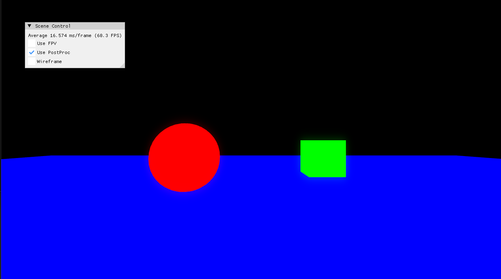

## Mouse Picking

3D 게임 상에서의 물체를 Mouse 를 통해서 클릭을 해서 색깔이 변하게 하려면 크게 두가지 방법이 있다.
1. 하나는 Ray Casting 기법이다. Mouse 로 부터, 물체쪽으로 광선을 쏴서, 광선이 충돌했는지 안했는지의 방법 (대신 광추적은 많이 느리다.)
2. 다른 하나는 Texture 작은걸 만들어서, GPU 에서 CPU 로 복사할때, Color 값을 가져오는 방식이다. 

마치 두번째 방식은 마치 Semantic Segmentation 하고 비슷하다. 

### Mouse Picking Ray Collision
* 이건 완전 Ray Casting 하고 동일하다. Camera 원점으로부터 결국엔 물체가 부딫히는지, 또는 안부딫히는지를 체크하는것이다.

### Quaternion 

### Virtual Trackball

## Resource
