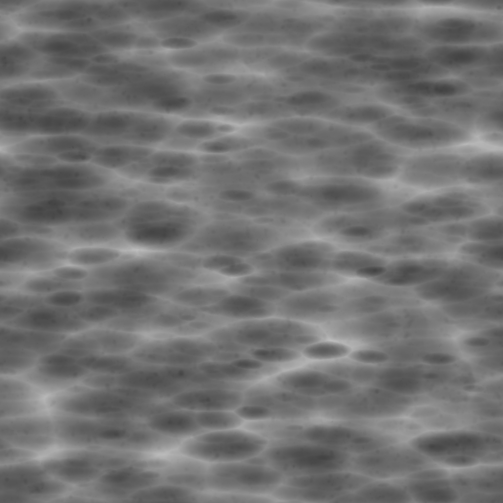

### DirectX11 - Height Mapping

자 우리는 Normal Mapping 을 해서, 빛의 영향을 받게끔, 조금더 자연스러운 벽돌을 봤었다. 다른 질감중에 바로 높이에 따른 Texture 를 Mapping 하는것을 Height Mapping 이라고 한다. 뭔가? 울퉁불퉁한 그런 굴곡이 있는 Texture 의 표현을 어떻게 할까가? 이 Post 에서 봐야할 것같다. Height Mapping 은 주로 Vertex Shader 에서 진행한다. 생각을 해보자면, 높이에따른 즉 Vertex 의 위치의 높이값? 이라는것이 달라지기 때문에 Vertex Shader 에서 정점을 움직인 이후에, 이제 그리면 된다. 더 정확하게는, Vertex Shader 의 정점을 어디로? 움직이냐면 바로 Normal 의 방향으로 쭉 당기면 된다.

HeightMap 대신에 Displacement 라고도 칭한다. [참고]

### Result

### DirectX11 - Ambient Occlusion

쉽게 설명하자면, Ambient Lighting 이 있다고 가정했을때, 주변에 어떠한 Geometry 에 의해서 얼마만큼 가려져 있는지를 설명하는것이라고 볼수 있다. 뭔가 자연스럽게 Gradation Effect 를 주기 때문에, Scene 을 더더욱 입체적으로 그릴수 있다고 말을 할수 있겠다. 즉 색깔은 무채색이고, 빛이 덜들어간다는 소리이다. 

근데 생각을 해보면, 주변의 Geometry 를 이용해야한다는 점에서 굉장히 무거운 연산작업이라고 추측을 할수 있는데, 특히나 실시간 Rendering 을 한다고 하면 계산 하기가 어렵기에 Unreal Engine 이나 Unity 는 따로 미리 Texture 를 구워(Baking) 해놓고 사용한다. 즉 어떤 물체에 가리거나, 어떤 좁은 공간에대해서 표현을 할수 있는게 바로 Ambient Occlusion 이라고 하고, Rasterization Stage 에서는 결국 삼각형을 따로따로 그리니 연관관계가 없기에, 애초에 빛(광자)가 들어오기 힘든 부분들을 Texture 로 표현 한게 Ambient Occlusion Texture 말을 할수 있겠다.

### Resource
* [Ambient Occlusion - WIKI](https://en.wikipedia.org/wiki/Ambient_occlusion)