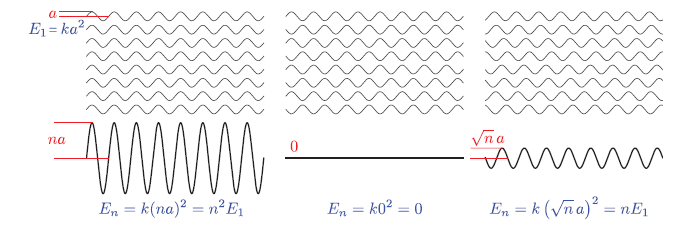

## Physically Based Rendering (Lighting & Shading)

Okay, this is a very difficult topics I could say from the point of muggles. (when I say muggle, it's not like dumb people, just people who don't know the background of physical rendering which include me). But we can simply narrow down about what we know. In order to fully understand physical based rendering, we need to understand how light behaves in real world. Basically we need to go over the physics in Light.

### Physics

First of all, the one of the principle of physics is energy conservation. What !? where this idea coming from? When we think of the physics of light. Light waves carry the energy, basically saying that the density of the energy flow is equal to the product of the magnitudes of the electric and magnetic field. 

  

Rendering, we care about the average energy flow over time, which is proportional to the squared wave amplitude, and this "average energy flow density" is also called irradiance. Summation / Subtraction of wave can be described as constructive and destructive interference, and also called coherent addition. Since those are not the most often case. If the waves are mutually incoherent, which means there wave's phase can be random. We can simply say that they can interfere each other resulting almost "zero" amplitude or "some amplitude" in different location. This basically tells us that the energy gained via constructive interference and the energy lost via destructive interference always cancel out, and the energy is conserved.

  

Above information, in rendering scenario, using the average energy flow density is plausible, Then we can talk about the light interaction with molecule. Basically, when light hits the matter, then it separates the positive and negative charges, forms dipoles, then this matter itself radiates the energy back out as form of heat or form of new waves (scattered light) in new direction. So far, in reality, it is hard to simulate all these behavior. 

While these molecular-level interaction are fascinating from a physics perspective, and implementing this simulation in rendering is computative expensive. When implementing rendering system, we don't work with individual molecules - instead, we deal with surfaces composed of countlesss molecules interacting together. This collecttive behavior creates some interesting effects:

1. Group Behavior: Lights interactions with a cluster of molecule behave differently than with single molecules in isolation.
2. Wave Coherence: When light waves scatter from molecules that are close together:
   - They maintain a coherent relationship since they come from the same source wave.
   - This leads to interference patterns between the scattered wave between scattered waves.
   - These interference patterns significantly affect the final appearance material

To make these complex light interactions more manageable for real-time rendering, we can leverage fundamental principles from optics. Our foundation begins with the concept of homogeneous media - materials that maintain uniform optical properties throughout their volume.

The key characteristic of a homogeneous medium is its Index of Refraction (IoR), a property familiar from basic physics. There are two numbers associated with IOR, one part is to describe the speed of light through the medium, and the other part is to describe how much light are absorbed in medium. But simply put how it bends when crossing boundaries between different materials like we learn in science class. 

Then, we assume that there are many molecules or isolated molecules inside of, what we called "Scattering Particle". These bascially behave similarly as what we mentioned earlier. The right below image basically shows overall combination of absoprtion and scattering property. There are different types of scattering "Rayleigh Scattering" for atmospheric particles, and "Tryndall Scattering" in particle embedded in solids. Also, mie scattering when particle size goes beyond the wavelength. 

  

In physically-based rendering, we need to design algorithms that simulate how light realistically interacts with surfaces—whether it’s glossy glass, brushed metal, or frosted plastic. When light hits a surface, two major factors influence the outcome:
- The substances on either side of the surface
- The surface geometry

The first factor—the materials on either side of the boundary—is governed by the index of refraction (IoR). When a light ray encounters a boundary between two media (e.g., air and glass), it bends according to Snell’s Law:

>> sin(θt) = (n1 / n2) * sin(θi)

Here, n1 and n2 are the indices of refraction for the "outside" and "inside" media, respectively. Assuming the surface is perfectly flat, Snell’s Law predicts the direction of the refracted ray. This kind of behavior explains how materials like glass or water bend light in a physically accurate way.

According to video, I've watched they talk about more geometry of the surface, so we're going to talk about that! In terms of surface, we can mention nanogeometry in terms of atomic level (smaller than wavelength). What we see the image below is basically diffraction in atomic level creating waves by the Huygens Law.

  

When light hits the surface, there are two parts, reflection & refraction. Depending on the surface normal, the direction for reflection can be varied as well as refraction. Such as shown below.

  

The great example would be the shown below. Even though we see and percieve the surface as "Similar" shape, but in microscopic level, these have different reflection and refraction. The one above seems to be very reflective, which means the roughness is relatively lower than below, and the other seeems to be relatively blurred.

  

The behavior of refracted light depends heavily on the type of material the medium is made of. Broadly, we can divide materials into two categories:
- Metals (Conductors)
- Dielectrics (Insulators)

* Metals (Conductors)
In metals, the refracted light doesn't travel far into the material. Instead, it is quickly absorbed due to the presence of free electrons. These electrons interact with the incoming light, converting much of the refracted energy into heat or re-emitting it as reflected light. This is why metals are highly reflective and often appear shiny, but not transparent.

* Dielectrics (Insulators)
In contrast, dielectrics—like water, glass, or plastic—allow light to enter and travel through the medium. However, as light moves through a dielectric, part of its energy is absorbed or scattered inside the material. For example, if you shine a light above a cup of water, you’ll notice that:

Some of the light reflects off the surface, creating visible highlights. The rest penetrates into the material, where it becomes attenuated due to absorption and scattering within the medium. This process is responsible for effects like subsurface scattering and volumetric absorption, which are essential for rendering realistic materials such as skin, wax, milk, or water.

A common real-world example is holding your finger up to sunlight. You'll notice a glowing red edge around the silhouette of your finger—this is light scattering beneath the surface of the skin and exiting at different points. It demonstrates how light can enter a translucent material, bounce around internally, and emerge with a diffused, softened appearance. All these are called subsurface scattering.

  

If the area below picture are smaller than one pixel, then we can treat them as a local point, treating like one particle as shown on next image. 

  

  

### Mathematics
Radiance is a physical quantity that measures the intensity of light traveling along a specific direction — essentially, how much light energy is flowing through a point in a specific direction. In rendering, this typically corresponds to the light that reaches the camera through a pixel along a ray.

Radiance is spectrally varying, meaning it can be described across different wavelengths (or as RGB in discrete form).

The unit of radiance is: W / (m²·sr)

### BRDF
The Bidirectional Reflectance Distribution Function (BRDF) defines how light is reflected at an opaque surface. The BRDF is defined as the ratio of the reflected radiance in a specific outgoing direction to the incident irradiance from a specific incoming direction, for given azimuth and zenith angles of both incidence and reflection.

Intuitively, the way a surface appears depends on two things:
- The direction of incoming light (where the light is shining from)
- The viewing direction (where the camera or eye is positioned)

  

l represent the light direction, and v as a view direction. If you take a closer look on image below, we can actually calculate how much lights are coming through that patch into one points. 

  

Now, we can truly define the what is really the definition of BRDF. Suppose we are given an incoming light direction ωᵢ (a unit vector pointing toward the surface), and an outgoing/viewing direction: ωₒ (a unit vector pointing away from the surface, typically toward the camera). BRDF can be defined as the ratio of the quantity of relfected light in direction ωₒ, to the amount of light that reaches the surface from direction ωᵢ. Which means, the quqntity of light reflected from the surface in direction ωₒ. Lo, and the amount of light arriving from direction ωᵢ, Ei. 

  

$$ 
f_r(\omega_i, \omega_o) = \frac{dL_o(\omega_o)}{dE_i(\omega_i)}
$$

The BRDF is the ratio of the differential outgoing radiance 
𝑑𝐿𝑜(𝜔𝑜) in direction 𝜔𝑜 to the differential incoming irradiance 𝑑𝐸𝑖 from direction 𝜔𝑖. 

There are two classes of BRDFs and two important properties. BRDFs can be classified into two classes, *isotropic* BRDFs and *anistorpics* BRDFs. The two important properties of BRDFs are *reciprocity* and *conservation of energy*. Reciprocity states that the BRDF remains unchanged when the directions of incoming and outgoing light are swapped. In other words, the ratio of reflected radiance in one direction to the irradiance from another direction is the same, regardless of whether the directions are reversed:

  

$$
\text{BRDF}_{\lambda}(\theta_i, \phi_i, \theta_o, \phi_o) = \text{BRDF}_{\lambda}(\theta_o, \phi_o, \theta_i, \phi_i)
$$

Conservation of energy ensures that the total reflected energy from a surface cannot exceed the total incoming energy. That is, the BRDF must not allow more light to be reflected than is received, ensuring energy is preserved in the system as shown below

  

### Reflectance Equation
All of the things we cover now reveal as one equation called reflectance equation. Outgoing Radiance from a point equals to the integral of incoming radiance times BRDF times the sign Factor over the hemisphere of incoming directions. Note that it is component-wise RGB multiplication. In detail, Lo is basically what we want to calculate in the pixel shader. Li(l) is the amount of incoming light (RGB). ndotl is the factor that increase and decrease the light power. f(l,v) is the BRDF term, then we integral all that terms. Unit-wise, Lo(V) is RGB, f(l,v) is RGB, Li(l) is also RGB with scalar. So output must be RGB.

  

### Microfacet Theory
To achieve a visually immersive experience, both the diffuse and specular components of light reflection are important. Let's begin by examining the specular term. 

  

Microfacet Theory provides a framework for modeling surface reflection on rough or non-optically-flat surfaces. Rather than treating a surface as perfectly smooth, it assumes the surface is composed of many tiny, flat facets—each acting like a perfect mirror. Depending on the surfaces, BRDFs output term can be varied.

  

By zooming in on a small surface region, we approximate it as a collection of microscopic facets, each with its own orientation. At any given point, light may be reflected or refracted depending on the orientation of the microfacets. This interpretation allows us to derive realistic BRDFs that account for the surface roughness and the distribution of microfacet normals.

The half vector is simply the direction that the microfacets must be aligned with in order to reflect light from the light direction L into the view direction V.

In other words, the proportion of light that is reflected from L to V depends on how many microfacets have their surface normals aligned with this half vector. These microfacets act like tiny mirrors that perfectly reflect light when their normals match the half vector. The more microfacets oriented in the direction of H, the stronger the specular reflection in the view direction V. This is basically halfway vector calculation in phong model.

  

Depending on the surface geometry, not all microfacets aligned with the half vector can contribute to reflection. For example, if a nearby facet is taller and blocks the incoming light from reaching a microfacet, this is known as shadowing. On the other hand, if the reflected light from a microfacet is blocked in the direction of the viewer, this is referred to as masking. In reality, the some light can reach into shadow area, but Micro BRDFs ignore all that. 

  

### Microfacet Specular BRDF

This is the general form of Microfacet Specular BRDF. 

  

---
**F(l,h) is Fresenel Reflectance.** This basically show depending on the view direction(incident angle) and surface normal, and the RoI. The vale of frasnel can be varied as shown below.

  

Since the barely change parts is kind of like a starting point (parameter), so that we can tweak them from there. The image below shows each fresnel value for each metal and dielectric.

  

  

The speaker mentioned that Schlick Approximiation is good enough to implement.

  

---
**The normal distribution D(h)**, describes how densely microfacet normals are aligned with a given half-vector direction h. In simple terms, it tells us how many microfacets are oriented in a way that would reflect light from the incoming direction L toward the outgoing view direction V. Since perfect specular reflection happens only when the microfacet normal matches the half-vector (the vector halfway between light direction L and view direction V), D(h) essentially controls **the shape and sharpness of the specular highlight.** You can actually see all those functions in [Cook-Torrance](https://graphicscompendium.com/references/cook-torrance)

---
Finally, the geometry function, often denoted as G(l, v, h), accounts for shadowing and masking effects caused by the microgeometry of a surface. Shadowing occurs when incoming light (from direction l) is blocked by parts of the surface before it can reach a microfacet. Masking happens when the reflected light (toward the view direction v) is blocked by other parts of the surface, preventing it from escaping.

So, G(l, v, h) tells us how much of the microfacet reflection is actually visible, based on how the surface self-occludes due to its roughness.

The image below is commonly used, smith function, to illustrate the concept of the geometry function, as it has been both mathematically and physically validated:

  

---
**Putting It All Together**
- D(h) (Normal Distribution Function): Describes how many microfacets are oriented in the direction of the half-vector h, which is the direction needed to reflect light from L to V. It essentially tells us how aligned the surface microfacets are with the ideal reflection direction.

- F (Fresnel Term): Tells us how reflective each of those microfacets are, depending on the viewing angle and material properties.

- G(l, v, h) (Geometry Function): Tells us how many of those microfacets are visible and not occluded, meaning they can actually participate in reflecting light from the light direction L to the view direction

---
In physically based rendering (PBR), we often split surface reflection into diffuse and specular components. The diffuse term accounts for the light that enters a surface, scatters beneath it, and then exits in a different direction.

  

Lambertian Diffuse Model assumes light is scattered equally in all directions, and the surface looks the same from all viewing angles. Fairly simple and works well for matte surfaces like a paper. 

Diffuse BRDF (Lambert): `𝑓𝑑 = C𝑑 / 𝜋`, where the C𝑑 is the diffuse color. In real world, the rougher surfaces doen't scatter light perfectly evenly. For example, skin, cloth have subsurface scattering and edge darkening. A specular reflection becomes sharper, the diffuse should became broader (vice versa). Thus Lambertian diffuse isn't always phsycially accurate when the rough microfacet is applied. 

The speaker also mentioned that **Diffuse Roughness = Specular Roughness**. It's because of the assumption. "If the surface is rough for specular, it must also be rough for diffuse" but the assumption is wrong because specular roughness comes from **surface microgeometry**, and diffuse roughness is caused by the **subsurface scattering, material properties, and light diffuion inside the medium.**.

## Results
Of course, this is a summary based on content from SIGGRAPH and various other sources, so it might not be perfect or comprehensive. However, I thought it would be helpful for the understanding stage, so I put together a blog post to organize the information.

## Resource
* [Presentation - Physics and Math of Shading](chrome-extension://efaidnbmnnnibpcajpcglclefindmkaj/https://blog.selfshadow.com/publications/s2015-shading-course/hoffman/s2015_pbs_physics_math_slides.pdf)
* [Youtube - Physics and Math of Shading](https://www.youtube.com/watch?v=j-A0mwsJRmk&ab_channel=ACMSIGGRAPH)
* [Moving Frostbite to Physically based rendering](https://seblagarde.wordpress.com/2015/07/14/siggraph-2014-moving-frostbite-to-physically-based-rendering/)
* [BRDF](chrome-extension://efaidnbmnnnibpcajpcglclefindmkaj/https://www.cs.princeton.edu/courses/archive/fall06/cos526/tmp/wynn.pdf)
* [A Reflectance Model for Computer Graphics - Cook Torrance](chrome-extension://efaidnbmnnnibpcajpcglclefindmkaj/https://www.graphics.cornell.edu/~westin/consortium-home/cook-tog.pdf)