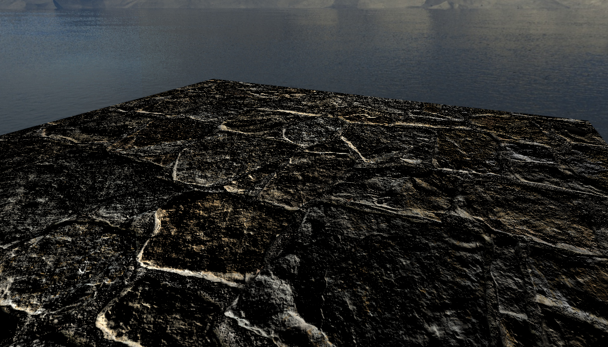

### Parallax Occlusion Mapping

The purpose was to make terrain in my Game Engine. In order to make terrain, you need to multiply the height scale based on Height Mapping for each model mesh in the vertex shader. However, one of my instincts was basically telling me **"Would it be efficient to use height mapping if there are too many vertices, and transform those vertices according to displacement texture to show realism?"** So, I've found that there is something called "Parallax Mapping", "Parallax Steep Mapping", and "Parallax Occlusion Mapping". These methods originate from Per-Pixel Displacement Mapping. These methods give a sense of depth or illusion, and this approximation technique can be done in the fragment shader. Let's take a look at Parallax Mapping first, then move on to Parallax Occlusion Mapping because steep mapping is an addition of steps - other than that, it's similar to Parallax Mapping.

### Idea

The idea is to think differently about the texture coordinate, considering that the fragment's surface is higher or lower than it actually is. So the UV coordinate is literally above or below the actual vertices from the vertex shader. If you take a look at the image below, what we want to find is Point B, rather than A. But A is what we actually see (in fragment space). Then how would you calculate Point B? You can think of it as similar to ray casting. Since you have the view direction, you can figure out the P vector by using the height (displacement) map, then we can approximate the displacement to Point B. But it won't always work - I will explain this in the limitations.

In terms of implementation, one important thing to note is to send the normal and tangent vectors. For each vertex, depending on where the surface is directing, you can set normal and tangent, and pass these through the render pass. In detail, you should calculate the Parallax mapping on tangent space, which means you need to transform the view direction to tangent space multiplying TBN matrix.

Okay! Let's look at the calculation in detail. We think that we are looking at the surface (at height 0.0), and the camera is pointing at A, but we want to figure out Point B. We can calculate the vector P from Point A using the view direction. The key insight is that we use the height value H(A) sampled from the height map at point A to determine how far to offset our texture coordinates along the projected view ray. Then we sample through along the Vector P with the length H(A) to A. Then we can get the end of Point from Vector P and corresponding H(P) from height map. Like i said this is approximation. In order to make it more accurate, you can certainly use steep method where it takes multiple sample by dividing total depth range into multiple layers. The details are shown in this [link](https://learnopengl.com/Advanced-Lighting/Parallax-Mapping). 

Finally, one more step is needed after steep parallax occlusion mapping. For each step we found T3 and T2, then we sample H(T3) and H(T2). Then we interpolatate those two points, treating like flat surface, if the depth is incorrect.

### Results

### Limitation

There are some limitation or usage I can mention by doing some experiments. The big issues is an aliasing exist when height map of that texture dramatically changes over a surface. You can test on this [repo](https://github.com/sjang1594/GameEngineWDirectX11). I guess that's why the usecase might be cave, stairs, bricks, some texture that have consistent height values. I can mentioned that each methods have a "bad effect"; it looks distorted in some angles for Parallax Mapping, and you can see the steep if the sample rate is very low for Steep Parallax Mapping. But if we know that why these downside appears to be true when you implementing, it all makes sense.

### Conclusion

Interestingly, we found the way to show the depth rather creating a lot of triangles. Of course the goal was to implement the terrain (height + tesselation), but it was good to develop new things!

### Resource
* [Per-Pixel Displacement Mapping](https://developer.nvidia.com/gpugems/gpugems2/part-i-geometric-complexity/chapter-8-pixel-displacement-mapping-distance-functions)
* [Parallax Occlusion](https://www.d3dcoder.net/Data/Resources/ParallaxOcclusion.pdf)
* [Parallax Occlusion - DX11](https://www.d3dcoder.net/Data/Resources/ParallaxOcclusion.pdf)
* [Bump, Normal, Displacement, and Parallax Mapping](https://www.youtube.com/watch?v=cM7RjEtZGHw&list=PLplnkTzzqsZS3R5DjmCQsqupu43oS9CFN&index=19&t=2263s&ab_channel=CemYuksel)