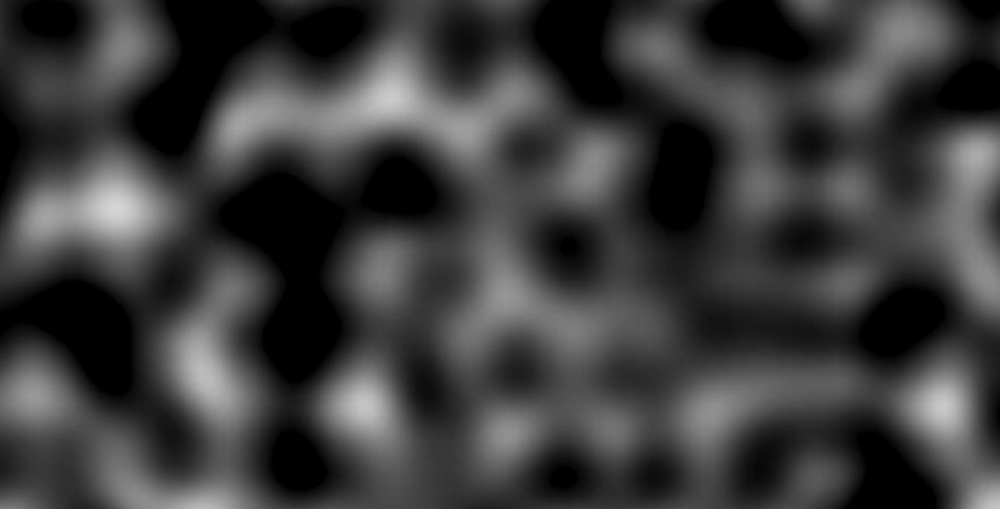

## Motivation: Noise

Noise is just random value, but in computer graphics, we use noise for various purposes, such as procedural tree, foilage, terrain, clouds, water, and many more. 

Let's look at the image below, these are examples of noise texture that we can use in computer graphics. It can look like static noise, but actually, these are Perlin Noise, which is a type of gradient noise developed by Ken Perlin in 1983. Obviously, there is value noise, and simplex noise, but Perlin Noise is widely used in computer graphics due to its smoothness and natural appearance.

### Perlin Noise

### Resource 
- [Perline Noise: Part2](https://web.archive.org/web/20180616011332/http://www.scratchapixel.com/lessons/procedural-generation-virtual-worlds%20/perlin-noise-part-2)
- [What is Perlin Noise](https://www.youtube.com/watch?v=7fd331zsie0)