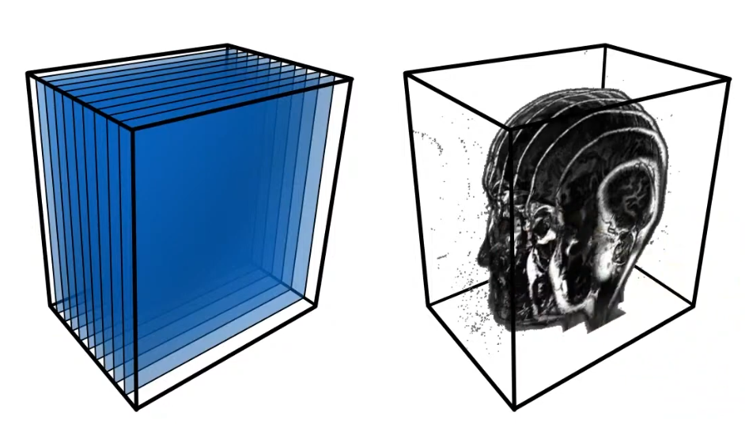
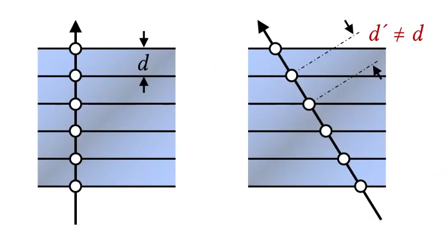
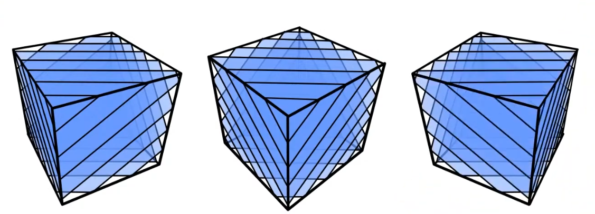
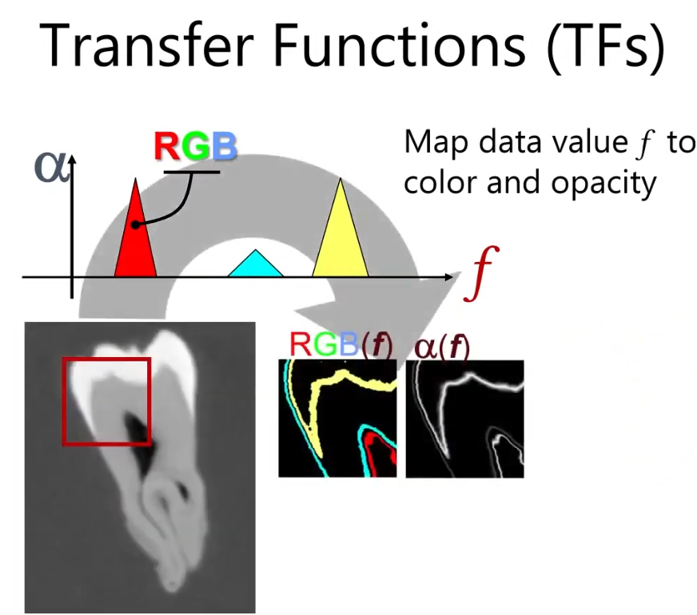
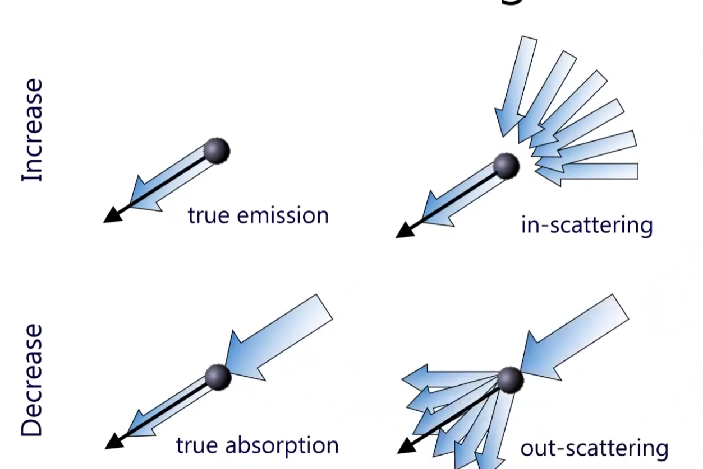

### Motivation

Volume rendering is a technique used to visualize 3D volumetric data, such as medical scans (CT, MRI), scientific simulations, and fluid dynamics. Unlike traditional surface rendering, which only displays the surfaces of objects, volume rendering allows us to see the internal structures and variations within a volume.

### Volume Rendering Techniques.

The simple way to do this is called "Volume Rendering with Slicing". It is similar to alpha blending, where we take multiple 2D slices of the volume data and blend them together to create a 3D representation. Each slice is rendered with a certain opacity, allowing us to see through the volume and observe its internal features.

  

Then this data is typically stored in GPU as a 3D Texture, where each voxel (3D pixel) contains information such as color and opacity. During rendering(Back to Front), we **sample the 3D texture along rays that pass through the volume, accumulating color and opacity values to produce the final image.**. But the limitation is we can only see the 3D-like data when we look at it from certain angles, otherwise it looks like so many slices stacked together, and this statement will be shown below. (Rotating the camera, the distance between slices will be different, so it looks bad from certain angles = this means sampling distrubution for view direction changes.) But have you thought about why the distance matter? because if you have dense, which means that I have so many samples(slices) to render, then it will look good from any angles. But if you have sparse samples, then it will look bad from certain angles. So, this is the bottleneck of slicing-based volume rendering. 

  

To resolve this issue, we can generate textures dynamically based on the view direction, which is called "View-Dependent Texture Generation". This technique involves creating textures that change depending on the camera's position and orientation. By doing so, we can ensure that the volume appears consistent and visually appealing from all angles, even with a limited number of samples. like the image shown below. (you can do this in geometry shader and make the different shape of slices based on the view direction, but it is still not good enough, or custom clipping plane based on the view direction)

  

or, you can render all this in blending returning zero alpha value.

### Transfer Function
Now, let's talk about Transfer Function. This basically describes how we map the raw volumetric data (like density or intensity values) for visualization. The image below shows an example of a transfer function. So picking the transfer function, we can visualize what we want to see in the volume data. Then we can visualize whole image by accumulating these values. (Shading, Compositing...). How to define the transfer function is up to you. 

  

### Volumetric Scattering

If the one particle is floating around, and light hits this particle, then this particle has true emission towards the view direction. (Basically I am looking at this emission) or if the particle doesn't have the emission, but other scattering light towards to this one particle (in-scattering) in side of the volume. There are multiples of volumetric scattering, as shown below.

  

So, depending on the media type, we can have different volumetric scattering effects. For example, in a foggy environment, light scatters multiple times before reaching the viewer, creating a soft and diffused appearance. In contrast, in a clear medium like air, light travels more directly, resulting in sharper and more defined visuals. The visibility in a volume can be decaying function like I(s) = I0 * e^(-σt * s), where the absoprtion along the ray segment s0 - s, and the equation would be I(s) = I(s0) * e^(-t(s0, s0)). Then the t is defined as extinction, and t(s1, s2) = ∫ k(s) ds from s1 to s2 and k represents absorption coefficient. 

If at one point, there is s_tilde that it's emtting light towards the view direction, then this will be added to I(s) as shown above. So, to sum up equation would be I(s) = I(s0) * e^(-t(s0, s)) + ∫ e^(-t(s_tilde, s)) * k_a(s_tilde)  ds_tilde from s0 to s. where k_a is absorption coefficient.

Let's look at the image below!

The 1) shows the how much light blocks along the ray segment. We won't be able to see the light source (L^s), but by this transmittance function T(x, x_surface) => Basically tells us how much light is getting through from point x_s to x. Then the 2) integral of how much(percentage) we can see along the z direction, then if we go up to surface level, that becomes the T(x, x_surface). Since it is possible that the inside of the volume can emit the lights, scatter, and absorb, we need to evaluate in this volume. T(x,z) will be absorbed, sigma_t(z) is the materials property. 

Then this L_m basically tells us how much the part of material is emitting the light towards to the view direction, and the part of light is scattered towards to the view direction. So, the final rendering equation will be like this above.

### Volume Tracing
As the ray traverses through the volume, we sample points along the ray at regular intervals. This is so called ray marching. This is expensive operation. Then, how do we handle it efficiently? There is a way called, Woodcook tracking / delta tracking. This method picks the random point along the ray, then generate another random position, and so on. What we can do is we create a fictitious medium with the highest desnsity in the volume. Then we can sample whether they are fictitious particle or real particle. If it is fictitious particle, then we just ignore it and keep going. If it is real particle, then we compute the scattering, absorption, and emission at that point. By doing this, we can avoid sampling in low-density regions where there are few interactions, thus speeding up the rendering process.

### Volumetric Shadows
When rendering volumes, we also need to consider shadows. Just like in surface rendering, where objects can cast shadows on each other, volumes can also block light and create shadows within themselves. To compute volumetric shadows, we can use techniques like ray marching combined with shadow mapping or shadow volumes. This involves tracing rays from the light source through the volume to determine how much light reaches each point, taking into account any occlusions caused by denser regions of the volume. You can use Opacity Shadow Maps for this.

### Practical Implemetation tips is Available on My Github.
* Single Scattering / Multi Scattering

### Resources
- [Volume Rendering Techniques GPU Gems](https://developer.nvidia.com/gpugems/gpugems/part-vi-beyond-triangles/chapter-39-volume-rendering-techniques)
- [Interactive Graphics: 25 - Volume Rendering](https://www.youtube.com/watch?v=y4KdxaMC69w&t=291s)