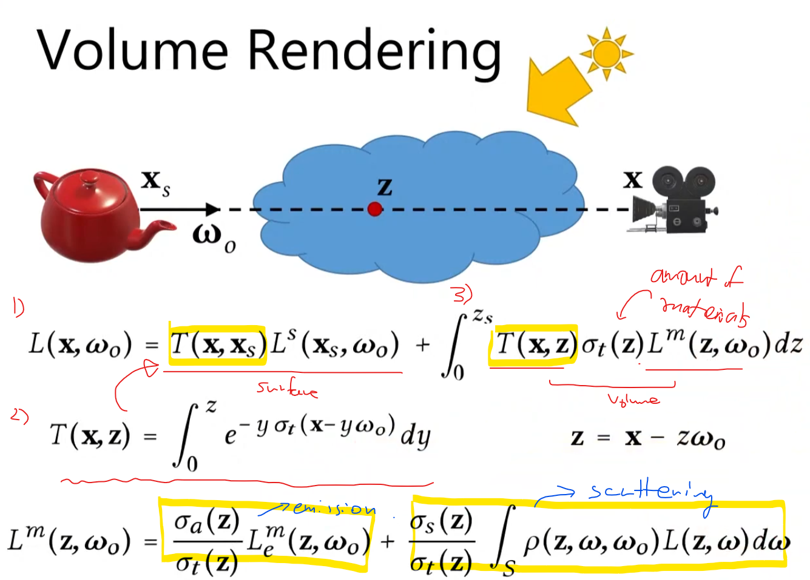
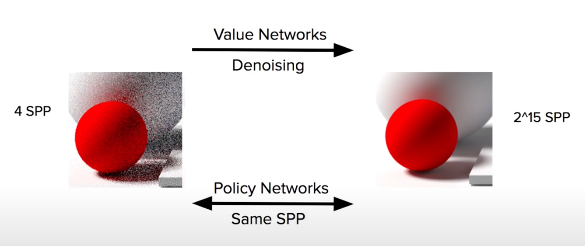

## Motivation
Firstly, Let's look at the diagram below, Forward Rendering (in this case specific, this is not forward rendering/deferrered rendering context, this just shows the computer graphics and computer vision=inverse rendering) is what we learn from Computer Graphics, such as PBR. Inverse Rendering application, for instance, might be 3D reconstruction and motion capture, etc. 

  

### Conventional Method

* 
* 

* 

* Monte Carlo Sampling is very expensive

## Resource 
* [Youtube - MIT](https://www.youtube.com/watch?v=BCZ56MU-KhQ&ab_channel=AlexanderAmini)
* [What is Neural Rendering - Medium](https://hu-po.medium.com/what-is-neural-rendering-e25371afc771)
* [Advances in Neural Rendering - ]
dfasdf