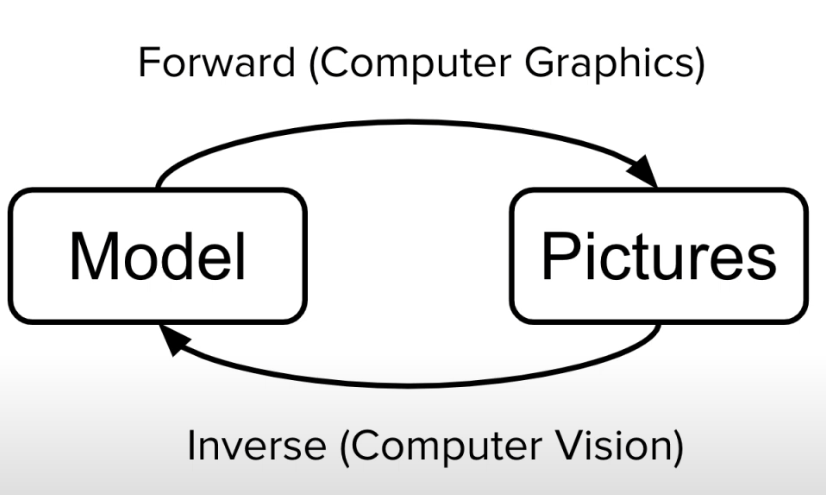

## Motivation
Firstly, Let's look at the diagram below, Forward Rendering (in this case specific, this is not forward rendering/deferrered rendering context, this just shows the computer graphics and computer vision=inverse rendering) is what we learn from Computer Graphics, such as PBR. Inverse Rendering application, for instance, might be 3D reconstruction and motion capture, etc. 

  

### Conventional Method

The Conventional Method is basically the rendering equation: the integral of the incident radiance at a certain surface point. If the red rectangle is the ligth source, we're basically casting the rays through the image plane, then we hit the certain surface point, and that points is where the light comes from all possible directions. The rendering equation at point p, the outgoing radiance Lo(p, wo) is the integral of the incoming radiance Li(p, wi) from all directions wi over the hemisphere, multiplied by the BRDF f_r(p, wi, wo) and the cosine term (wi · n).

$$
L_o(p, \omega_o) = \int_{\Omega} 
f_r(p, \omega_i, \omega_o)\,
L_i(p, \omega_i)\,
(n \cdot \omega_i)\,
d\omega_i
$$

  

Then, in order to approximate this integral above, we need to perform mult-sampling over all directions on the hemisphere, which is called Monte Carlo Integration. We will talk about this later.

  

The image above is the BRDF example, where f_r(p, wi, wo) is the BRDF at point p, wi is the incoming light direction, wo is the outgoing view direction. The BRDF defines how light is reflected at an opaque surface. Depending on the material properties, the BRDF can vary significantly, Matte surface has a sampling in all direction, while the glossy surface has a sampling in a specific direction, and the rough surface has a very scattered sampling. Therefore, the BRDF tells you the weight of what percentage of light is reflected in which direction.

If we sample the rendering equation above, and approximate the Monte Carlo Integration, we can get the following equation:
$$
L_o(p, \omega_o) \approx \frac{1}{N} \sum_{i=1}^{N}
\frac{f_r(p, \omega_i, \omega_o)\, 
L_i(p, \omega_i)\,
(n \cdot \omega_i)}{p(\omega_i)}
$$

Where N is the number of samples, and p(wi) is the probability density function (PDF) of sampling direction wi. But, as we might know, the Monte Carlo Integration is very expensive, because we need to sample a lot of rays in order to get a good approximation of the integral.

  

  

## Resource 
* [Youtube - MIT](https://www.youtube.com/watch?v=BCZ56MU-KhQ&ab_channel=AlexanderAm1594ini)
* [What is Neural Rendering - Medium](https://hu-po.medium.com/what-is-neural-rendering-e25371afc771)
* [Advances in Neural Rendering]()