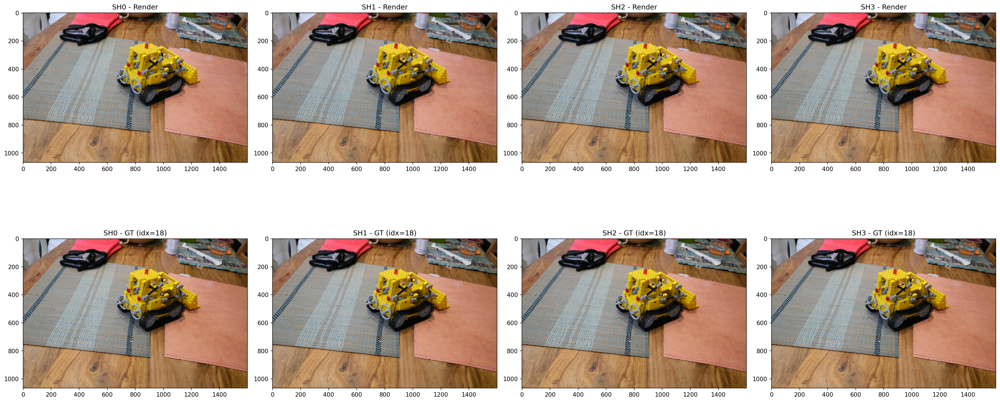
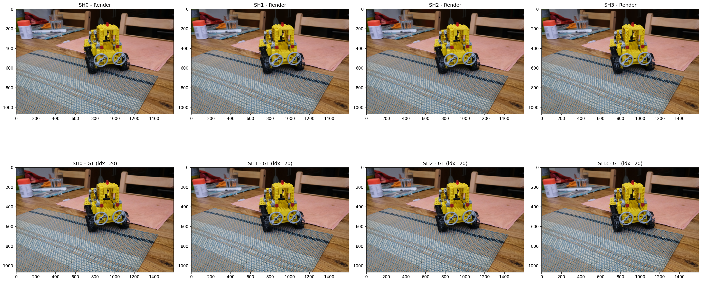
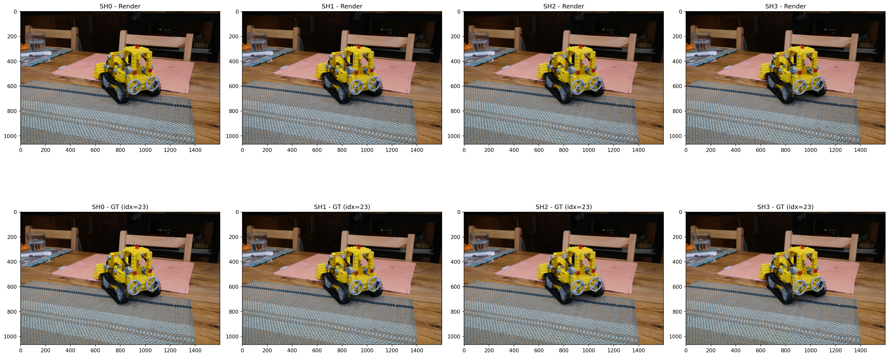
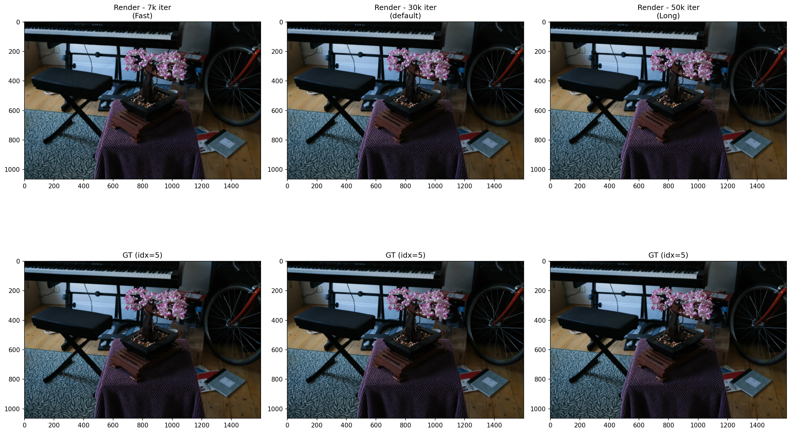
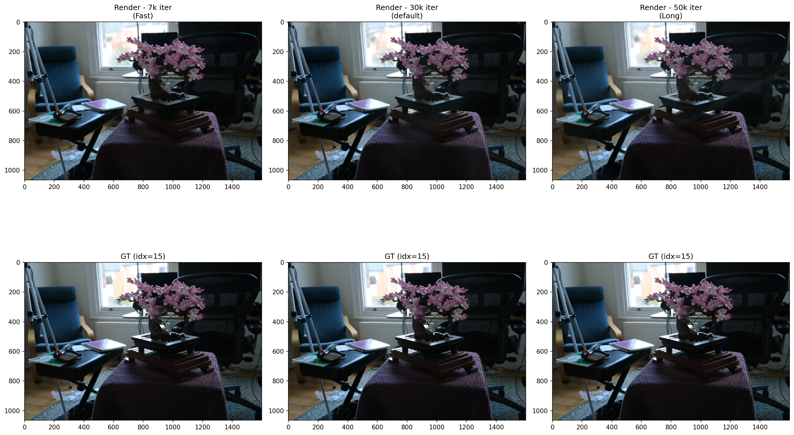
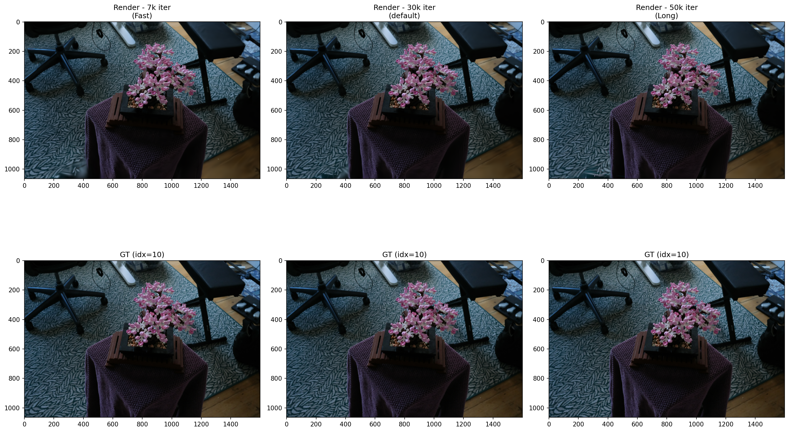

# 3D Gaussian Splatting Experiments

## Motivation
In the previous post, we looked at the history of Gaussian Splatting. Now, let's look at some experiments with 3D Gaussian Splatting and validation of the results. Also, I want to learn this as kinda of like top-down approach. So, I will start with running the 3DGS pipeline on a custom dataset and then analyze the results. The goal is to understand how the pipeline works end-to-end and to validate that it produces reasonable results on a real-world scene.

## Objective 
It was to run the 3DGS implementation en-to-end on a custom dataset. (self-capmtured indoor scene) for the first time and validate the results.

- Experience the **full pipeline**: COLMAP SfM → 3DGS training → point cloud output → viewer visualization
- Verify that training converges and produces visually reasonable results on a custom scene
- Obtain baseline quantitative metrics (PSNR / SSIM / LPIPS) for future comparison

### First Run Gaussian Splatting.

The **meta** for first time running the 3DGS pipeline on playroom dataset. (225 Images). My GPU was NVIDIA GeFORCE RTX 2070 Super (8GB VRAM) and the training took about 2 days to complete. The [viewer](https://antimatter15.com/splat/) were used to visualize the output point cloud.

The config was as follows:

```bash
Namespace(
  data_device='cuda',
  eval=False,            # ← BUG: no train/test split → metrics are NaN
  images='images',
  resolution=-1,         # original resolution
  sh_degree=3,           # Spherical Harmonics degree
  source_path='C:\\Users\\skcjf\\project\\gaussian-splatting\\data\\my_scene\\playroom',
  model_path='./output/858ba1ea-e',
  train_test_exp=False,
  white_background=False
)
```

### Results
- Training time: ~2 days (RTX 2070 Super)
- Iterations: 30,000 (checkpoints at 7,000 and 30,000)
- Output: `gaussian-splatting\output\858ba1ea-e\point_cloud\iteration_30000`

Then I did not get the results that I expected because I did not add --eval flag to the config, so I got NaN for all the metrics. But the point cloud output looked reasonable and the viewer visualization showed a decent reconstruction of the scene. The PSNR, SSIM, and LPIPS metrics were not computed due to the missing evaluation flag, so I will need to rerun with --eval to get those quantitative results.


Iteration Comparison in Point Cloud Output:

| Iteration | 7K | 30K |
| --- | --- | --- |
|     |  |  |

- Front-facing view (looking into the room): 7k and 30k are nearly identical
- Looking up at the ceiling: visible holes/gaps → likely insufficient training views from upward angles, or densification did not cover that region adequately


### Problem Encountered:
- Output folder names are random hashes (e.g. `858ba1ea-e`), so locating the actual results was initially confusing
- No build errors; used a separate Python virtual environment
- Training took ~2 days on RTX 2070 Super, which saturated the GPU entirely (couldn't even run YouTube simultaneously)
- 4 total attempts, 3 failed/aborted before the successful run

## Second Run with Evaluation

### Objective
Run 3DGS on a standard benchmark dataset with `--eval` enabled to obtain **real quantitative metrics** (PSNR/SSIM/LPIPS) for the first time. This fixes the [[3DGS First Run]] problem where `eval=False` produced NaN metrics.
- Validate that the 3DGS pipeline produces results consistent with the original paper
- Establish a quantitative baseline for future experiments (hyperparameter tuning, ablation)
- Learn the full evaluation pipeline: train → render → metrics

I choose to use Google Colab for this run to leverage a more powerful GPU (A100 40GB with High RAN) and faster training times. Then, I ran multiple data (tandt_db /  Mip-NeRF 360 dataset) as well to validate the results from paper.

The config was as follows:

```bash
Namespace(
  sh_degree=3,
  source_path='/content/gaussian-splatting/data/tandt/train',
  model_path='/content/drive/MyDrive/3dgs_output/train',  # NOTE: mislabeled — actual scene is "train"
  images='images',
  resolution=-1,         # original resolution
  white_background=False,
  train_test_exp=False,
  data_device='cuda',
  eval=True              # FIXED from First Run — train/test split enabled
)
```

### Results

| Metric     | Value                                  |
| ---------- | -------------------------------------- |
| PSNR       | **22.12**                              |
| SSIM       | **0.822**                              |
| LPIPS      | **0.196**                              |
| Gaussians  | **1,095,714**                          |
| Iterations | 30,000 (checkpoints at 7,000 / 30,000) |
| GPU        | A100 40GB (Google Colab)               |

These were the metrics using for the dataset: tandt_db(**train**). The PSNR and SSIM values are consistent with the original 3DGS paper, which reported PSNR around 22-23 and SSIM around 0.8 for similar scenes. The LPIPS value of 0.196 also indicates a reasonably good perceptual quality compared to the ground truth images. The number of Gaussians (1,095,714) is also in line with expectations for a scene of this complexity.

### Problems Encountered
- Mip-NeRF 360 dataset URL (`storage.googleapis.com`) returned 404 — dead link
- Initial `!unzip` extracted to wrong path → `Could not recognize scene type!` error. Fixed by ensuring `sparse/0/` was in the correct location.

### What I Learned
1. `--eval` is mandatory for quantitative evaluation — without it, no train/test split occurs
2. 3DGS with default config on standard benchmarks reproduces paper results — the pipeline works
3. A100 vs RTX 2070 Super is a massive speed difference — Colab is the practical choice for experimentation
4. Dataset URL availability is not guaranteed — always have backup sources

## Third Run with Mip-NeRF 360 Dataset

### Objective
Experimentally verify the impact of 3 key 3DGS hyperparameters on the Mip-NeRF 360 dataset:
- `sh_degree`: Spherical Harmonics degree (controls angular detail) for Kitchen Scene
- ['densification']:Densify Grad Threshold (controls when Gaussians are split/cloned. Lower = more Gaussians generated → better representation of thin structures) for Bicycle Scene
- ['iterations']:Number of training iterations (controls convergence) for Bonsai Scene

The goal is to understand how these hyperparameters affect the final rendered quality (PSNR/SSIM/LPIPS) and visual appearance of the output point cloud. I will run multiple experiments varying one hyperparameter at a time while keeping others fixed, and then analyze the results.

### Platform:
Google Colab with A100 High RAM for all experiments to ensure consistent training times and results.


### Hyperparameter 1: Spherical Harmonics Degree (`sh_degree`)
- Kitchen scene contains many **reflective surfaces** — stainless steel appliances, faucets, tiles
- Higher SH degree enables more detailed view-dependent color changes (specular, highlights) as camera angle changes
- Degree 0 = flat color (diffuse only), Degree 3 = highlights and reflections supported

Parameters:

```bash
# sh0
python train.py -s data/mipnerf360/kitchen --eval --sh_degree 0 -m .../kitchen/sh0
# sh1
python train.py -s data/mipnerf360/kitchen --eval --sh_degree 1 -m .../kitchen/sh1
# sh2
python train.py -s data/mipnerf360/kitchen --eval --sh_degree 2 -m .../kitchen/sh2
# sh3 (default)
python train.py -s data/mipnerf360/kitchen --eval --sh_degree 3 -m .../kitchen/sh3
```

### Results
| Degree | SH Coefficients | SSIM      | PSNR       | LPIPS     | Iterations |
| ------ | --------------- | --------- | ---------- | --------- | ---------- |
| 0      | 1               | 0.9244097 | 30.6005344 | 0.1243820 | 7k         |
| 1      | 4               | 0.9281715 | 31.0590820 | 0.1205885 | 7k         |
| 2      | 9               | 0.9311565 | 31.2686272 | 0.1176810 | 30k        |
| 3      | 16              | 0.9326434 | 31.5447502 | 0.1158840 | 7k         |
- **Note:** sh0, sh1, sh3 trained at 7k iterations, sh2 at 30k → metrics for sh2 may be overestimated. Re-run with unified iteration count for fair comparison.

| Image Index | Description | Image       |
|-------------|-------------|-------------|
| 18          | SH degree 0 ~ 3 with ground truth Comparison | 
| 20          | SH degree 0 ~ 3 with ground truth Comparison | 
| 23          |SH degree 0 ~ 3 with ground truth Comparison | 


### Hyperparameter 2: Densify Grad Threshold (`densification`)
- Controls when Gaussians are split/cloned during training based on the gradient magnitude
- Lower threshold → more aggressive densification → more Gaussians generated → better representation of thin structures (e.g. bicycle spokes, tree branches)
- Higher threshold → fewer Gaussians → faster training but worse representation of fine details
- Bicycle scene contains many thin structures (spokes, leaves, handlebars) that may benefit from aggressive densification and require 1–2 pixel level detail reconstruction

Parameters:

```bash
# Low (more Gaussians, detail ↑, VRAM ↑)
python train.py -s data/mipnerf360/bicycle --eval --densify_grad_threshold 0.0001 -m .../bicycle/dense_low

# Medium (default)
python train.py -s data/mipnerf360/bicycle --eval --densify_grad_threshold 0.0002 -m .../bicycle/dense_med

# High (fewer Gaussians, faster, detail ↓)
python train.py -s data/mipnerf360/bicycle --eval --densify_grad_threshold 0.0005 -m .../bicycle/dense_high
```

### Results (30k iterations)

| Threshold | Config        | SSIM      | PSNR       | LPIPS     |
| --------- | ------------- | --------- | ---------- | --------- |
| 0.0001    | Low           | 0.7719774 | 25.3083401 | 0.1857106 |
| 0.0002    | Medium (Base) | 0.7473353 | 25.1360970 | 0.2421628 |
| 0.0005    | High          | 0.6516691 | 24.1706982 | 0.3792148 |

| Image Index | Description | Image       |
|-------------|-------------|-------------|
| 0          | Densification Threshold Comparison (0.0001, 0.0002, 0.0005) with GT | 
| 1          | Densification Threshold Comparison (0.0001, 0.0002, 0.0005) with GT | 
| 2          | Densification Threshold Comparison (0.0001, 0.0002, 0.0005) with GT | 

### Observations
- SH degree 0: Reflective surfaces appear as flat, uniform color. No highlights
- SH degree 3: Highlights on pots and faucets shift as the camera angle changes
- Higher degree increases view-dependent effects but also increases VRAM usage and training time
- Diminishing returns: 0→1 gives the largest PSNR gain (+0.46), subsequent steps are smaller
- 
### Observations
- Lower threshold (more Gaussians) = higher PSNR/SSIM and lower LPIPS → better across all metrics
- LPIPS degrades more than 2x from Low → High (0.186 → 0.379) → thin structures deteriorate sharply
- However, more Gaussians = higher VRAM usage → memory constraints must be considered in practic

### Hyperparameter 3: Number of Training Iterations (`iterations`)

### Objective
- Does longer training improve quality? like NeRF?
- At what point does the model converge?

Parameters:

```bash
# 7k
python train.py -s data/mipnerf360/bonsai --eval --iterations 7000 --densify_until_iter 5000 -m .../bonsai/iter7k

# 30k (default)
python train.py -s data/mipnerf360/bonsai --eval --iterations 30000 -m .../bonsai/iter30k

# 50k
python train.py -s data/mipnerf360/bonsai --eval --iterations 50000 --densify_until_iter 25000 --test_iterations 7000 30000 50000 --save_iterations 7000 30000 50000 -m .../bonsai/iter50k
```

### Results

| Iterations | SSIM      | PSNR       | LPIPS     | PSNR Gain |
| ---------- | --------- | ---------- | --------- | --------- |
| 7k         | 0.9323797 | 30.5002346 | 0.2045038 | -         |
| 30k        | 0.9468836 | 32.3352585 | 0.1800254 | +1.84     |
| 50k        | 0.9468449 | 32.6032143 | 0.1798774 | +0.26     |

| Image Index | Description | Image       |
|-------------|-------------|-------------|
| 5          | Iteration Comparison (7k, 30k, 50k) with GT | 
| 10         | Iteration Comparison (7k, 30k, 50k) with GT | 
| 15         | Iteration Comparison (7k, 30k, 50k) with GT | 

### Observations
- 7k → 30k: PSNR +1.84 improvement. Leaf and stem sharpness clearly improved
- 30k → 50k: PSNR +0.26, SSIM nearly identical (0.9468) → **convergence confirmed**
- **Conclusion: 3DGS converges at ~30k iterations.** Training beyond 50k yields diminishing returns

### Summary

| Experiment                 | Key Variable                     | Conclusion                                                                                             |
| -------------------------- | -------------------------------- | ------------------------------------------------------------------------------------------------------ |
| Spherical Harmonics Degree | View-dependent color             | Higher degree improves PSNR/SSIM and reduces LPIPS. Re-run with unified iterations for fair comparison |
| Densify Threshold          | Gaussian count / thin structures | Lower threshold = better quality. VRAM trade-off exists                                                |
| Iterations                 | Training time vs quality         | Converges at 30k. Beyond 50k is inefficient                                                            |

### Resource
- Repo History: https://github.com/sjang1594/3dgs-experiments/tree/main/experiments