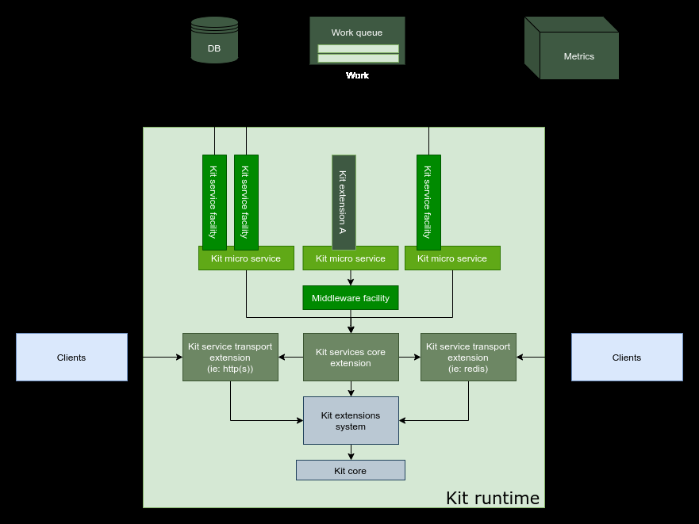
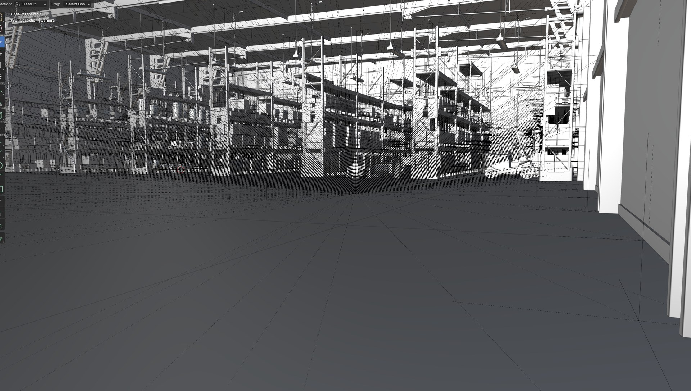
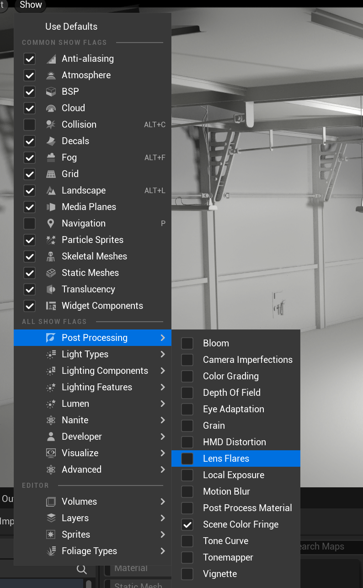
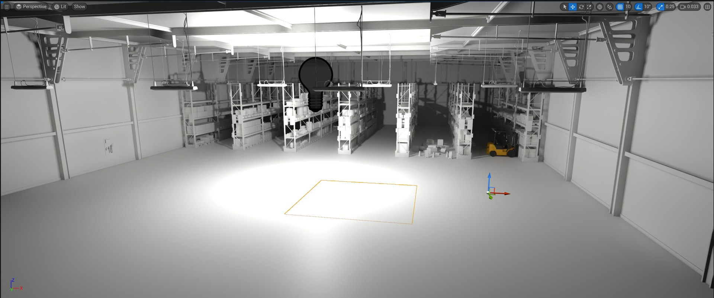
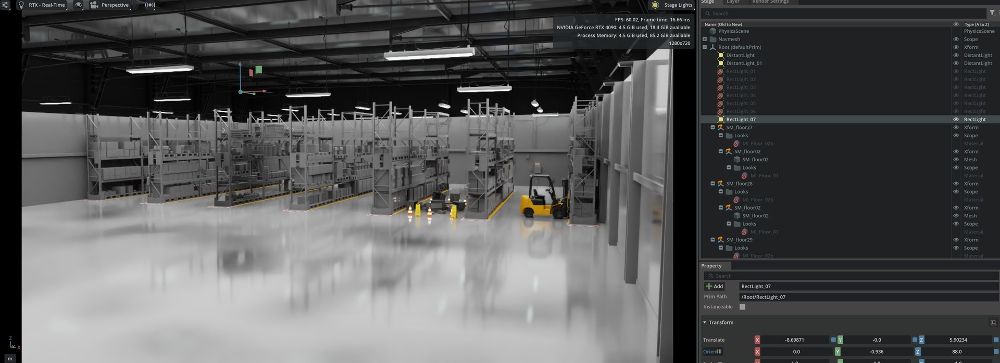
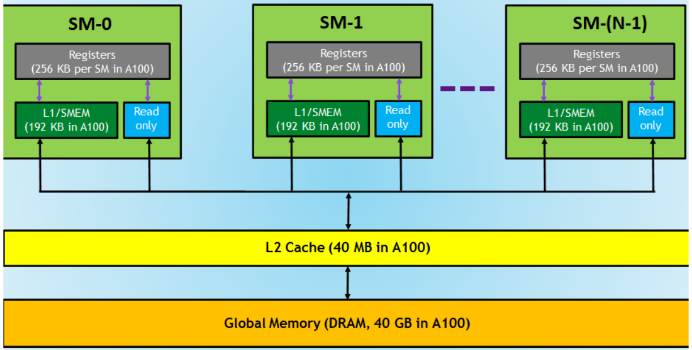
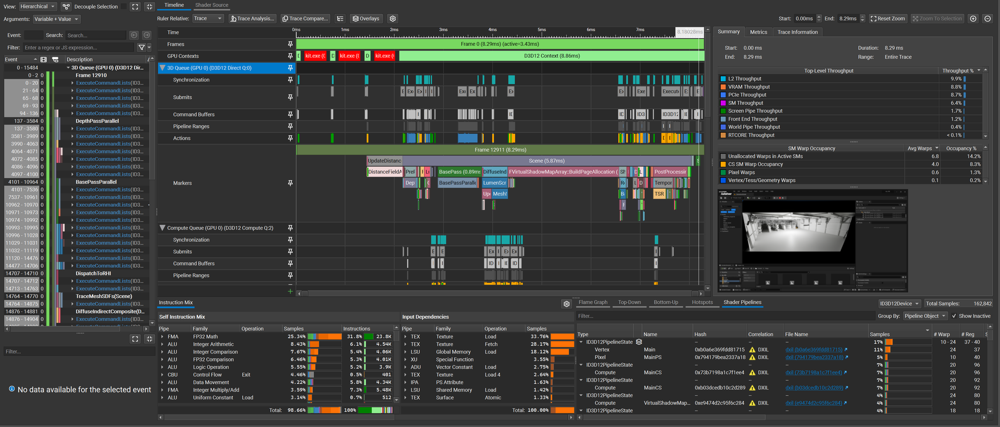
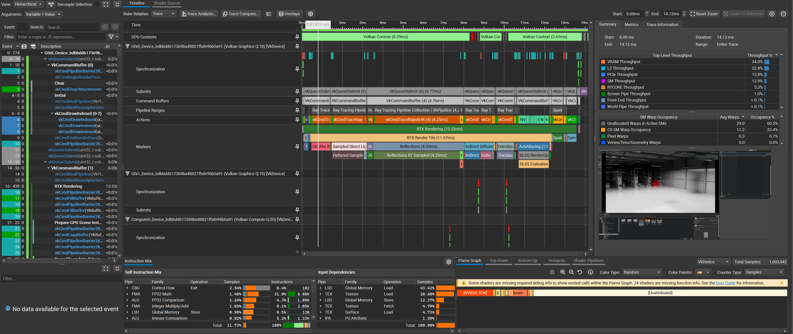
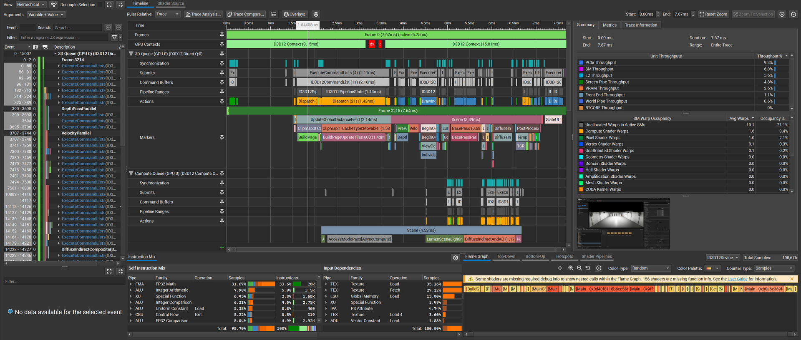
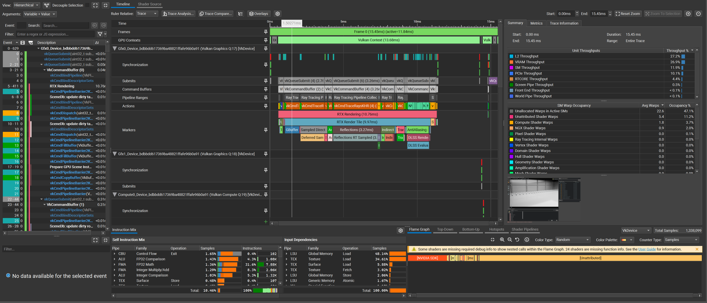

# NVIDIA Omniverse PoC — Profiling Isaac Sim against Unreal Engine

## Why this evaluation

We had a concrete decision to make: for a warehouse-scale robotics digital twin, do we build on **Isaac Sim** (Omniverse Kit) or stay on **Unreal Engine**, which the team already knows?

The naive way to answer this is to run both, look at the FPS counter, and pick the faster one. That answer would have been "Unreal, by a mile" — and it would have been wrong, or at least wrong for the reasons people would have assumed. So instead of trusting the frame counter, I captured both runtimes under **NVIDIA Nsight Graphics** and read the GPU counters.

This post is the write-up of that PoC: what the platform actually is, what the profiler actually showed, and — most importantly — **which of those numbers are comparable across two different renderers and which are not**. The second part matters more than the first.

---

## 1. What Omniverse actually is

Before benchmarking it helps to be precise about what is being benchmarked. "Omniverse" is not an engine. It is a **microservice runtime (Omniverse Kit)** on which applications are composed from extensions.



The relevant architectural properties:

- **Extension-based composition.** Everything — the viewport, the physics scene, the ROS bridge — is an extension loaded into the Kit runtime. There is no monolithic editor binary the way there is in Unreal.
- **Kit micro services + service facilities.** DB, work queue, metrics, and logging are first-class service facilities. This is what makes headless/fleet deployment (multi-server, cloud) a configuration change rather than a port.
- **USD as the scene contract.** The stage is OpenUSD, not a proprietary asset database. Interop with Maya/Blender/Unreal goes through USD via Omniverse Connect rather than through import/export.

### The pieces that mattered for us

| Layer | Component | Why we cared |
|---|---|---|
| Core | **Kit** | The runtime everything else is an extension of |
| Core | **Connect** | USD LiveLink into Unreal / Maya / Blender |
| Core | **Nucleus** | Cloud-native asset DB + versioning; feeds Omniverse Farm |
| Core | **USD Composer** | Authoring/composition environment for the stage |
| Sim | **Isaac Sim** | PhysX 5.0 + RTX rendering + native ROS/ROS2, sensor suite (RGB-D, LiDAR, IMU) |
| Sim | **Drive Sim** | AV workloads: RT-based LiDAR, ultrasonic, HD maps, weather |
| AI/ML | **Replicator** | Synthetic data + domain randomization with segmentation GT |
| AI/ML | **Isaac Lab** | RL for manipulation / mobile manipulation / drones |
| AI/ML | **Cosmos** | World Foundation Models — predict / transfer / reason |
| AI/ML | **PhysicsNeMo** | Neural-operator PDE solvers (CFD, EM) |
| AI/ML | **Earth-2** | Climate digital twin |

Reference implementations: [IsaacSim](https://github.com/isaac-sim/IsaacSim), [IsaacLab](https://github.com/isaac-sim/IsaacLab), [Replicator samples](https://github.com/NVIDIA-Omniverse/synthetic-data-examples), [Cosmos](https://github.com/NVIDIA/Cosmos), [PhysicsNeMo](https://github.com/NVIDIA/physicsnemo), [earth2studio](https://github.com/NVIDIA/earth2studio).

> **First gap found:** neither Kit nor Isaac Sim ships a **runtime monitoring extension**. There is no built-in equivalent of `stat unit` / `stat gpu` that streams structured per-subsystem timings out of the process. Everything below had to be captured externally with Nsight. For a production digital twin this is a real gap — you cannot alert on what you cannot export.

---

## 2. Test setup

Both runtimes on the same box, same monitor, same scene asset.

| Component | Specification |
|---|---|
| OS | Windows 11 |
| CPU | Intel Core i9-14900K |
| GPU | NVIDIA GeForce RTX 4090 |
| Scene | `Simple_Warehouse/full_warehouse.usd` (Omniverse sample) |
| Robot | Universal Robots **UR16e** |
| Profiler | Nsight Graphics (frame capture, 1 frame + 20–30 frame ranges) |

Two scenarios:

1. **Scenario A** — the warehouse scene with an action sequence playing.
2. **Scenario B** — 50 × UR16e, all executing a `RotateZ` action simultaneously.

Counters collected: GPU utilization, frame time, SM throughput, VRAM throughput, L2 throughput + sector hit-rate, draw calls, dispatches, SM warp occupancy.

### Establishing environment parity (and failing to, honestly)

This was the hardest part of the PoC and it is worth being explicit about, because it bounds every conclusion below.

**Problem: material loss on export.** Getting the same stage into Unreal meant going Isaac Sim → FBX/glTF → Unreal, and **material information does not survive that trip**. Blender as an intermediate shows what actually crosses the boundary — geometry, and not much else:



**Mitigation.** Rather than fight it, we levelled *down* to the lowest common denominator:

- Stripped materials in Isaac Sim so both sides render untextured geometry.
- Standardised lighting on **Rect Lights**.
- Disabled post-processing in Unreal via Show Flags — Bloom, Color Grading, DoF, Eye Adaptation, Motion Blur, Tonemapper, Vignette all off.



Resulting baselines:

| Unreal Engine | Isaac Sim |
|---|---|
|  |  |

**Caveat I want on the record:** the captures were ultimately taken with **Point Light in Unreal and Rect Light in Isaac Sim**. That is not a cosmetic difference. A point light is an analytic delta-distribution light; a rect light is an *area* light that has to be sampled. Under a ray-traced integrator that changes the shading cost per pixel directly. So the numbers below are a comparison of **two configured pipelines**, not of two engines under identical optical conditions. Read them as "what each stack does when set up the way its own defaults push you," not as a controlled A/B.

---

## 3. How to read these counters

One diagram is worth keeping in mind for the whole results section, because every number below is a statement about one level of this hierarchy:



- **SM Throughput** — how hard the shader cores are working. Instructions issued vs. peak issue rate.
- **SM Warp Occupancy** — how many of the SM's warp slots hold a resident warp. `(Active Warps / Theoretical Max Warps) × 100`. On Ada the theoretical max is 48 warps/SM. **Nsight reports "Unallocated Warps in Active SMs" as a separate row — that row is empty slots, not work.**
- **L2 Throughput / Sector Hit-Rate** — how much traffic the last-level cache is absorbing. High throughput *with* a high hit-rate means the working set fits and is being hammered; a hit-rate drop means you fell through to DRAM.
- **VRAM Throughput** — DRAM bandwidth, split read/write. The read/write ratio is a fingerprint of the workload.

The interpretive rule I applied throughout: **if SM throughput is low while VRAM/L2 throughput is high, the frame is latency- or bandwidth-bound, not math-bound.** Low on both means the GPU is waiting on someone else — usually the CPU.

---

## 4. Scenario A — warehouse scene with action sequence

| | Unreal Engine | Isaac Sim |
|---|---|---|
| Light setup | Point Light | Rect Light |
| FPS (before play) | 92.80 – 107.21 | 76.91 – 116.50 |
| FPS (play & run) | 75.59 – 104.21 | 48.34 – 60.15 |
| **Avg FPS** | **100.01 → 89.90** | **96.71 → 54.25** |
| Frame time (capture) | 8.29 ms | 14.12 ms |
| API | D3D12 | Vulkan |
| GPU contexts | 1 × D3D12 (8.86 ms) | 3 × VkContext (8.29 + 1.07 + 3.65 ms) |
| Dispatches | 2 + 7 + 2 = 11 | 22 compute + 7 ray tracing + 15 OptiX/CUDA |
| Draw calls (`vkCmdDrawIndexed` / equiv.) | 8 + 2 + 8 + 1 = 19 | **2 (UI only)** |
| SM throughput | 6.4 % | 12.9 % |
| VRAM throughput | 8.8 % (R 5.5 / W 3.2) | **34.0 % (R 10.5 / W 23.5)** |
| L2 throughput | 9.9 % (hit-rate 82.6 %) | 32.4 % (hit-rate 90.1 %) |
| Occupancy — unallocated | 6.8 warps / 14.2 % | 29.0 warps / 60.5 % |
| Occupancy — compute | 4.0 warps / 8.3 % | 11.2 warps / 23.4 % |
| Occupancy — pixel | 0.6 warps / 1.3 % | 0.3 warps / 0.7 % |
| Occupancy — vtx/tess/geom | 0.1 warps / 0.2 % | 0.0 warps / 0.0 % |

### Unreal capture



A textbook deferred frame. `Scene` occupies 5.87 ms of the 8.29 ms frame, and inside it the marker track reads `DistanceFieldA…` → `BasePass (0.89 ms)` → `FVirtualShadowMapArray::BuildPageAllocation` → `DiffuseIndirect` → `LumenScreen…` → `PostProcessing` → `TSR`. Note what that spells out: **Lumen and Virtual Shadow Maps are on.** Unreal here is not doing "plain rasterization" — it is running its own software-traced GI. The async compute queue is live in parallel.

### Isaac Sim capture



Structurally different. Three Vulkan contexts with batched submission:

1. **Geometry / direct** — G-buffer, sampled direct lighting, reflections
2. **Indirect diffuse** — global illumination
3. **Post** — translucency, anti-aliasing (DLSS SR / TAA)

The marker track is the interesting part. `RTX Rendering` is **13.52 ms** of the 14.12 ms frame, `RTX Render Tile` is 11.97 ms of that, and inside it:

- `Reflections` — **4.50 ms**
- `Reflections RT Sampled` — **4.25 ms**
- then `Indirect Diffuse`, `Translucency`, `AntiAliasing`, `DLSS RenderOp`, `DLSS Evaluation`

**Ray-traced reflections alone are ~33 % of the frame.** That is the single largest line item, and it is a *quality setting*, not a structural property of Isaac Sim. Actions: raise the roughness cutoff so glossy surfaces fall back to a cheaper probe, reduce reflection sample count, or cap reflection bounce depth. The warehouse floor in that scene is a mirror — visible in the viewport screenshot — and mirrors are exactly what makes RT reflections expensive.

Also worth noting: `vkCmdTraceRaysKHR (4)` shows at **4.25 ms**, and **RTCORE throughput is only 5.3 %**. The RT cores are not saturated. The cost is not in triangle-ray intersection; it is in the incoherent memory access that BVH traversal and reflection-ray shading generate. Which the VRAM counter confirms — 34 % throughput, and **write-dominant** (23.5 % write vs 10.5 % read), the signature of a denoise/accumulate pipeline writing out radiance and history buffers every frame.

---

## 5. Scenario B — 50 robots

| | Unreal Engine | Isaac Sim |
|---|---|---|
| Robots | 50 × UR16e, `RotateZ` | 50 × UR16e, `RotateZ` |
| FPS (play & run) | 93.89 – 104.54 | 42.15 – 49.42 (66.67 when few robots in frustum) |
| **Frame time** | **7.67 ms** | **15.45 ms** |
| GPU contexts | 2 | 4 |
| Dispatches | 96 | 24 compute + 7 ray tracing + 15 OptiX/CUDA |
| **Draw calls** | **10,733** (incl. UI) | **2 (UI only)** |
| SM throughput | 11.9 % | 11.9 % |
| VRAM throughput | 11.5 % (R 3.6 / W 7.8) | 26.9 % (R 7.6 / W 19.2) |
| L2 throughput | 20.6 % (hit-rate 95.5 %) | 27.2 % (hit-rate 91.9 %) |
| Occupancy — unallocated | 36.9 warps / 76.9 % | 22.6 warps / 47.1 % |
| Occupancy — pixel | 5.9 warps / 12.2 % | 0.0 warps / 0.1 % |
| Occupancy — vertex | 3.5 warps / 7.3 % | 0.0 warps / 0.0 % |
| Occupancy — compute | 0.0 warps / 0.0 % | 1.8 warps / 3.7 % |
| Occupancy — unattributed | 0.0 warps / 0.0 % | 5.4 warps / 11.2 % |





### Three things in this table are not what they look like

**(a) 10,733 vs 2 draw calls is not an efficiency result.**

This is the number most likely to be quoted out of context, so: Isaac Sim issues 2 draw calls because **the scene is not rasterized at all.** Geometry is resolved through ray-tracing acceleration structures — TLAS/BLAS built once, then traversed by `vkCmdTraceRaysKHR`. Instanced geometry never passes through `vkCmdDrawIndexed`. The 2 draw calls that *do* appear are the ImGui overlay.

Draw-call count is therefore **not a comparable metric across these two renderers.** It measures a submission model that only one of them uses. Comparing them is a category error.

**(b) 10,733 draw calls in Unreal is a config problem, not an engine property.**

50 robots → **~215 draw calls per robot.** A UR16e has 6–7 links. That means the imported meshes are being submitted per-section with no instancing and no Nanite, which is exactly what you get from a raw FBX import chain that also lost its materials. The occupancy row corroborates it: 76.9 % of warp slots unallocated with pixel warps at 12.2 % and vertex at 7.3 % — SMs are *active* almost the whole frame but mostly *empty*, the classic signature of many small draws with poor warp packing. Enable instancing or Nanite on those meshes and this number should collapse.

**(c) Unreal got *faster* with 50 more robots (8.29 → 7.67 ms). Treat that as a methodology flag, not a finding.**

An engine does not speed up when you give it 500× the draw calls. The likely explanation is that the two captures do not share a camera pose or view frustum — and the Scenario A capture, at 8.29 ms with SM throughput at 6.4 % and *everything* else in single digits, looks like a frame where the GPU was largely idle waiting on present or CPU submission. The Scenario B capture shows the GPU genuinely busy (SM 11.9 %, L2 20.6 % at a 95.5 % hit-rate). **Different bottlenecks, so the two frame times are not on the same scale.** Fixing this needs a locked camera and a fixed-path flythrough on both sides.

### What actually costs time in each frame

**Unreal, 50 robots (7.67 ms frame, 5.75 ms active):**

- `UpdateGlobalDistanceField` — **2.14 ms**, with `Clipmap: 0 / Clipmap: 1 CacheType:Movable (1.58 ms)` and `BuildPageUpdateTiles 600 (1.43 ms)`
- `Scene` — 3.39 ms on the 3D queue, plus 4.53 ms on the async compute queue (`AccessModePass[AsyncCompute]`, `LumenSceneLighting`, `DiffuseIndirectAndAO 1.17 ms`)

That first line is the real story on the Unreal side: **28 % of the frame is rebuilding Lumen's global signed distance field**, because 50 articulated robots marked `Movable` dirty the SDF clipmaps every single frame. This is a cost that scales with *moving* geometry, not with geometry. If we did not need Lumen GI for this workload — and for a robotics twin we largely do not — turning it off recovers roughly a third of the frame outright.

**Isaac Sim, 50 robots (15.45 ms frame, 11.84 ms active):**

- `RTX Rendering` — 10.76 ms, `RTX Render Tile` — 9.97 ms
- `Reflections` — 3.27 ms, `Reflections RT Sampled` — ~3.0 ms
- then `Indirect`, `AntiAliasing`, `DLSS Render` / `DLSS Evaluation`

Compare against Scenario A: RTX rendering went **13.52 ms → 10.76 ms** while the scene gained 50 articulated robots. **Isaac Sim's render cost is essentially independent of robot count here.** It is dominated by a fixed per-pixel ray-tracing budget — reflections above all — not by scene complexity. That is the expected scaling behaviour of a ray tracer: cost tracks pixels and ray depth, and geometry only shows up as BVH-traversal depth.

---

## 6. The finding the render captures do *not* explain

Look back at Scenario A:

```
Isaac Sim   Before Play: 96.71 avg FPS   →   Play & Run: 54.25 avg FPS
Unreal      Before Play: 100.01 avg FPS  →   Play & Run:  89.90 avg FPS
```

Isaac Sim loses **44 % of its frame rate the moment simulation starts** — while, as shown above, GPU render cost barely moves. That delta is not in any of these Nsight captures, because Nsight captured the graphics queue.

The cost is on the other side of the frame: **PhysX 5.0 articulation stepping, and USD stage update / Fabric synchronisation.** Every simulated joint produces transform writes that must propagate through the stage before the renderer can consume them, and Kit's update loop is where that happens.

This is the concrete consequence of the monitoring gap noted in §1 — **we found the largest single performance effect in the entire PoC and could not attribute it**, because there is no CPU-side instrumentation exported from the Kit runtime. It is the top item on the follow-up list for a reason.

---

## 7. Summary of trade-offs

| Aspect | Unreal Engine | Isaac Sim |
|---|---|---|
| Frame rate (50 robots) | 93–104 FPS | 42–49 FPS |
| Frame time | 7.67 ms | 15.45 ms |
| Rendering model | Rasterization + Lumen SW-traced GI + VSM | RTX ray-traced GI, reflections, DLSS |
| Dominant frame cost | Global SDF rebuild (2.14 ms, moving geometry) | RT reflections (3.3–4.5 ms, fixed per-pixel) |
| Scaling behaviour | Scales with **draw calls + moving geometry** | Scales with **pixels + ray depth** |
| Memory profile | Low bandwidth, high L2 hit-rate (95.5 %) | Write-dominant, 27–34 % VRAM throughput |
| GPU bound by | Submission / warp packing | Memory latency (BVH traversal, incoherent access) |
| Physics | Chaos | **PhysX 5.0** |
| Robotics integration | Plugin / bridge work required | **Native ROS/ROS2**, RGB-D / LiDAR / IMU sensors |
| Synthetic data | Roll your own | **Replicator** — segmentation GT + domain randomization |
| Scene interop | Proprietary asset DB | **OpenUSD** + Nucleus versioning |

The headline is easy to state and easy to misread: *Unreal renders this scene about 2× faster.* The correct reading is that **the two runtimes are bound by different things**, both are running well under 20 % SM throughput on a 4090, and neither frame time is anywhere near a hardware limit. **This is a configuration difference far more than a capability difference.**

---

## 8. Recommendation

**Isaac Sim** where the simulation *is* the product:

- Robotics simulation and controller testing (PhysX 5.0 articulations)
- Synthetic data generation for perception training (Replicator, segmentation GT, domain randomization)
- Physically-accurate sensor simulation — RGB-D, LiDAR, IMU
- Anything with a ROS/ROS2 requirement
- Digital twin with OpenUSD/Nucleus as the asset system of record

**Unreal Engine** where the *image* is the product:

- High-fidelity visualization, cinematics, stakeholder-facing demos
- Interactive applications with a hard >60 FPS budget
- Teams already invested in the Unreal ecosystem

**What we are actually proposing:** not a choice — a split. Isaac Sim as the **physics and sensor authority**, Unreal as a **visualization client**, coupled over USD via Omniverse Connect. Each side then runs in the regime it is good at, and the 2× render gap stops being a decision input, because Isaac Sim runs headless with rendering disabled for the RL/data-generation workloads where throughput actually matters.

Before committing, the cheap wins are worth taking on both sides:

- **Isaac Sim** — cap RT reflection roughness cutoff and sample count. That is a ~30 % frame-time line item under direct control.
- **Unreal** — disable Lumen for the twin workload (recovers the 2.14 ms SDF rebuild), and enable instancing/Nanite on the imported robot meshes to kill the 10,733 draw calls.

---

## 9. Open items

Ranked by how much they would change the conclusions:

1. **CPU / memory profiling instrumentation.** The 96 → 54 FPS drop at simulation start (§6) is the largest unexplained effect in the PoC and it is entirely CPU-side. Nsight Systems trace of the Kit update loop, isolating PhysX stepping from USD/Fabric sync.
2. **Re-run with locked camera and matched lighting.** The Scenario A/B inconsistency (§5c) and the Point-vs-Rect light mismatch (§2) both cap how far these numbers can be pushed. Fixed-path flythrough, identical light type, on both sides.
3. **Build a monitoring extension for Kit.** No structured per-subsystem timing export exists. For production this is a blocker, and Kit's service-facility model (metrics is already a first-class facility) is the right place to hang it.
4. **Initialization latency.** Time from `Play` to first stepped simulation frame — untouched so far, and it dominates iteration speed in practice.
5. **Sequence storage footprint.** Bytes-per-frame for recorded sequences, which determines whether long-horizon captures are viable at all.
6. **Scaling curve, not points.** Sweep robot count (1 / 10 / 50 / 200) and sensor configuration. Two data points cannot distinguish linear from constant scaling — and §5 suggests Isaac Sim's render cost may be close to constant, which would be the strongest argument in its favour.

---

## Closing note

The one lesson I would carry out of this PoC: **frame rate is a scalar summary of a vector quantity.** Isaac Sim "lost" by 2× on FPS while being bound by ray-traced reflection cost that is a slider, and Unreal "won" while spending 28 % of its frame rebuilding a distance field for GI we do not need. Neither of those facts is visible from the frame counter, and both change the decision.

Profile the frame, not the number.
