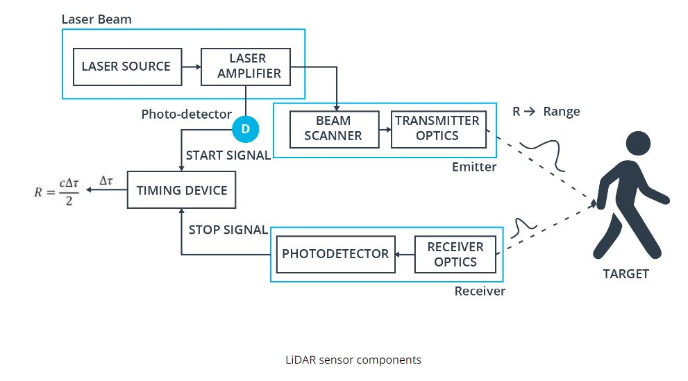
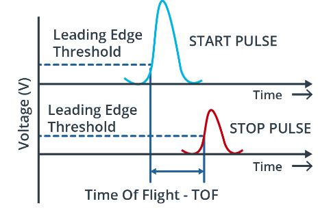
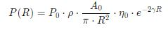

* this unordered seed list will be replaced by the toc
{:toc}

## Introduction

Sensor 에는 Camera, Radar, Ultrasound, and Lidar 가 있다. Camera 같은 경우는 Lateral 의 정보들을 우리가 보는 View 에 들어오고, 그 View 에는 수많은 Pixel 정보들을 가지고 있다. Radar 같은 경우에는, Distance 의 정보들을 가지고 올수 있으며, 특히 **Velocity** 정보들을 가지고 올수 있기 때문에 driver assistance system 에 들어가는 "adaptive cruise control" 이나 "autonomous emergency braking" 등 사용이 간다. 일단 Radar 같은 경우 electromagnetic wave 를 쏴서, 어떤 물체에 부딫혔을때, run-time of the signal 을 받아서 distance 의 값을 가지고 올수 있으며, Dopller effect 로 인해서, 물체의 움직임의 frequency shift 를 활용해서, velocity 를 구할수 있다. Camera 와 달리 weather condition 에 영향을 받진 않지만 low spatial resolution 을 가지고 있다. 그 영향은 Metal 같은 Object 가 아닐경우 다 refracted 된다고 한다면, 그 signal 은 약한 return signal 이 기 때문이다. [참고: radar 는 24GHz radar sensor 가 있는데, 이건 wider 하며, Long Range radar sensor 같은 경우 77GHz 가 있다.]

그다음은 최신 기술인 Lidar Sensor 이다. Lidar 는 beams of laster light 을 쏴서, object 로 부터 bouncing 한 시간을 기록한다. 이렇게 보면 Radar 랑 비슷하지만, 일단 Lidar 는 360 degree arc 를 쏴서, 3D point maps 에 대한 정보를 per second 당 Measure 을 한다.

1. 너무 비싸다른것(lowering the price per unit)
2. Decreasing package size
3. Increasing sensing range and resolution

등이 존재한다. 그래서 LiDAR 의 Alternative approach 는 non-scanning sensor(Flash Lidar) 를 사용하는건데, 여기서 "Flash" 라는 거는 FOV(Field of View) 에 Laser source 를 한번 다쏘는식이다. 마치 필름카메라가 사진을 찍을때처럼 빛을 한번 뽱 싸주는거고, 쏴서 reflected laser pulse 만 가지고 오면 된다. 하지만 FOV 가 정해져있으니, narrow field 와 limited range 를 들고 있다는점이 drawback 이다. 그래서 우리가 실제 보는건 Roof-mounted scanning Lidar 를 사용하고 4 쪽 사이드에 사용되는건 non-scanning lidar sensor 를 사용한다.

간단한 Sensor Criteria 를 인용된걸 써보려고 한다.

```
Range : LiDAR and radar systems can detect objects at distances ranging from a few meters to more than 200m. Many LiDAR systems have difficulties detecting objects at very close distances, whereas radar can detect objects from less than a meter, depending on the system type (either long, mid or short range) . Mono cameras are not able to reliably measure metric distance to object - this is only possible by making some assumptions about the nature of the world (e.g. planar road surface). Stereo cameras on the other hand can measure distance, but only up to a distance of approx. 80m with accuracy deteriorating significantly from there.
Spatial resolution : LiDAR scans have a spatial resolution in the order of 0.1° due to the short wavelength of the emitted IR laser light . This allows for high-resolution 3D scans and thus characterization of objects in a scene. Radar on the other hand can not resolve small features very well, especially as distances increase. The spatial resolution of camera systems is defined by the optics, by the pixel size on the image and by its signal-to-noise ratio. Details on small object are lost as soon as the light rays emanating from them are spread to several pixels on the image sensor (blurring). Also, when little ambient light exists to illuminate objects, spatial resolution decreases as objects details are superimposed by increasing noise levels of the image sensor.
Robustness in darkness : Both radar and LiDAR have an excellent robustness in darkness, as they are both active sensors. While daytime performance of LiDAR systems is very good, they have an even better performance at night because there is no ambient sunlight that might interfere with the detection of IR laser reflections. Cameras on the other hand have a very reduced detection capability at night, as they are passive sensors that rely on ambient light. Even though there have been advances in night time performance of image sensors, they have the lowest performance among the three sensor types.
Robustness in rain, snow, fog : One of the biggest benefits of radar sensors is their performance under adverse weather conditions. They are not significantly affected by snow, heavy rain or any other obstruction in the air such as fog or sand particles. As an optical system, LiDAR and camera are susceptible to adverse weather and its performance usually degrades significantly with increasing levels of adversity.
Classification of objects : Cameras excel at classifying objects such as vehicles, pedestrians, speed signs and many others. This is one of the prime advantages of camera systems and recent advances in AI emphasize this even stronger. LiDAR scans with their high-density 3D point clouds also allow for a certain level of classification, albeit with less object diversity than cameras. Radar systems do not allow for much object classification.
Perceiving 2D structures : Camera systems are the only sensor able to interpret two-dimensional information such as speed signs, lane markings or traffic lights, as they are able to measure both color and light intensity. This is the primary advantage of cameras over the other sensor types.
Measure speed : Radar can directly measure the velocity of objects by exploiting the Doppler frequency shift. This is one of the primary advantages of radar sensors. LiDAR can only approximate speed by using successive distance measurements, which makes it less accurate in this regard. Cameras, even though they are not able to measure distance, can measure time to collision by observing the displacement of objects on the image plane. This property will be used later in this course.
System cost : Radar systems have been widely used in the automotive industry in recent years with current systems being highly compact and affordable. The same holds for mono cameras, which have a price well below US$100 in most cases. Stereo cameras are more expensive due to the increased hardware cost and the significantly lower number of units in the market. LiDAR has gained popularity over the last years, especially in the automotive industry. Due to technological advances, its cost has dropped from more than US$75,000 to below US$5,000. Many experts predict that the cost of a LiDAR module might drop to less than US$500 over the next few years.
Package size : Both radar and mono cameras can be integrated very well into vehicles. Stereo cameras are in some cases bulky, which makes it harder to integrate them behind the windshield as they sometimes may restrict the driver's field of vision. LiDAR systems exist in various sizes. The 360° scanning LiDAR is typically mounted on top of the roof and is thus very well visible. The industry shift towards much smaller solid-state LiDAR systems will dramatically shrink the system size of LiDAR sensors in the very near future.
Computational requirements : LiDAR and radar require little back-end processing. While cameras are a cost-efficient and easily available sensor, they require significant processing to extract useful information from the images, which adds to the overall system cost.
```

## Available Lidar Types

<figure>
  
</figure>

일단 Lidar Type 중에 `Scanning LiDAR` 중에서 `Motorized Optomechanical Scanners` 가 most common 한 LiDAR Type 중에 하나이다. `Velodyne` 에서 만들어졌으며, 64-beam rotating line scanner 이다.

이 LiDAR 의 장점을 List-up 해보자면, 아래와 같은 장점을 가ㅣㅈ고 있으며, 이런 LiDAR 을 가지고 있는 Type 은 transmitter-reciever channel이 존재하고 360 도의 FOV 를 가지고 있고, Receiver 와 Emitter 가 Vertically 하게 잘싸옇져있다.

1. Long Ranging Distance
2. Wide Horizontal FOV
3. Fast Scanning Speed

물론 high-quality 의 Point-Cloud data 를 얻을 수 있는 반면, 이거에 따른 단점도 존재한다. 일단 High Power Consumption, Physical 한 충격에 대한 민감한 정도, 그리고 마지막으로 bulky 하기 때문에 high price 라는 단점을 가지고 있다. 

다른 한종류로는 `Non-Scanning Flash Lidar` 가 있다. 일단 Non-Scanning 에서 알아볼수 있듯이, sequential reconstruction 을 할수 있는게 아니라, camera 처럼 flash 를 data 수집하는 원리이다. 어떤 Array 에서 광선이 나와서, 각 Element 들이 tof receive 를 하는 방식이다. 즉 이때에 각 Pixel 값들이 하나 나온다. 이 부분 같은경우는 2D 를 Rasterization 하는 기법과 비슷핟.  

## LiDAR

일단 Most Common Lidar Sensor 는 "pulsed Lidar" 이다. a laser source 로 부터 laser beam scene 으로 burst or emit 한 이후에, 어떤 물체에 부딫혔을때, 굴절되거나 반사를 통해서 LiDAR 의 receiver 로 도착한다. time of flight 을 구하기 위해선, range R (distance) 를 구할수 있는데, 바로 공식은 `R = (1/2n) * c * (delta t)`. 여기서 c 는 speed of light 이고 n 은 eta 라고 부르기도 하며 1.0 이라고 가정한다.

typical lidar sensor 의 Pipeline 을 한번 봐보자.

<figure>
  
</figure>

Laser source 로 부터 burst 할수 있게끔 Amplifier 르 ㄹ 해준다. 이럴때 laser 의 pulse 는 picoseconds 나 nanoseconds 정도 generate 이 도니다. 그런다음 beam scanner 와 transmitter optics 의 도움을 받아 Target 에다가 쏜다. 그런다음에 어떤 물체에 부딫혔을때, scatter 된 pulse energy 가 receiver lens 에 도착한이후에 amplify 가 되고, voltage signal 로 변경한다.

아래의 그림은 time of flight 을 구하는 부분을 그래프로 표현한거다.

<figure>
  
</figure>

여기에서, 중점적으로 봐야되는게 `range resolution` 과 `maximum range`

## Lidar Equation

<figure>
  
</figure>

### Lidar Range Map


### Lidar based Object Detection

- Deep Learning Approach

- Machine Learning

## Resource
- [Udacity](https://www.udacity.com/online-learning-for-individuals?irclickid=SJV3CfS2GxyNWLhU3iwjR3CZUkAXh83J4zdQxw0&irgwc=1&utm_source=affiliate&utm_medium=&aff=2381957&utm_term=&utm_campaign=161_%7Bsubid%7D_645e6b6a5c7730035175fc3b_161_%7Bsubid%7D&utm_content=161_%7Bsubid%7D&adid=786224)