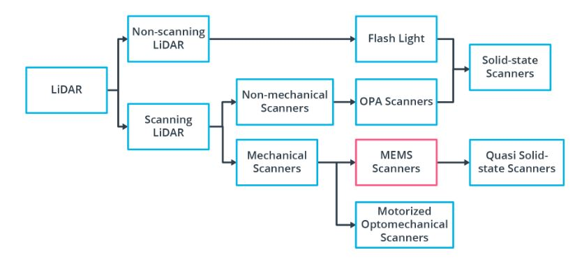
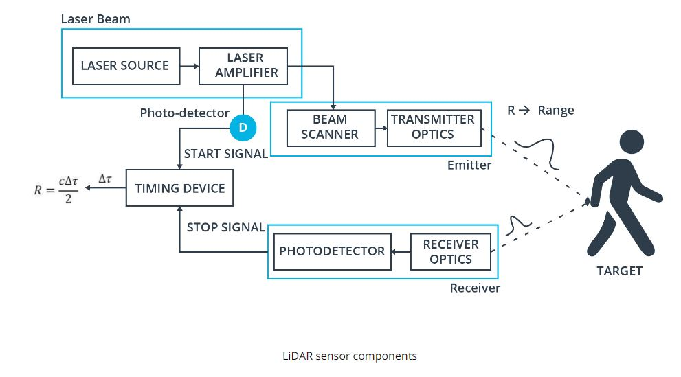
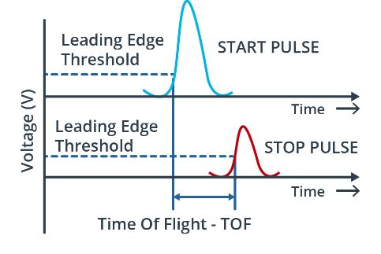
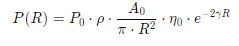
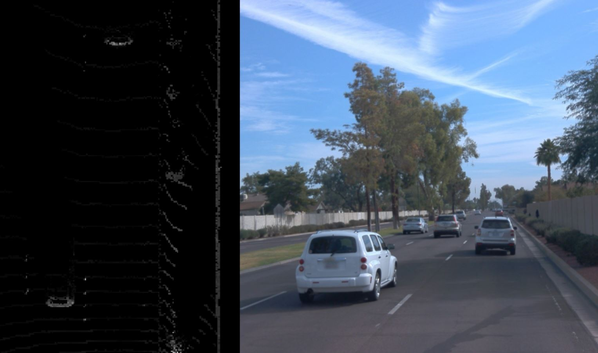
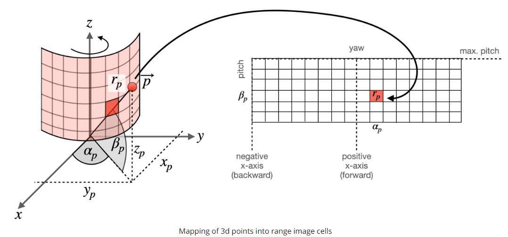
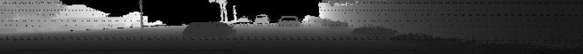
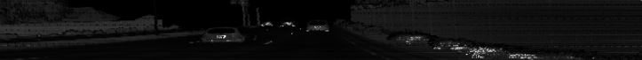
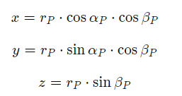

* this unordered seed list will be replaced by the toc
{:toc}

## Introduction

Sensor 에는 Camera, Radar, Ultrasound, and Lidar 가 있다. Camera 같은 경우는 Lateral 의 정보들을 우리가 보는 View 에 들어오고, 그 View 에는 수많은 Pixel 정보들을 가지고 있다. Radar 같은 경우에는, Distance 의 정보들을 가지고 올수 있으며, 특히 **Velocity** 정보들을 가지고 올수 있기 때문에 driver assistance system 에 들어가는 "adaptive cruise control" 이나 "autonomous emergency braking" 등 사용이 간다. 일단 Radar 같은 경우 electromagnetic wave 를 쏴서, 어떤 물체에 부딫혔을때, run-time of the signal 을 받아서 distance 의 값을 가지고 올수 있으며, Dopller effect 로 인해서, 물체의 움직임의 frequency shift 를 활용해서, velocity 를 구할수 있다. Camera 와 달리 weather condition 에 영향을 받진 않지만 low spatial resolution 을 가지고 있다. 그 영향은 Metal 같은 Object 가 아닐경우 다 refracted 된다고 한다면, 그 signal 은 약한 return signal 이 기 때문이다. [참고: radar 는 24GHz radar sensor 가 있는데, 이건 wider 하며, Long Range radar sensor 같은 경우 77GHz 가 있다.]

그다음은 최신 기술인 Lidar Sensor 이다. Lidar 는 beams of laster light 을 쏴서, object 로 부터 bouncing 한 시간을 기록한다. 이렇게 보면 Radar 랑 비슷하지만, 일단 Lidar 는 360 degree arc 를 쏴서, 3D point maps 에 대한 정보를 per second 당 Measure 을 한다.

1. 너무 비싸다른것(lowering the price per unit)
2. Decreasing package size
3. Increasing sensing range and resolution

등이 존재한다. 그래서 LiDAR 의 Alternative approach 는 non-scanning sensor(Flash Lidar) 를 사용하는건데, 여기서 "Flash" 라는 거는 FOV(Field of View) 에 Laser source 를 한번 다쏘는식이다. 마치 필름카메라가 사진을 찍을때처럼 빛을 한번 뽱 싸주는거고, 쏴서 reflected laser pulse 만 가지고 오면 된다. 하지만 FOV 가 정해져있으니, narrow field 와 limited range 를 들고 있다는점이 drawback 이다. 그래서 우리가 실제 보는건 Roof-mounted scanning Lidar 를 사용하고 4 쪽 사이드에 사용되는건 non-scanning lidar sensor 를 사용한다.

간단한 Sensor Criteria 를 인용된걸 써보려고 한다.

```
Range : LiDAR and radar systems can detect objects at distances ranging from a few meters to more than 200m. Many LiDAR systems have difficulties detecting objects at very close distances, whereas radar can detect objects from less than a meter, depending on the system type (either long, mid or short range) . Mono cameras are not able to reliably measure metric distance to object - this is only possible by making some assumptions about the nature of the world (e.g. planar road surface). Stereo cameras on the other hand can measure distance, but only up to a distance of approx. 80m with accuracy deteriorating significantly from there.
Spatial resolution : LiDAR scans have a spatial resolution in the order of 0.1° due to the short wavelength of the emitted IR laser light . This allows for high-resolution 3D scans and thus characterization of objects in a scene. Radar on the other hand can not resolve small features very well, especially as distances increase. The spatial resolution of camera systems is defined by the optics, by the pixel size on the image and by its signal-to-noise ratio. Details on small object are lost as soon as the light rays emanating from them are spread to several pixels on the image sensor (blurring). Also, when little ambient light exists to illuminate objects, spatial resolution decreases as objects details are superimposed by increasing noise levels of the image sensor.
Robustness in darkness : Both radar and LiDAR have an excellent robustness in darkness, as they are both active sensors. While daytime performance of LiDAR systems is very good, they have an even better performance at night because there is no ambient sunlight that might interfere with the detection of IR laser reflections. Cameras on the other hand have a very reduced detection capability at night, as they are passive sensors that rely on ambient light. Even though there have been advances in night time performance of image sensors, they have the lowest performance among the three sensor types.
Robustness in rain, snow, fog : One of the biggest benefits of radar sensors is their performance under adverse weather conditions. They are not significantly affected by snow, heavy rain or any other obstruction in the air such as fog or sand particles. As an optical system, LiDAR and camera are susceptible to adverse weather and its performance usually degrades significantly with increasing levels of adversity.
Classification of objects : Cameras excel at classifying objects such as vehicles, pedestrians, speed signs and many others. This is one of the prime advantages of camera systems and recent advances in AI emphasize this even stronger. LiDAR scans with their high-density 3D point clouds also allow for a certain level of classification, albeit with less object diversity than cameras. Radar systems do not allow for much object classification.
Perceiving 2D structures : Camera systems are the only sensor able to interpret two-dimensional information such as speed signs, lane markings or traffic lights, as they are able to measure both color and light intensity. This is the primary advantage of cameras over the other sensor types.
Measure speed : Radar can directly measure the velocity of objects by exploiting the Doppler frequency shift. This is one of the primary advantages of radar sensors. LiDAR can only approximate speed by using successive distance measurements, which makes it less accurate in this regard. Cameras, even though they are not able to measure distance, can measure time to collision by observing the displacement of objects on the image plane. This property will be used later in this course.
System cost : Radar systems have been widely used in the automotive industry in recent years with current systems being highly compact and affordable. The same holds for mono cameras, which have a price well below US$100 in most cases. Stereo cameras are more expensive due to the increased hardware cost and the significantly lower number of units in the market. LiDAR has gained popularity over the last years, especially in the automotive industry. Due to technological advances, its cost has dropped from more than US$75,000 to below US$5,000. Many experts predict that the cost of a LiDAR module might drop to less than US$500 over the next few years.
Package size : Both radar and mono cameras can be integrated very well into vehicles. Stereo cameras are in some cases bulky, which makes it harder to integrate them behind the windshield as they sometimes may restrict the driver's field of vision. LiDAR systems exist in various sizes. The 360° scanning LiDAR is typically mounted on top of the roof and is thus very well visible. The industry shift towards much smaller solid-state LiDAR systems will dramatically shrink the system size of LiDAR sensors in the very near future.
Computational requirements : LiDAR and radar require little back-end processing. While cameras are a cost-efficient and easily available sensor, they require significant processing to extract useful information from the images, which adds to the overall system cost.
```

## Available Lidar Types

<figure>
  
</figure>

일단 Lidar Type 중에 `Scanning LiDAR` 중에서 `Motorized Optomechanical Scanners` 가 most common 한 LiDAR Type 중에 하나이다. `Velodyne` 에서 만들어졌으며, 64-beam rotating line scanner 이다.

이 LiDAR 의 장점을 List-up 해보자면, 아래와 같은 장점을 가ㅣㅈ고 있으며, 이런 LiDAR 을 가지고 있는 Type 은 transmitter-reciever channel이 존재하고 360 도의 FOV 를 가지고 있고, Receiver 와 Emitter 가 Vertically 하게 잘싸옇져있다.

1. Long Ranging Distance
2. Wide Horizontal FOV
3. Fast Scanning Speed

물론 high-quality 의 Point-Cloud data 를 얻을 수 있는 반면, 이거에 따른 단점도 존재한다. 일단 High Power Consumption, Physical 한 충격에 대한 민감한 정도, 그리고 마지막으로 bulky 하기 때문에 high price 라는 단점을 가지고 있다. 

다른 한종류로는 `Non-Scanning Flash Lidar` 가 있다. 일단 Non-Scanning 에서 알아볼수 있듯이, sequential reconstruction 을 할수 있는게 아니라, camera 처럼 flash 를 data 수집하는 원리이다. 어떤 Array 에서 광선이 나와서, 각 Element 들이 tof receive 를 하는 방식이다. 즉 이때에 각 Pixel 값들이 하나 나온다. 이 부분 같은경우는 2D 를 Rasterization 하는 기법과 비슷하다.

일단 vibration 에 robust 하지만 단점이라고 하면, 한번 Flash 했을때, 전체의 Scene 이 들어와야하므로 Beam 을 쏠때의 큰 Energy 지가 필요하다. 하지만, 이러한 Energy 를 줄이려고 한다면, Receive 할때의 SNR 도 고려해야한다.

그 이외에 Optical Phase Array (OPA) 및 MEMS Mirror-based Quasi Solid-State LiDAR 가 존재한다.

## LiDAR

일단 Most Common Lidar Sensor 는 "pulsed Lidar" 이다. a laser source 로 부터 laser beam scene 으로 burst or emit 한 이후에, 어떤 물체에 부딫혔을때, 굴절되거나 반사를 통해서 LiDAR 의 receiver 로 도착한다. time of flight 을 구하기 위해선, range R (distance) 를 구할수 있는데, 바로 공식은 `R = (1/2n) * c * (delta t)`. 여기서 c 는 speed of light 이고 n 은 eta 라고 부르기도 하며 1.0 이라고 가정한다.

typical lidar sensor 의 Pipeline 을 한번 봐보자.

<figure>
  
</figure>

Laser source 로 부터 burst 할수 있게끔 Amplifier 르 ㄹ 해준다. 이럴때 laser 의 pulse 는 picoseconds 나 nanoseconds 정도 generate 이 도니다. 그런다음 beam scanner 와 transmitter optics 의 도움을 받아 Target 에다가 쏜다. 그런다음에 어떤 물체에 부딫혔을때, scatter 된 pulse energy 가 receiver lens 에 도착한이후에 amplify 가 되고, voltage signal 로 변경한다.

아래의 그림은 time of flight 을 구하는 부분을 그래프로 표현한거다.

<figure>
  
</figure>

## Lidar Equation

<figure>
  
</figure>

## Lidar Range Map

아래의 그림을 보면 Lidar 데이터가 왼쪽에서는 앞 차량의 뒷부분이 보이고, 전혀 차선(Lane) 또는 Road Surface 들이 보이지 않는다.

<figure>
  
</figure>

이런 Lidar scan 을 보는 방법중에 하나가 봐로 Range Image 이다. 이 Range Image 의 Data Structure 은 image 처럼 이지만 Lidar sensor 에서 한번 돌린 이미지라고 볼수 있다. 아래의 그림을 한번 보자.

<figure>
  
</figure>

일단 row 의 정보는 elevation angle, pitch 에 대한 정보가 있고, column 정보에는 azimuth angle, yaw 의 정보를 담고 있다. 즉 감아져있는 원통을 한번 쭉 펼치는것과 마찬가지이다. 그리고 각 Element 에는 intensity 들을 가지고 있다. 여기에서 alpha p 는 yaw 라고 하며, beta p 는 pitch 라고 한다.

## Waymo Dataset

### Range Image

Waymo Dataset 같은 경우, 고해상도의 다양한 센서(Lidar / Radar / Lidar) 들로 Dataset 을가지고 있다. 주로 밀집된 도시중심이나 풍경, 그리고 날씨의 변화에 따른 다양한 환경에서 센서데이터를 가지고 있다. 내가 실제로 받은 데이터의 version 은 1.2 이다. 그리고 이 dataset 을 사용하려면, WaymoDataFileReader tool 를 사용해서, waymo dataset 을 읽은 이후에 객체의 형태로 들고 올 수 있다.

일단 간락한 설명을 하기위해서, training 만 봐보도록 하자. training 안에 여러개의 Camera Label Segment 가 존재하고, 그 하위에 Lidar / Radar / Camera 의 정보들을 가지고 있다. 예를 들어서 Top Lidar 를 가지고 오려면, 아래의 Python Code 를 사용하면 된다.

```python
lidar_name = dataset_pb2.LaserName.Top
lidar = [obj for obj in frame.lasers if obj.name == lidar_name][0]
```

결국엔 이 Dataset 을 하기 위해선, Point Cloud Data 로 가지고 와야하지만, 여기에서 Point Cloud Data 이외에 표현하고 Visualize 를 하기 위해서는, 위의 Range Map 을 사용하면 된다. 여기에 Waymo Dataset 에서 한 Frame 당 구하기 위해선, 하나의 Frame 을 Matrix 로 변환이후에 reshape 을 해주면 shape `(64, 2650, 4)` 가 나온다. 아래의 코드는 Top Lidar 를 가지고 와서 Dimension 을 확인할수 있다.

```python
lidar_name = dataset_pb2.LaserName.Top
lidar = [obj for obj in frame.lasers if obj.name == lidar_name][0] 
if len(lidar.ri_return1.range_image_compressed) > 0:
  ri = dataset_pb2.MatrixFloat()
  ri.ParseFromString(zlib.decompress(lidar.ri_return1.range_image_compressed))
  ri = np.array(ri.data).reshape(ri.shape.dims)
  print(ri.shape)
```

Waymo Dataset 의 Range Image Structure 는 range, intensity, elogation, and vehicle position 을 가지고 있다. 그리고 Waymo dataset 에 elogation 값이 높고, intensity 가 낮은걸 날씨를 나타낼때 나타난다고 제시한다. 이 Range Image Structure 에서 내가 궁금한건 range 와 intensity 가 사용할것이다. 아래와 같이 Range Image 를 한번 확인 해보자.

Waymo Dataset 에서 사용된 Top Lidar 같은 경우 Scanning Lidar 이므로 Horizontal Field of View 는 360 degree 를 가지고 있다. 즉 360 / 2650 을 나눠보면 약 0.1358 만큼 degree 만큼 움직였으며, 이걸 [Angular Resolution (min)](https://en.wikipedia.org/wiki/Angular_resolution) 변환하면, 8.8 정도를 가지고 있다. 하지만 Vertical Field of View 에서의 Vertical Resolution 도 구하는게 필요하다. 즉 Minimum 부터 maximum inclination 을 확인해야므로, pitch 를 구해야한다.

Python 으로 구해보자면 아래와 같다. 여기서 max 와 min 을 빼줘서, 64 의 채널로 나눠준 각도를 구해주는 것이다.

```python
lidar_calibration = [obj for obj in frame.context.laser_calibrations if obj.name == lidar_name][0]

min_pitch = lidar_calib.beam_inclination_min
max_pitch = lidar_calib.beam_inclination_max

vfov = max_pitch - min_pitch

pitch_res_rad = vfov / ri.shape[0]
pitch_res_deg = pitch_res_rad * 180 / np.pi
```

Range Image 이의 Range 의 Value 값들은, 환경속의 특정 포인트까지의 거리를 2D 이미지로 담아냈기때문에, 센서부터 거리(distance) 를 말한다. 근데 여기에서 min = -1 일때가 있는데 geometrically 하게 make sense 하지 않는다. 그래서 Filter 를 한번 해줘야한다. 자세한 내용은 [Waymo Dataset Paper](https://arxiv.org/pdf/1912.04838.pdf) 을 참고하자. 일단 이부분을 구현한 부분은 아래와 같다.

```python
def load_range_image(frame, lidar_name):
  lidar = [obj for obj in frame.lasers if obj.name == lidar_name][0]
  ri = []
  if len(lidar.ri_return1.range_image_compressed) > 0: # use first response
      ri = dataset_pb2.MatrixFloat()
      ri.ParseFromString(zlib.decompress(lidar.ri_return1.range_image_compressed))
      ri = np.array(ri.data).reshape(ri.shape.dims)
  return ri

def get_max_min_ranage(frame, lidar_name):
  ri = load_range_image(frame, lidar_name)
  # ri[:, :, 0] -> range
  # ri[:, :, 1] -> intensity
  ri[ri<0]=0.0
  print('max. range = ' + str(round(np.amax(ri[:,:,0]),2)) + 'm')
  print('min. range = ' + str(round(np.amin(ri[:,:,0]),2)) + 'm')
```

그 이후에 Range Image 를 Visualize 하기 위해서는 Range 의 Channel 을 살펴보아야한다. Range Image Structure 의 Shape 은 (64, 2650, 4) 이였다. 여기에서 할수 있는 방법은 Normalize 를 한이후에 8 bit grayscale image 로 다루어야한다. 그 이후에 OpenCV 를 사용해서 `image_range` 를 볼수 있다. 하지만 Range Image 는 Lidar 의 Full Scan 이미지를 가지고 있으므로, 차가 바라보는 방향만, ROI 를 정해줄수 있는게 필요하다. 여기에 [Waymo Dataset Paper](https://arxiv.org/pdf/1912.04838.pdf), 명시된것 처럼 -45 ~ +45 도 만큼을 잘라낼 필요가 있다.

아래의 코드는 위의 내용을 기반으로 -45 도와 45 도의 Range 를 가지고 Crop 한 Image 를 구하는 방식이다. range_image 의 결과의 이미지가 이싿.

```python
def visualize_range_image_channel(frame, lidar_name):
  ri = load_range_image(frame, lidar_name)
  ri[ri < 0] = 0.0

  ri_range = ri[:, ;, 0]
  ri_range = ri_range / (np.amax(ri_range) - np.amin(ri_range))
  image_range = ri_range.astype(np.uint8)

  ri_center = int(image_range.shape[1] / 2)
  image_range = image_range[: , ri_center - int(image_range.shape[1] / 8): ri_center + int(image_range.shape[1] / 8)]

  cv2.imshow('range_image', image_range)
  cv2.waitKey(0)
```

<figure>
  
</figure>

### Intensity

Range Image 이외에 살펴봐야하는 부분이 바로 Intensity 부분이다. 결국 Lidar 는 64개의 Channel 을 쏘았을때, 물체에 부딫쳐서 돌아왔을때의 색깔을 결정하기 위한 Intensity 들을 Return 한다. 그리고 이러한 Range Intensity 를 가지고, 우리가 Detection Algorithm 을 사용할수 있게끔 Point Cloud 가 나오게 된다.

일단 min-max normalization 으로 그렸을때, 아래와 같이 나올수 있다. 이렇게 나온 이유는 reflective material 을 가지고 있는건 그대로 Intesnity 를 Return 할 경우가 있는데, 이때 intensity 가 엄청 밝은것과 어두운것은 확죽이는데 적당하게 밝은 애들은 Noise 들을 더키우기 때문이다. 그래서 heuristic 방법을 사용하면, 아래처럼 scaling 을 할수 있다. 이때 사용한 scaling 방법은 Contrast adjustment 이라고 한다.

<figure>
  
</figure>

```python
ri_intensity = np.amax(ri_intensity)/2  *ri_intensity*  255 / (np.amax(ri_intensity) - np.amin(ri_intensity))
```

그래서 위의 내용을 적용하면 아래와 같이 사진이나오는데, 차량의 licence plate 가 reflective 하기 때문에 차량의 뒷편에 intensity 가 높은걸 확인할수있다.

<figure>
  
</figure>

```python
def visualize_intensity_channel(frame, lidar_name):
  ri = load_range_image(frame, lidar_name)
  ri[ri < 0] = 0.0

  # map value range to 8 bit
  ri_intensity = ri[:, :, 1]  # get intensity
  ri_intensity = ri_intensity * 255 / (np.amax(ri_intensity) - np.amin(ri_intensity))
  img_intesnity = ri_intensity.astype(np.uint8)

  deg45 = int(img_intensity.shape[1] / 8)
  ri_center = int(img_intensity.shape[1]/2)
  img_intensity = img_intensity[:,ri_center-deg45:ri_center+deg45]

  cv2.imshow("img", img_intensity)
  cv2.waitKey(0)
```

다시 말해서, 우리가 결국 range_image 로 부터 구하고 싶은건 Point cloud 를 return 하는 거다. range image 에서 point cloud 로 변경하려면, range image 에서 어떠한 point 를 spherical coordinate 에서 world coordinate 로 변경해야한다.



일단 Range Image 로 부터 Point Cloud Data 를 가지고오려면, 위에 했던 내용을 결국은 사용해야하며, Calibration Data 를 Waymo Dataset 에서 가져와야한다. 그리고 결국엔 vehicle 이 x axis 로 보게끔 range image 를 correction 을 거쳐야한다. 이때, [extrinsic calibration matrix](https://en.wikipedia.org/wiki/Camera_resectioning) 를 가지고 와야한다. 

아래는 Python range_image 를 Point Cloud 변경하는 코드이다. 

1. calibration 을 하기 위해서, calibration data 를 가지고 온다.
2. 그 data 에서 extrinsic matrix 를 가지고 와서, azimuth 를 구해준다. 이때 값을 구할때, [1, 0] 과 xetrinsic[0, 0], spherical coordinates 에서 world coordinate 으로 변경한 Y 와 X 의 값이다.
3. 실제 고쳐야되는 azimuth 가 있었다면 -180 부터의 180 까지에서 corrected 된걸 연산해준다.
4. Corrected 된걸 가지고, World Coordinates X, Y, Z 를 연산해줘서, 센서의 위치를 파악한다.
5. Sensor 위치가 나오면, extrinxisc 과 xyz_sensor 를 matrix multiplication 을 통해서 ego coordinate system 으로 변경한다.
6. Point Cloud Data 를 (64, 2560, 4) 변경시켜서, 일단 거리가 0 보다 작은것들은 row 로 masking 을 시켜서, filtering 을 한이후 0:3 까지의 값들은 가지고 온다.(3 의값은 1 --> Homogeneous Coordinates)
7. Point Cloud Data 를 그린다. 

```python
def range_image_to_point_cloud(frame, lidar_name):
  ri = load_range_image(frame, lidar_name)
  ri[ri < 0] = 0.0
  ri_range = ri[:, :, 0]

  # load calibration data
  calibration = [obj for obj in frame.context.laser_calibrations if obj.name = lidar_name][0]

  # compute vertical beam inclination
  height = ri_range.shape[0]
  inclination_min = calibration.beam_inclination_min
  inclination_max = calibration.beam_inclination_max
  inclination = np.linspace(inclination_min, inclination_max, height)
  inclination = np.flip(inclinations)

  width = ri_range.shape[1]
  extrinsic = np.array(calibration.extrinsic.transofrm).reshape(4,4)
  azimuth_corrected = math.atan2(extrinsic[1,0], extrinsic[0, 0])
  azimuth = np.linspace(np.pi, -np.pi, width) - azimuth_corrected

  azimuth_tiled = np.broadcast_to(azimuth[np.newaxis,:], (height,width))
  inclination_tiled = np.broadcast_to(inclinations[:,np.newaxis],(height,width))

  x = np.cos(azimuth_tiled) * np.cos(inclination_tiled) * ri_range
  y = np.sin(azimuth_tiled) * np.cos(incliation_tiled) * ri_range
  z = np.sin(inclination_tiled) * ri_range 
  # transform 3d points into vehicle coordinate system
  xyz_sensor = np.stack([x,y,z,np.ones_like(z)])
  xyz_vehicle = np.einsum('ij,jkl->ikl', extrinsic, xyz_sensor)
  xyz_vehicle = xyz_vehicle.transpose(1,2,0)

  idx_range = ri_range > 0
  pcl = xyz_vehicle[idx_range,:3]

  pcd = o3d.geometry.PointCloud()
  pcd.points = o3d.utility.Vector3dVector(pcl)
  o3d.visualization.draw_geometries([pcd])

  pcl_full = np.column_stack((pcl, ri[idx_range, 1]))    

  return pcl_full    

```

## Resource

- [Udacity](https://www.udacity.com/online-learning-for-individuals?irclickid=SJV3CfS2GxyNWLhU3iwjR3CZUkAXh83J4zdQxw0&irgwc=1&utm_source=affiliate&utm_medium=&aff=2381957&utm_term=&utm_campaign=161_%7Bsubid%7D_645e6b6a5c7730035175fc3b_161_%7Bsubid%7D&utm_content=161_%7Bsubid%7D&adid=786224)
- [Camera Extrinsics](https://xoft.tistory.com/12)
- [Homogenous Coordinates](https://darkpgmr.tistory.com/78)