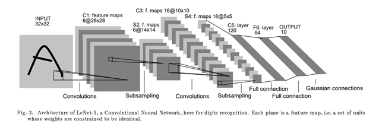
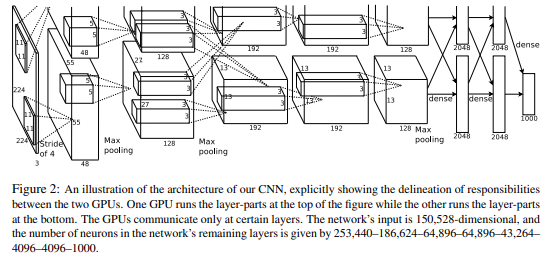
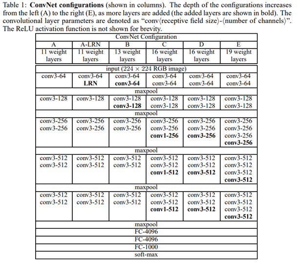
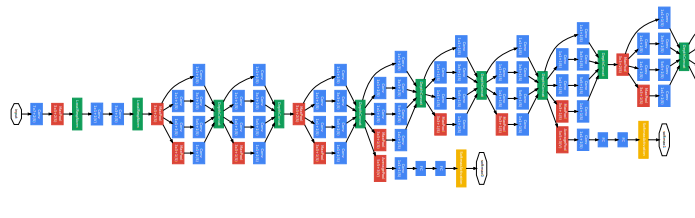
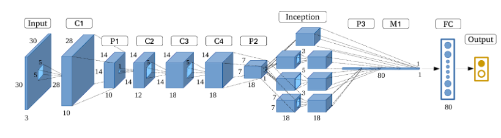
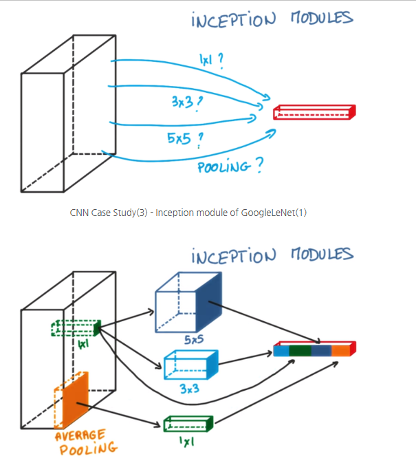
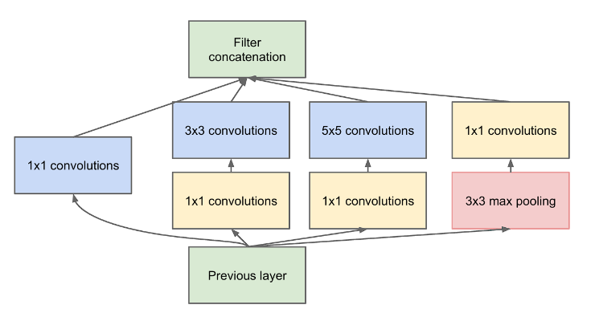
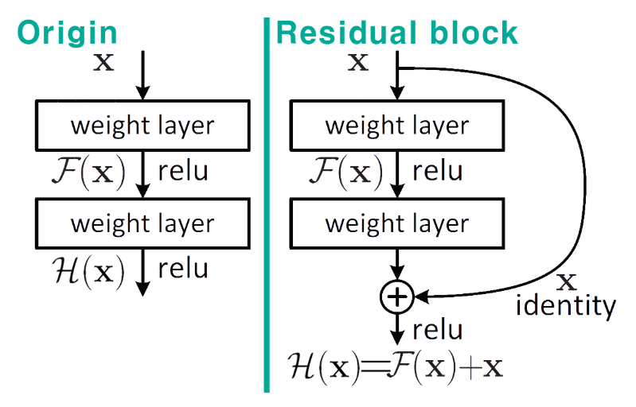
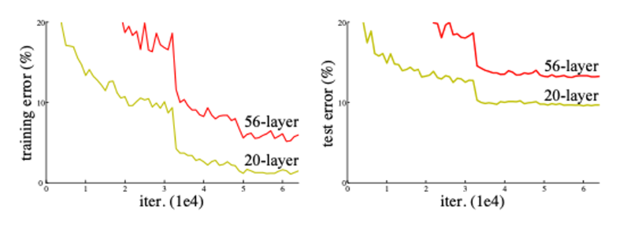

### From Deep Learning Aspirations to Systems Development: My Unexpected Path into AI

During grad school, I studied Deep Learning, thinking it was a promising field worth diving into. I was genuinely excited about neural networks and how they were changing the landscape of tech.

But after graduation, I found myself doing something completely different—systems development. It felt disconnected from AI at first, and honestly, a bit frustrating. Still, I took it as a good opportunity and kept going. Surprisingly, that path led me back to AI—just from a different angle. I ended up working on systems that supported Computer Vision features. I wasn’t building models, but I was helping them run efficiently in real environments.

### Why CNN?

At first, I tried training image data using a simple Multi-Layer Perceptron (MLP). To do that, I had to flatten the 2D image into a 1D vector. While this made it technically possible to train, it came at a cost—the model lost all the local and topological information in the image. It couldn't understand where features were located, only what values existed. This made learning abstract concepts in images inefficient and slow.

To solve this, I turned to Convolutional Neural Networks (CNNs), which preserve spatial information using the concept of a receptive field—like how a lifeguard watches over a specific area of a pool, each convolutional filter focuses on a local region of the image.

### Preliminary

In CNNs, we use small filters (or kernels) that slide over the image. Each kernel has weights (e.g., a 3×3 filter) and performs convolution operations followed by a bias addition and an activation function (like ReLU or Sigmoid). This produces a feature map that captures localized patterns in the image.

For example, filters like the Sobel operator are hand-designed to detect edges, but in CNNs, these filters are learned automatically during training. As a result, CNNs can effectively capture local features and build up abstract representations layer by layer.

By using convolutional layers instead of fully connected layers, the model not only gains efficiency but also becomes much better at recognizing patterns in images.

### 1. LeNet - Gradient Based Learning Applied to Document Recognition

  

One of the earliest and most influential CNN-based architectures was LeNet, developed by Yann LeCun. It was originally designed for handwritten digit recognition (e.g., MNIST) and laid the groundwork for modern convolutional networks.

The input to LeNet is a 32×32×1 grayscale image. The first convolutional layer applies 6 filters of size n×n (typically 5×5), resulting in a feature map of size 28×28×6. This means each of the 6 filters scans the input image and extracts different local features.

After convolution, a subsampling (or downsampling) layer is applied—usually a type of average pooling—which reduces the spatial resolution. This pattern of Convolution → Subsampling repeats, gradually extracting higher-level features while reducing dimensionality.

Finally, the network flattens the feature maps and passes them through one or more fully connected layers, similar to an MLP, to perform classification.

### 2. AlexNet - ImageNet Classification with Deep Convolutional Neural Network

  

While traditional face detection algorithms like Haar Cascades could recognize faces fairly well—especially with properly preprocessed input—AlexNet took things to a whole new level. Designed to handle 224×224 RGB images, AlexNet leveraged the power of GPUs for parallel computation, which allowed it to scale deeper and wider than previous models.

One interesting feature of AlexNet was its split architecture: the network was divided into two parallel streams to take advantage of multi-GPU setups.

AlexNet also introduced several key innovations that became standard in deep learning:

* ReLU Activation: Instead of using sigmoid or tanh, AlexNet used the ReLU function f(x) = max(0, x) for faster convergence and to mitigate the vanishing gradient problem.
* Dropout: To combat overfitting, AlexNet randomly dropped units during training, forcing the network to learn redundant representations.
* Overlapping Pooling: Unlike previous networks that used non-overlapping pooling (e.g., pooling window size = stride), AlexNet used 3×3 pooling windows with stride 2, allowing windows to overlap. This reduced the output size and helped capture more spatial detail, improving translational invariance.
* Local Response Normalization (LRN): Since ReLU can produce very large activations, LRN was introduced to normalize the responses across adjacent neurons at the same spatial location. This helped prevent a few highly activated neurons from dominating.
* Softmax: At the output, a softmax layer was used to convert logits into probabilities, amplifying confident predictions and suppressing weaker ones.

AlexNet’s success in the 2012 ImageNet competition marked a turning point for deep learning, showing that with enough data, compute, and smart design choices, neural networks could outperform traditional hand-engineered features by a large margin.

### 3. VGGNet - Very Deep Convolutional Networks for Large-Scale Image Recognition

  

VGGNet built on the success of AlexNet, using similar input dimensions (e.g., 224×224×3), but introduced a key design shift: replacing larger filters (like 5×5) with multiple 3×3 convolutions stacked in sequence.

This approach brought several advantages:
* Deeper architectures (16 or 19 layers) could be created without excessively increasing the number of parameters.
* Multiple 3×3 filters in a row have the same receptive field as a larger filter (e.g., two 3×3 filters ≈ one 5×5), but with fewer parameters and lower computational cost.

As a result, VGGNet significantly improved performance while maintaining a clean, uniform architecture. Because of its regular structure and strong performance, VGGNet became a popular backbone network for tasks like semantic segmentation and object detection.

However, deeper networks introduced a new problem: during backpropagation, gradients could vanish as they moved backward through many layers, especially toward the input. This vanishing gradient problem made training very deep models difficult, eventually motivating the development of architectures like ResNet, which addressed this with residual connections.

### 4. GooLeNet - Going Deeper with Convolution

  

  

If VGGNet made networks deeper by stacking layers vertically, GoogLeNet (a.k.a. Inception v1) took a different approach—it went deeper in both width and depth (it goes deeper both vertically and horizontally).

GoogLeNet introduced the concept of the Inception Module, which allowed the network to process spatial information at multiple scales simultaneously. As the name suggests, this architecture digs deeper and deeper into the network structure.

The unique part of GoogLeNet is the Inception Module. Take a look at the diagram below to understand it better.

  

As shown in the diagram above, one way to increase the depth of the network is by extracting feature maps using different kernels, then applying average pooling or max pooling, and finally concatenating the results.

However, GoogLeNet went further and proposed a more efficient structure by combining multiple operations—like pooling and convolutions with different kernel sizes—in parallel. One of the key innovations was the use of 1×1 convolutions, either before or after other operations, forming what’s known as a bottleneck structure.

Using 1×1 convolutions significantly reduced the number of parameters and computation. For example, performing the same operation with 1×1 filters required only around 67,584 parameters (12,288 + 55,296)—a much smaller number compared to what would be needed without them.

Another interesting feature of GoogLeNet is the use of auxiliary classifiers. Instead of having a single softmax classifier at the end, it includes two additional softmax branches in the middle of the network. These auxiliary classifiers help mitigate the vanishing gradient problem by providing additional gradient signals during training.

Lastly, GoogLeNet replaces traditional fully connected layers with Global Average Pooling (GAP) near the end of the network. While the exact mechanism may seem abstract at first, the core idea is that GAP reduces each feature map to a single number by averaging spatial values, effectively summarizing global information without introducing additional parameters—unlike fully connected layers.

  

### 5. ResNet
**Residual Learning: Tackling the Vanishing Gradient Problem**. As mentioned in the previous post, one of the biggest issues with deep neural networks is the vanishing gradient problem. As networks get deeper, gradients calculated during backpropagation tend to shrink. The more layers you have, the more the gradients approach zero, which means the weight updates—especially in early layers—become negligible. In other words, the network struggles to learn because the influence of the output on earlier layers diminishes.

To address this, the concept of the Residual Block was introduced. It uses a mechanism called a skip connection, which forms the basis of residual learning. This allows the gradient to flow directly through the network, helping to mitigate the vanishing gradient issue even in very deep architectures.

Traditionally, the goal was to learn a function H(x) that maps the input x to the desired output y—in other words, to minimize H(x) – y.
However, residual learning takes a different approach: instead of learning H(x) directly, the network learns the residual function, which is H(x) – x.
The idea is that if the desired mapping is similar to the input, it's easier to learn the difference between the input and output than the output itself.

By reformulating the learning objective this way, the model becomes easier to optimize and performs better in very deep configurations.

  

Why F(x) + x Helps: Stabilizing Gradients with Residual Blocks: The diagram above shows what we've been building toward: by using Residual Blocks, we compute F(x) + x, where F(x) is the output of a few convolutional layers and x is the original input.
The key idea here is that when you differentiate this structure during backpropagation, the gradient always retains a value of 1 through the skip connection, ensuring that at least some portion of the signal survives as it flows backward.

Of course, this doesn't completely eliminate the vanishing gradient problem, but according to the original paper, the issue was significantly mitigated by using Batch Normalization. Whether BatchNorm fully solves the vanishing gradient issue or just partially helps is still up for debate. One could argue it's a major breakthrough—or just a minor contributor. Either way, it plays an important role in training very deep networks. BatchNorm's role is to normalize the output of each layer, helping stabilize the gradient flow and speed up convergence.

As a result of stacking multiple residual blocks—50 to 152 layers deep—ResNet was able to achieve a depth 8× greater than VGGNet, while still being trainable.

This is how deeply layered networks with Residual Learning end up looking, as illustrated in the diagram below.

  

According to the paper, as the network depth increases, there is a noticeable trend in performance—but this trend is not necessarily due to overfitting.

**Performance Analysis** 

| Cause              | Explanation                                             | Resolution                    |
|--------------------|---------------------------------------------------------|-------------------------------|
| Vanishing Gradient | Weakened gradients in upper layers during backpropagation | Skip Connection               |
| Weight Attenuation | Imbalanced parameter updates in deeper layers          | Residual Learning Architecture|
| Optimization Issues| Non-convex functions increase local minima              | Bottleneck Architecture       |

The following diagram shows how these challenges have been addressed in the improved architecture.

### 6. DenseNet

### 7. MobileNet

### Resource
* [CNN 흐름 역사](https://junklee.tistory.com/111)
* [Reproducibility in Deep Learning and Smooth Activations](https://research.google/blog/reproducibility-in-deep-learning-and-smooth-activations/)
* [CNN Case Study (2)](https://blog.naver.com/sohyunst/221665969575)