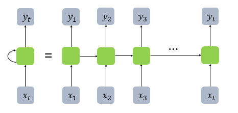
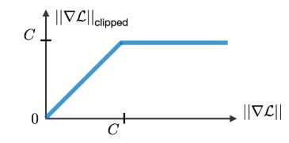
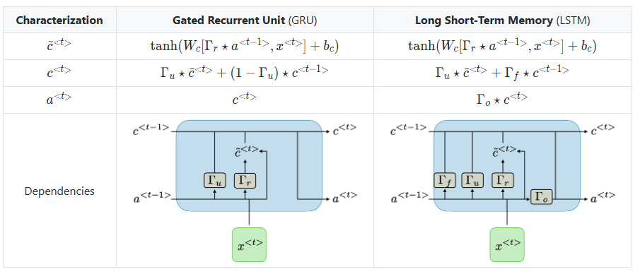
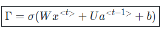
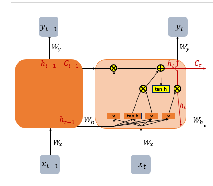
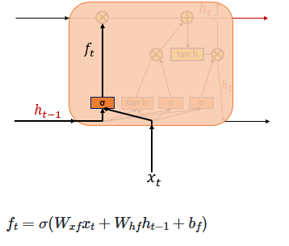
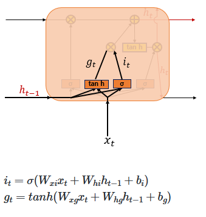
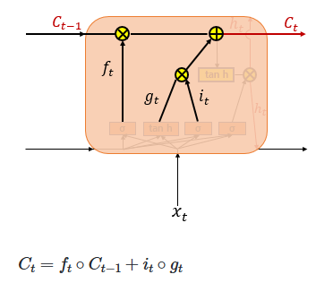
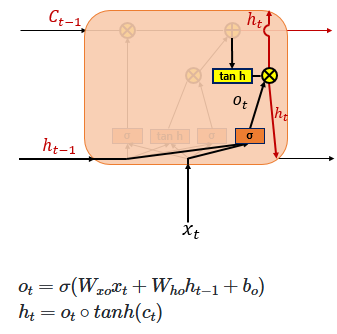
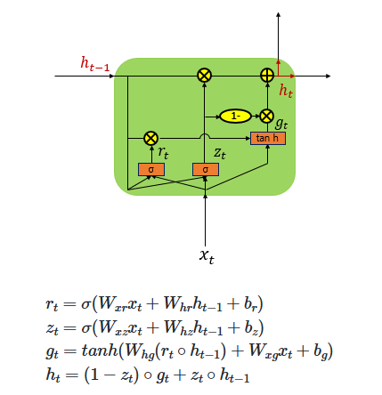

## RNN History

### Series Data and Recurrent Neural Networks (RNNs)

**Series data** refers to data where the state at one point in time is dependent on the states before (or after) it. Examples include input data for **sentiment analysis, music analysis, or even large language models (LLMs)**. These tasks all rely on sequences of information—also known as time series data.

### What is RNN
RNN, or Recurrent Neural Network, refers to a type of neural network where data is processed sequentially, one step at a time. This sequential nature allows RNNs to handle inputs such as words in a sentence, musical notes, or time-series sensor data.

The core building block of an RNN is the cell—a unit inside the hidden layer that performs activation and maintains memory. These are often referred to as memory cells, because they try to "remember" previous information in the sequence.

At each time step, the memory cell receives two inputs:
* The current input (e.g., the current word or note)
* The hidden state from the previous time step

This structure enables recursive reuse of hidden states across time, making the network capable of learning temporal dependencies.

One of the key components of RNNs is the hidden state. Each memory cell carries a hidden state, and at every time step, this hidden state is updated using both the current input and the previous hidden state. This allows the network to "remember" past context as it processes the sequence step-by-step.

When the RNN is unrolled in time, it forms a chain-like structure, where each cell is connected to the next, passing along the hidden state as shown in the diagram.

  

In RNNs, each hidden state at time t depends on the hidden state from the previous time step (t-1). This recursive structure allows the network to "recall" past information over time.

However, this also leads to a major issue:
* As information is passed along through many time steps, older data tends to be lost.
The longer the sequence, the harder it becomes for the model to retain information from earlier time steps.
* In addition, as the depth of the unrolled RNN increases, the model suffers from the vanishing gradient problem during backpropagation—where gradients become too small to update earlier layers effectively.
* 
This makes it extremely difficult to learn long-term dependencies. **One Common Solution** to this problem is **gradient clipping** As shown in the diagram, a constant C is defined as a threshold. If the gradient exceeds this value, it is scaled back to prevent it from exploding or vanishing entirely.

This technique helps stabilize training, especially in deep RNNs or long sequence tasks.

  

### LSTM & GRU

To address the issue of losing information from earlier time steps, a specialized architecture was introduced: LSTM (Long Short-Term Memory).

LSTM is designed to capture both short-term and long-term dependencies in sequential data, allowing the model to selectively retain or forget information over time.

  

Although the above equations may look quite complex, they essentially involve multiple gates, each performing a specific role. Mathematically, the representation of these gates can be expressed as shown in the image below.

  

If we break down these equations further and represent them in a simplified diagram, the image below might help make the concept easier to understand.

  

As mentioned earlier, each gate has a specific role. Let’s examine them one by one from left to right:

### 1. Forget Gate (Decides Whether to Erase the Cell State or Not)

  

The Forget Gate is responsible for deleting unnecessary information. At the current time step 𝑡, the input `𝑥𝑡` and the previous hidden state `ℎ𝑡 −1` are passed through a sigmoid function, producing values between 0 and 1. Values closer to 0 indicate that much of the information is discarded, while values closer to 1 mean the information is retained. This gating mechanism controls how the cell state is updated accordingly.

### 2. Input Gate

  

The Input Gate is used to process the new information to be added to the cell state. As shown on the right, the current input `𝑥𝑡` is multiplied by the weight matrix `𝑊𝑥𝑖`, and the previous hidden state `ℎ𝑡−1` is multiplied by `𝑊ℎ𝑖`. Their sum is then passed through a sigmoid function. At the same time, the current input `𝑥𝑡` multiplied by `𝑊𝑥𝑔` and the previous hidden state `ℎ𝑡−1` multiplied by `𝑊ℎ𝑔` are summed and passed through a hyperbolic tangent (tanh) function. The result of this operation is denoted as `𝑔𝑡`

In other words, the combination of the sigmoid output (ranging from 0 to 1) and the tanh output (ranging from -1 to 1) determines how much new information is selected to update the cell state.

### 3. Cell Gate ***

  

In a standard RNN, only the hidden state is passed along to the next time step. However, in an LSTM, both the hidden state and the cell state are passed forward. The Forget Gate selectively removes some information from the cell state, while the element-wise product of the input gate activation `𝑖𝑡` and the candidate values `𝑔𝑡` determines how much new information is added.

These two components—the retained memory and the newly selected information—are then combined (summed) to update the current cell state `𝐶𝑡` This updated cell state is passed on to the next time step `𝑡+1`. If the forget gate output `𝑓𝑡` is zero, the previous cell state `𝐶𝑡−1` is effectively reset to zero, meaning the cell only retains the newly selected information.

### 4. Output Gate & Hidden State

  

Finally, the Output Gate computes the output at the current time step `𝑡`. It takes the current input `𝑥𝑡` and the hidden state, passes them through a sigmoid function to produce the output gate activation `𝑜𝑡`. Meanwhile, the current cell state `𝐶𝑡` is passed through a hyperbolic tangent (tanh) function, producing values between −1 and 1. The element-wise product of these two values filters the cell state output, resulting in the new hidden state, which is then passed on to the next time step.

As shown in the diagram, the LSTM architecture divides these operations into multiple gates. In contrast, the GRU (Gated Recurrent Unit) simplifies this by combining some of these functions into just two gates: the Update Gate and the Reset Gate. This reduction results in a simpler structure while still effectively updating the hidden state over time, making the GRU a streamlined variant of the LSTM.

  

### Resource
* [WikiDocs - Deep Learning Approach for Natural Language Processing](https://wikidocs.net/22886)
* [Standford - CheatSheet](https://stanford.edu/~shervine/teaching/cs-230/cheatsheet-recurrent-neural-networks)