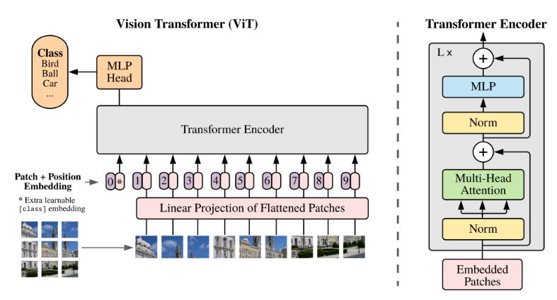
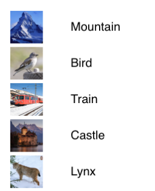
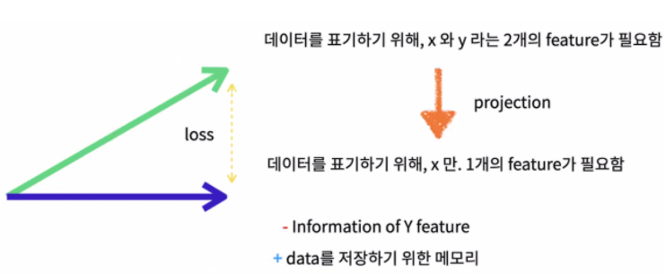
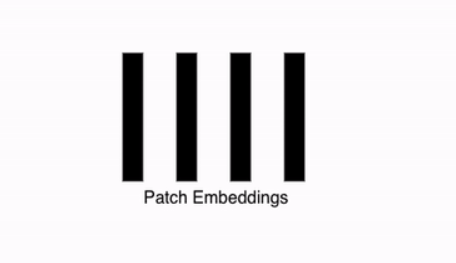
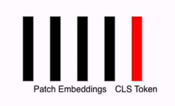
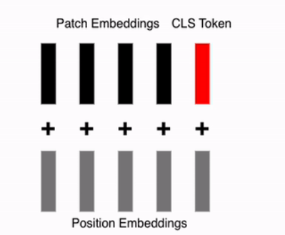
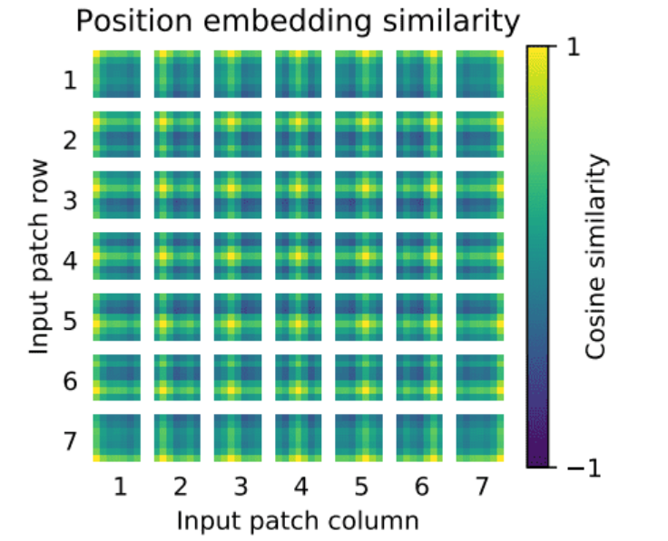

## Vision Transformer

You might have seen this in previous posts. Essentially, a Transformer is a self-attention model that operates in the following way:  
Normalization → Multi-head Attention → Normalization → MLP.

---

Let’s take a look at the overall architecture diagram below.

  

### Input Data
Since it is a Vision Transformer, image data and the corresponding label data are used for training.

  

수식은 아래와 같다.

$$
x \in \mathbb{R}^{C \times H \times W}
$$

### Image Patch in Vision Transformers
In the context of Vision Transformers, an Image Patch refers to the process of dividing an input image into smaller, fixed-size segments called patches. These patches are typically of size $ p \times p $ pixels and are used as input to the Transformer model, effectively treating the image as a sequence of patches, similar to how words are treated in natural language processing.

For example:

* Given a 224 x 224 pixel image, if the patch size is set to 16 x 16 pixels, the image is divided into a grid of 14 x 14 patches (since $ 224 \div 16 = 14 $).
Each patch is then flattened and processed as part of a sequence, which is fed into the Transformer architecture for vision tasks.

* This approach allows the Transformer to leverage its sequence-processing capabilities for vision tasks, treating the grid of patches as a sequence of "tokens" akin to words in text processing.

  

* Below is a direct translation of your input into English, formatted in Markdown, keeping the technical details and structure intact as requested.

CNNs and Vision Transformers: Image Patch Flattening
CNNs have traditionally excelled in image processing through convolution operations. One of their drawbacks is the explosive increase in parameters, leading to issues like overfitting and gradient vanishing, which are addressed using regularization or dropout.
In contrast, Transformers appear to rely on a specific exploitation method. In traditional Transformers, word embedding sequences are used as input. For vision tasks, this is adapted by inputting image patch sequences, enabling tasks like image label prediction. This represents a distinctly different architectural pattern. Flattening of Image Patches
With patched images, a flattening process is applied to convert each patch into a vector of size $p^2 \times c$, where:

* Flatten Operation: The image is divided into patches, and each patch is flattened into a vector. Patch and Input Size: For an image of size $H \times W$ pixels divided into $N$ patches (where $N = \frac{HW}{p^2}$), each patch is processed.
* Flattened Vector: Each patch $z_p$ is represented as a vector in $\mathbb{R}^{N \times (p^2 \cdot c)}$, where:

* $p$: Size of one side of the patch.
* $c$: Number of color channels (e.g., 3 for RGB).
* $N = \frac{HW}{p^2}$: Total number of patches, derived from the image dimensions $H$ (height) and $W$ (width) divided by the patch area $ p^2 $.

Mathematical Formulation
$$z_p \in \mathbb{R}^{N \times (p^2 \cdot c)} \quad \text{where} \quad N = \frac{HW}{p^2}$$

This reflects the process of converting image patches into a sequence of flattened vectors suitable for input into a Transformer model.

### Patch Embeddings
After dividing the image into patches, embeddings are created from each patch. The split image patches undergo a linear transformation to initiate the encoding process. The resulting vectors are referred to as Patch Embedding Vectors, and they are characterized by a fixed length $ d $.

* Each patch of size $ n \times n $ is reshaped into a single column vector of size $n^2 \times 1$.
  * Example: A patch of $16 \times 16$ pixels is flattened into a $256 \times 1$ vector.

### Linear Projection
Each patch, after flattening, concatenates all pixel channels. It then undergoes a linear projection to the desired input dimension. This might seem confusing, but the key idea is:

After flattening, each patch becomes a single column vector (e.g., $256 \times 1$).
The linear projection aims to reduce or transform the dimensions, typically for compatibility with the model’s input requirements.
Example: If a $256 \times 1$ flattened patch is input into a linear layer with 512 nodes, a linear computation (multiplication by weights plus addition of bias) transforms it into a $512 \times 1$ output vector.

  

### Projection of Two Features into One
By projecting two features into a single feature through linear projection, the process allows the use of only one feature. Ultimately, this maps pixel values into a format the model can understand. This involves transforming high-dimensional pixel data into a vector (or point), enabling a more concise representation that captures essential information.

### Latent Vector Definition
The latent vector represents the encoded representation of the image patches after processing. It is defined as:

A sequence of $N$ patch embeddings, where each embedding is scaled by a factor $\alpha$.
The resulting vector is denoted as $[\alpha^1 E_1, \alpha^2 E_2, \dots, \alpha^N E_N]$.

Mathematical Formulation
$$[\alpha^1 E_1, \alpha^2 E_2, \dots, \alpha^N E_N] \in \mathbb{R}^{N \times D}$$
where:

$E \in \mathbb{R}^{(p^2 \cdot c) \times D}$: The embedding matrix, with $p^2 \cdot c$ representing the flattened patch size (where $p$ is the patch dimension and $c$ is the number of channels) and $D$ is the desired embedding dimension. 

Through this process, all patches can be embedded into vectors. The result is an $ N \times D $ array, where:

* $N$: The number of patches.
* $D$: The embedding size for each patch.

This $N \times D$ array represents the embedded patch sequence ready for input into the Transformer model.

  

### Appending a Class (Classification) Token
To effectively train the model, a vector called the CLS Token (Classification Token) is added to the patch embeddings. This vector: Acts as a learnable parameter within the neural network.
* Is randomly initialized.
* Is a single token added uniformly to all data instances.

After this step, the total number of embeddings becomes $n + 1$ (where $n$ is the number of patch embeddings plus the CLS token). Combined with the embedding size $D$, this results in a $(n+1) \times D$ array, which serves as the representation vector for further processing.

### Initial Embedding with CLS Token
The initial embedding $ z_0 $ is formed by appending the CLS Token to the patch embeddings. It is defined as:

Mathematical Formulation
$$z_0 = [\alpha_{cls}, \alpha^1_p E_1, \alpha^2_p E_2, \dots, \alpha^N_p E_N] \in \mathbb{R}^{(N+1) \times D}$$

* $\alpha_{cls} $: The CLS Token, a learnable vector.
* $\alpha^1_p E_1, \alpha^2_p E_2, \dots, \alpha^N_p E_N$: The scaled embeddings of $N$ patches.
* $(N+1) \times D$: The resulting dimension, where $N$ is the number of patches and $D$ is the embedding size.

This $z_0$ serves as the input representation vector for the Transformer model.

  

### Adding Positional Embedding Vectors
In the original Transformer, positional information for words was added to create 2D data. For images, where "which position?" becomes relevant, a process is added to encode positional information for each patch, reflecting its spatial location. This positional encoding is directly added to each embedding vector, including the CLS Token.

**Process**
* Patch Embeddings: Represent the content of each patch.
* Positional Embeddings: Encode the spatial order or position of each patch.
*  Combination: The positional embeddings are added to the patch embeddings and the CLS token to form the final input.
  

  

The Equations are following: 

$z_0 = [\alpha_{cls}, \alpha^1_p E_1, \alpha^2_p E_2, \dots, \alpha^N_p E_N] + E_{pos} \in \mathbb{R}^{(N+1) \times D}$ 

where:
* $E_{pos} \in \mathbb{R}^{(N+1) \times D}$: The positional embedding matrix, with the same shape as the patch and CLS token sequence. This $z_0$ represents the final input to the Transformer, incorporating both the content (via patch embeddings and CLS token) and positional information.

  

Similar to the previous discussion, the positional encoding method used here involves sin and cos functions, as seen in prior posts. This approach encodes the positional information of each patch, allowing the model to understand the spatial arrangement of the image patches.

The positional encoding $ PE(pos, 2i) $ and $ PE(pos, 2i+1) $ are defined using sine and cosine functions to encode the position of each patch. The formulas are:
Mathematical Formulation
$$PE(pos, 2i) = \sin\left(\frac{pos}{10000^{2i/d_{model}}}\right)$$
$$PE(pos, 2i+1) = \cos\left(\frac{pos}{10000^{2i/d_{model}}}\right)$$

* $pos$: The position of the patch.
* $i$: The dimension index.
* $d_{model}$: The dimensionality of the model.

## Encoder
### Encoder Input
After the previous steps, you now have an array of size $(n + 1) \times d$, where $n$ is the number of patches and $ d $ is the embedding dimension. The next step is to apply self-attention, which allows the model to weigh the importance of different patches (including the CLS token) in relation to each other.

### Multi-Head Self Attention
Create QKV (Query, Key Value)

The embedding vector generated from the previous steps is linearly transformed into multiple large vectors, which are subdivided into three components: Q (Query), K (Key), and V (Value). These vectors are derived from the $(n + 1) \times d$ array, where $n + 1$ represents the number of patches plus the CLS token, and each component retains the same $n + 1$ length.

  

### Resource
[Transformers for Image Recognition at Scale](https://research.google/blog/transformers-for-image-recognition-at-scale/)