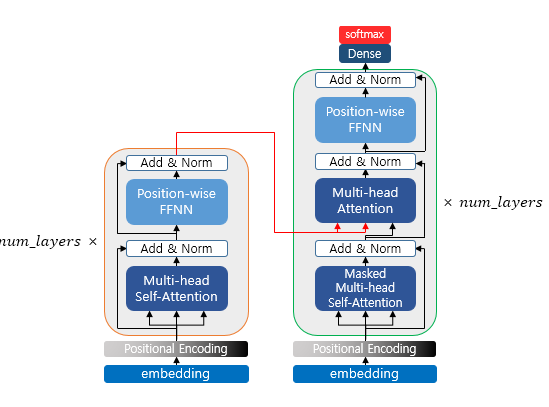

## Attention & Transformer

### Attention Mechanism
The basic idea of attention is that, at each time step during decoding, the decoder refers back to the entire input sentence encoded by the encoder. Instead of treating all parts of the input sentence equally, the model focuses more on the specific parts of the input that are most relevant to predicting the current output word.

### Attention Function (HashMap Analogy)
The attention function can be thought of similarly to a Python dictionary. However, its role is to compute the similarity between a given query and all keys, then map each key to a value weighted by this similarity. The output is essentially a weighted sum of these values, where the weights reflect the relevance (similarity) to the query.

  

* Q: Query — The hidden state of the decoder cell at time step 𝑡
* K: Keys — The hidden states of all encoder cells at every time step
* V: Values — The hidden states of all encoder cells at every time step

### Attention Features

At each time step, the decoder refers back to all encoder hidden states, focusing more on the words that are most relevant. This approach helps address issues like vanishing gradients and the fixed-size output vector limitation of traditional RNNs.

The attention mechanism computes similarity scores based on dot products. Specifically, to calculate the attention scores, the decoder’s hidden state at time step `𝑡`, denoted as `𝑠𝑡`, is multiplied by each encoder hidden state `ℎ1, ℎ2, …,ℎ𝑁` For example, in the third decoding stage where the model predicts the next word after "je" and "suis," it re-examines all encoder inputs to determine relevant information.

Formally, assuming the encoder and decoder hidden states share the same dimensionality, the attention scores `𝑒𝑡` can be calculated as: `et = [st⊤h1, st⊤h2, … ,st⊤hN] Here, 𝑒𝑡 is the vector of attention scores representing the relevance of each encoder hidden state to the current decoder state.

  

After computing the attention scores, we apply the softmax function to obtain the attention distribution, also known as the attention weights. By applying softmax to the attention scores `𝑒𝑡`, we get a probability distribution `𝑎𝑡`, where all values sum to 1. Each value in `𝑎𝑡` represents the weight (or importance) assigned to the corresponding encoder hidden state.

Formally: `𝑎𝑡 = softmax(𝑒𝑡)`
These attention weights determine how much each encoder hidden state should contribute to the current decoding step. In the diagram, the red rectangles represent the magnitude of attention weights applied to the encoder hidden states.

  

Once the attention weights `𝑎𝑡` are computed, we calculate the weighted sum of the encoder hidden states. This weighted sum is called the attention value, and it's also commonly referred to as the context vector.

The higher the attention weight assigned to a particular hidden state, the more strongly it contributes to the final context vector—indicating a higher relevance to the current decoding step.

Formally, the context vector context 𝑡 (or attention value) is computed as:

$$
\text{context}_t = \sum_{i=1}^{N} a_i^t \cdot h_i
$$
 
This vector summarizes the relevant parts of the input sequence, tailored for the current decoding time step 𝑡.

  

After computing the attention value (context vector), it is concatenated with the decoder's hidden state at time step 𝑡, denoted as `𝑠𝑡`.

This concatenated vector, often written as `𝑣𝑡 = [context𝑡;𝑠𝑡]`, combines both the information from the encoder (via attention) and the current state of the decoder. This merged vector `𝑣𝑡` is then used as input for predicting the output `𝑦𝑡`, helping the model make more accurate predictions by leveraging both current decoding context and relevant encoder features.

  

### Computing \( \tilde{s}_t \), the Input to the Output Layer

Before sending \( v_t \) (the concatenation of the context vector and the decoder hidden state) directly to the output layer, it is passed through an additional neural layer for transformation.

Specifically, \( v_t \) is multiplied by a weight matrix and then passed through a **hyperbolic tangent** (tanh) activation function. This results in a new vector \( \tilde{s}_t \), which serves as the final input to the output layer:

$$
\tilde{s}_t = \tanh(W_o \cdot v_t)
$$

This transformation allows the model to learn a richer representation before making the final prediction for the output word \( y_t \).

  

### Different Attention & Score

| Name           | Score Function                                                                                                     | Defined by                  |
|----------------|---------------------------------------------------------------------------------------------------------------------|-----------------------------|
| dot            | \( \text{score}(s_t, h_i) = s_t^\top h_i \)                                                                        | Luong et al. (2015)         |
| scaled dot     | \( \text{score}(s_t, h_i) = \frac{s_t^\top h_i}{\sqrt{n}} \)                                                       | Vaswani et al. (2017)       |
| general        | \( \text{score}(s_t, h_i) = s_t^\top W_a h_i \)   // \( W_a \) is a learnable weight matrix                    | Luong et al. (2015)         |
| concat         | \( \text{score}(s_t, h_i) = W_a^\top \tanh(W_b[s_t; h_i]) \)   or   \( W_a^\top \tanh(W_b s_t + W_c h_i) \) | Bahdanau et al. (2015)      |
| location-base  | \( \alpha_t = \text{softmax}(W_a s_t) \)   // Only uses \( s_t \) when computing \( \alpha_t \)                | Luong et al. (2015)         |

### RNN + Attention (seq2seq) Limitation

The Encoder-Decoder structure consists of two main components: the encoder, which compresses the input sequence into a fixed-length vector (often called the context vector), and the decoder, which generates the output sequence based on this vector.

However, this approach has several limitations:
* Information loss during compression into a single vector
* Lack of parallelism, since RNN-based encoders/decoders process sequences sequentially
* High computational complexity

To address these issues, the **Transformer** architecture was introduced.

### Transformer

The Transformer replaces recurrence with attention mechanisms, specifically self-attention and cross-attention, to model dependencies in sequences. Just as CNNs use convolution to extract feature maps, attention computes similarity scores using dot products, followed by a weighted sum of values. This allows the model to focus on the most relevant parts of the input when processing each token.

Key features include:
* The ability to differentiate between individual tokens using attention weights
* The use of self-attention within both the input (encoder) and output (decoder) sequences
* Support for parallel computation, greatly improving training efficiency

Although the Transformer does not use RNNs, it still follows the Encoder-Decoder architecture, where it takes an input sequence and generates an output sequence. The overall structure is similar to that of traditional RNN-based models.

However, there is a key difference:
In RNNs, the model processes the sequence step by step over time — each unit corresponds to a specific time step 𝑡. In Transformers, the model processes the entire sequence in parallel. Instead of time steps, it consists of 𝑁 repeated encoder and decoder blocks, each operating on the entire sequence simultaneously. This structural shift allows Transformers to overcome the sequential bottleneck of RNNs and achieve much better performance in terms of parallelization and long-range dependency modeling.

  

The end of the computation is as shown in the image below. The process continues from the input `<sos>` until `<eos>` is produced. Especially, since it is not divided by time steps like an RNN, positional encoding is necessary. In other words, a word's one-hot encoding technique can be considered to be included.

  

  

  

  

### Transformer Components
I will first define the following steps. The diagram below can be considered the overall architecture.

  

### Encoder (self.attention)

The encoder is built using `num_layers` (6). Inside, there can be layers such as multi-head self-attention and position-wise FFNN.

  

In Sequence-to-Sequence models, the meaning of Q, K, and V was that Q represented the decoder hidden state at time step t.

However, in self-attention, Q, K, and V are the same. This means they represent the vectors of all words in the input sentence.

Note that instead of using the words themselves directly, their dimensionality is reduced. For example, if there are 4 words, each has a position vector, and these position vectors’ dimensions are reduced to form the dimensions of Q, K, and V.

After that, scaled dot-product attention is applied. Overall, this is performed as matrix operations (not just vector operations).

---

### Multi-Head Attention

Among the parameters, there is a "number of heads," which corresponds to parallel processing heads. Each head performs the following steps with Q and K: matrix multiplication → scaling → optional masking → softmax → matrix multiplication with V. Each head extracts different values, and by processing them in parallel, the values from each head are obtained.

---

### Padding Mask

Here, the mask refers to the padding mask. Padding tokens have no actual meaning. Therefore, in the transformer, if a key corresponds to a padding token, similarity is not computed—in other words, it is excluded (which might be compared to a skip connection, but they are not the same). In this case, the padding mask has small values (close to zero) in the attention score.

### Position-wise FFNN

The point-wise FFNN can be considered a sublayer that both the encoder and decoder have. Therefore, it can be viewed as performing the computations shown in the diagram below.

  

Another notable aspect is the use of skip connections and layer normalization (similar to the residual blocks in ResNet).

---

### Encoder to Decoder

That is, the encoded information is passed to the decoder. This is done by feeding the values into the multi-head attention. We will take a closer look at this part on the decoder side.
If you want, I can help expand or clarify further!

  

### Decoder (Self-Attention / Look-Ahead Mask)

Like the encoder, the decoder also receives a sequence of words as input. However, to prevent the model from looking at future words beyond the current time step, an optional mask is applied during training. This masking prevents the decoder from attending to subsequent words and is called the look-ahead mask. Similar to the encoder, self-attention is performed. 

In summary, the decoder can only attend to itself and the previous words, but not to future words.

  

The second case is when the values received from the encoder and the decoder are used together. In this layer, it is not self-attention. This means the definitions of Q, K, and V are different.

Q corresponds to the decoder matrix, while K and V correspond to the encoder matrix. Mapping this to the example above, it looks like the following.

  

After that, the output probabilities are generated, and during inference, the token with the highest probability is produced.

### Dot Product of Query and Key Values

  

### Resource
* [WikiDocs - Deep Learning Approach for Natural Language Processing](https://wikidocs.net/22886)