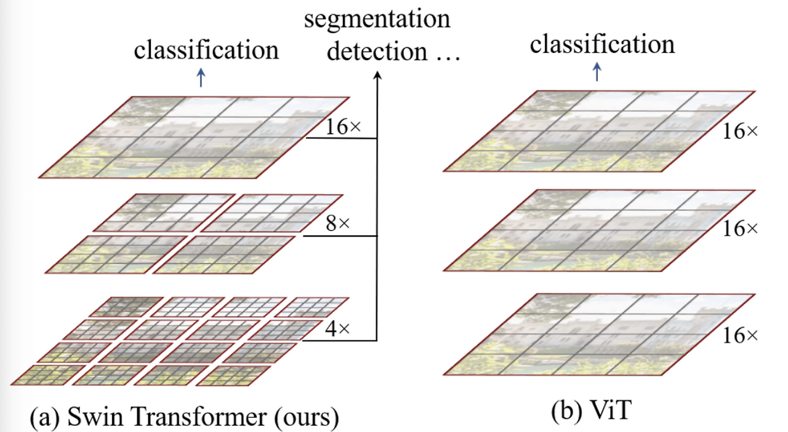
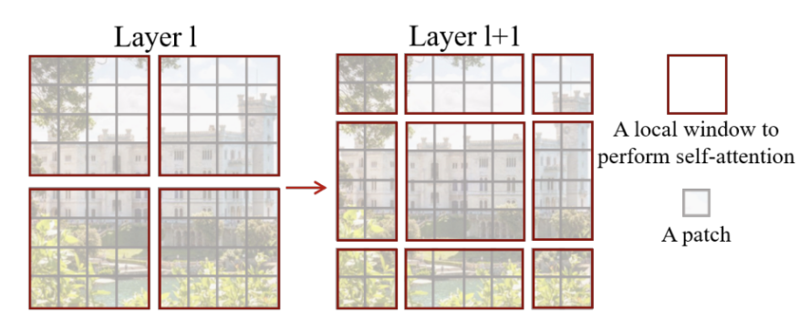
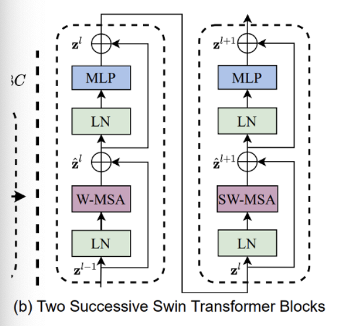
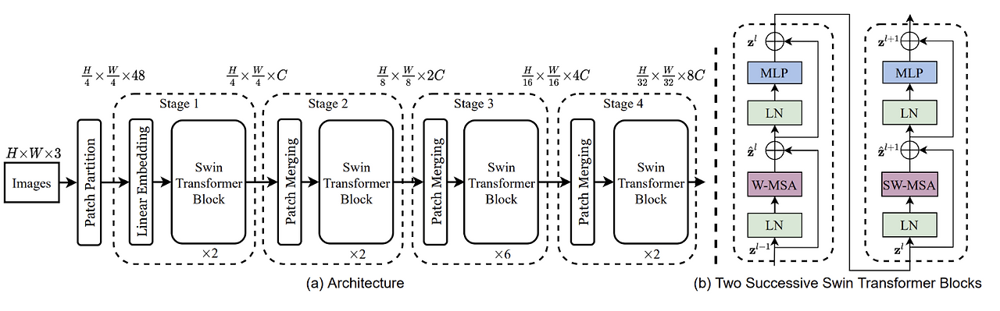
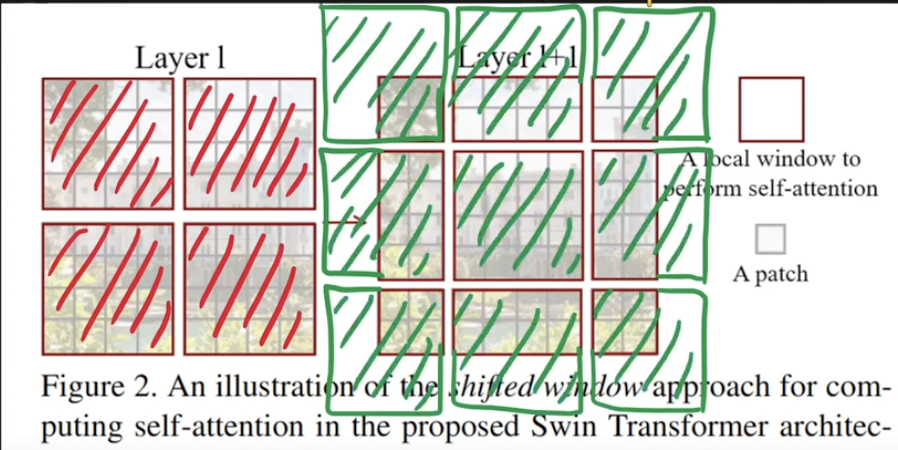
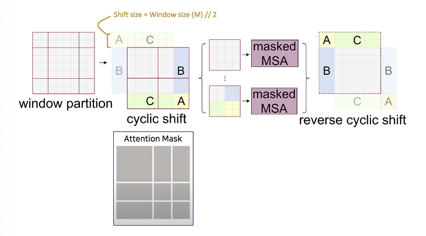
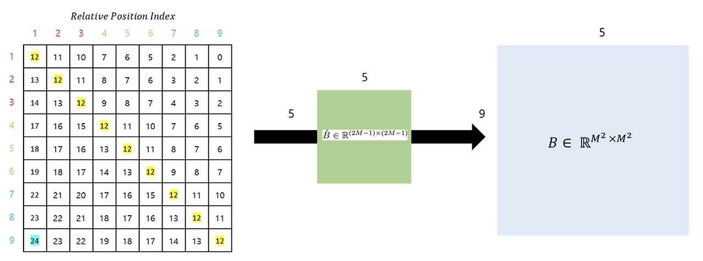

## Swin Transformer

## Limitation on Vision Transformer (ViT)

While Vision Transformers (ViT) have shown strong performance in image classification. There are several limitations that arise when applying them to more and various computer vision tasks. 

### 1. Fixed Patch Size & Lack of Local Content

ViT splits the image into **fixed-size patches** (e.g., `16x16`), regardless of the underlying content

As a results:
- The model may **attent to meaningless or background regions** (e.g white pixels) with no semantic values
- If important visual elements are split across patch boundaries, **local similarity between pixels is lost**

Maybe the example I can think of is, a small object like a bird might get split between patches, causing the network to miss its continuity entirely.

### 2. Poor Handling of Scale Variations 

ViT lacks mechanisms to handle **scale variablity** in visual tokens.
In real-world images:
- A bird could occupy **200x200** or **just 20x20**, but both should still be recognized as "a bird"
- Without scale-awareness, the model struggles to generalize across different object sizes.

### 3. Quadratic Complexity

ViT's self-attention has **quadratic complexity** with respect to the number of patches (i.e., \( O(n^2) \)).

This becomes computationally expensive for high-resolution images commonly found in practice (e.g., 1920×1080).

### 4. Limited to Classification Tasks
ViT was initially designed for **image classification**, but many vision applications require more:
- **Object Detection**: Unlike language tokens, visual elements vary widely in size and spatial distribution.
- **Semantic Segmentation**: Image resolution is **much higher** than text sequences, requiring dense predictions across pixels.

### Solution & Architecture: Hierarchical Structure & Shifted Window Attention
- A **pyramid-like hierarchical structure**, inspired by CNNs and U-Net
- **Shifted window-based local self-attention**, which allows the model to:
  - Capture local context efficiently
  - Reduce computation to **linear complexity** with respect to image size
  - Scale well to high-resolution and dense prediction tasks

These architectural choices allow Transformers to be applied **beyond classification**—including detection and segmentation

### A General Transformer Backbone for Vision

  

The diagram above illustrates the **general structure of a Transformer-based vision backbone**.  The **Swin Transformer** begins by splitting the input image into **small non-overlapping patches** (gray outlines) and gradually builds up **hierarchical representations** by merging neighboring patches at deeper layers—similar to CNNs.

### Local Self-Attention with Shifted Windows
To reduce computational complexity, **Swin Transformer** performs self-attention **within non-overlapping windows** (red outlines) rather than across the entire image.

- These windows are fixed in size (e.g., 4×4 patches).
- Attention is calculated **only within each window**, not globally.
- As a result, **computational complexity becomes linear with respect to image size**, instead of quadratic.

This window-based local attention allows the model to efficiently process images of various sizes, since the number of windows scales with the image size.

### Example: Window and Patch Hierarchy
- Suppose the input image is divided into **16×16 windows**, each window containing **4×4 patches**.
- Within each 4×4 window:
  - Self-attention is computed **locally**, without looking outside the window.
- In deeper layers:
  - **Neighboring patches are merged** (e.g., combining 2×2 patches).
  - This reduces the total number of patches by **a factor of 4**, while increasing the **spatial resolution** of each patch (i.e., width × 2 and height × 2).

This hierarchical merging process enables the model to learn increasingly **abstract and global features**, while maintaining efficiency and scalability.

### Multi-head Self-Attention in Swin Transformer

  

In Swin Transformer, attention is applied **locally** within windows. However, instead of applying the same partitioning across all layers, it introduces a clever mechanism:  
**Shifted Windows**, which allows the model to connect neighboring windows and capture richer context. Each patch in a window shares the **same key set**, which not only simplifies computation but also improves memory access efficiency—crucial for hardware acceleration as explain furthermore.

Notably, all windows in Swin are **non-overlapping**.

  

### W-MSA (Window-based Multi-head Self-Attention)

In **Layer 1** of the Swin Transformer block (left side of the original figure above), the image is divided into non-overlapping windows. Self-attention is applied **within each window only**, making it a **local attention mechanism**. This is referred to as **W-MSA**.

### SW-MSA (Shifted Window-based Multi-head Self-Attention)

In **Layer 2** (right side of the original figure), the windows are **shifted** relative to the previous layer. This allows self-attention to be computed **across window boundaries**, connecting adjacent regions. While traditional sliding windows can also cover neighboring areas, shifted windows **maintain efficiency** while introducing **inter-window connections**, enabling the model to capture **global interactions gradually**.

Traditional Multi-head Self-Attention (MSA) computes attention globally across all tokens in an image. While this enables long-range dependencies, it comes with a significant computational cost.

Before, the complexity of global self-attenion is: 

MSA:
  Ω(MSA) = 4 * h * w * C^2 + 2 * (h * w)^2 * C

Where:
- h, w = height and width of the feature map
- C = number of channels

But there is a problem with this, if the input resolution increases, the quadratic term grows dramatically - making it inefficient for high-resolution images.

To address this, **Window-based Multi-head Self-Attention (W-MSA)** restricts attention to local windows of size M × M. Its complexity is:

W-MSA:
  Ω(W-MSA) = 4 * h * w * C^2 + 2 * M^2 * h * w * C

Here, M is a fixed window size (e.g., 7), making this approach **linear** in terms of image size. This dramatically reduces computational cost while retaining performance in local contexts.

| Method   | Complexity                         | Scales with Image Size? |
|----------|------------------------------------|--------------------------|
| MSA      | O((h·w)^2)                         | ❌ Quadratic             |
| W-MSA    | O(h·w) (when M is fixed)           | ✅ Linear                |

Also, the each swin transformer block consists of: 
- A **W-MSA** or **SW-MSA** module  
- A **two-layer MLP** with **GELU activation**
- **Layer Normalization** before each sub-layer
- A **residual connection** (skip connection) applied after each block

### Model Architecture

  

The figure above illustrates the overall architecture of the **Swin Transformer**. Here's how the input image is processed step-by-step:

1. **Patch Partitioning**  
   The input image is first split into non-overlapping patches of size **4×4**, resulting in patch tokens of shape **4×4×3**. Each patch is then flattened and passed through a **Linear Projection** to form an embedding vector.

2. **Linear Embedding**  
   These patch vectors are embedded into a fixed-dimensional space using a learnable linear layer. This prepares them for the Transformer blocks that follow.

3. **Transformer Blocks (Stage 1)**  
   The embedded patches are fed into Transformer blocks, where self-attention is computed both **within patches** (local) and **between patches** (global). This stage captures fine-grained, low-level features.

4. **Patch Merging (Stage 2)**  
   After Stage 1, a **Patch Merging Layer** is applied. This merges each group of **2×2 neighboring patches**, concatenating their features into a single vector (dimension becomes **4C**). A linear layer then reduces this to **2C**, effectively reducing spatial resolution (by a factor of 2) and increasing the channel capacity.

5. **Hierarchical Feature Learning (Stages 3 & 4)**  
   This patch merging process and Transformer block application are **repeated multiple times**, forming deeper stages. As a result, the feature maps get smaller in spatial dimensions but richer in representation—similar to how **UNet** or **image pyramids** work in traditional vision architectures.

6. **Final MLP Head**  
   At the end of the final stage, a **Multi-Layer Perceptron (MLP)** head is applied to perform the final prediction task, such as classification or detection.

To explain furthermore on second layer, let's look at the image below.

  

### Shifted Windows in Swin Transformer
Let's slowly wrap this, Swin Transformer, introduces a novel mechanism—**Shifted Window Multi-head Self-Attention (SW-MSA)**—to efficiently model long-range dependencies without incurring the high cost of global self-attention.

**Why Shift Windows?** The baseline attention mechanism, **Window-based MSA (W-MSA)**, computes self-attention **within non-overlapping windows**. This is efficient, but it lacks cross-window communication.

To address this, **shifted windows** are applied in alternating Transformer blocks:
- Each window is **shifted by a fixed size (e.g., half the window dimension)**.
- This causes adjacent windows to partially overlap.
- As a result, **tokens from different regions can now interact**, enhancing the model’s representational power.

### Cyclic Shift & Attention Masking

 

  

Shifting windows introduces new windows and disrupts alignment, potentially increasing computational complexity. Swin Transformer handles this elegantly using:

- **Cyclic Shift:**
  - Instead of moving data in memory, patches are **cyclically shifted** (like a ring buffer), preserving the GPU’s memory alignment and **restoring the original number of windows**. (ex: a left-side window is shifted **down and right**, aligning back to the initial layout.)
- **Attention Masking:**
  - After shifting, some patches may come from **semantically unrelated areas**.
  - Example: patches A, B, and C are visually close after the shift, but **not contextually related**.
  - A **binary attention mask** ensures that attention is **only computed within valid, local regions**.
  - After self-attention, the **cyclic shift is reversed**, restoring spatial structure.

### Relative Positional Encoding
Unlike traditional Vision Transformers (ViT), which use **absolute positional embeddings**, Swin Transformer applies:

- **No positional encoding at the input**.
- Instead, **relative position bias** is learned and added **during attention computation**.
  - This bias represents the **relative distance between tokens** inside each window.
  - It enables the model to maintain spatial structure without global positional references.

- The details are shwon below
  
  $Attention(Q, K, V) = SoftMax(\frac{QK^T}{\sqrt{d}} + B)Vs$

  

In conclusion, as shown in the figure above, the Relative Position Bias is generated using $\hat{B}$. Ultimately, for the matrices $Q$, $K$, and $V$, where $M^2$ represents the number of Window Patches, and the relative positions along each axis range from $[-M+1, M-1]$, it can be seen that a smaller-sized Bias matrix $\hat{B}$ is parameterized, and the values of $B$ are derived from $\hat{B}$.

---

## Resource
* [Small Object Detection for Birds with Swin Transformer](chrome-extension://efaidnbmnnnibpcajpcglclefindmkaj/https://www.cs.is.i.nagoya-u.ac.jp/users/ide/res/paper/E23-conference-huod-1pub.pdf) 
* [Swin Transformer: A Scalable Vision Transformer That just make sense](https://medium.com/@nithinrachakonda.ds/swin-transformer-a-scalable-vision-transformer-that-just-makes-sense-1f142b7ee20e)
* [Swin Transformer V1 Review](https://brunch.co.kr/@leadbreak/13)
* [Swin Transformer Paper Review](https://kimjy99.github.io/%EB%85%BC%EB%AC%B8%EB%A6%AC%EB%B7%B0/swin-transformer/)
* [Swin Transformer Paper Review](https://stevenkim1217.tistory.com/entry/%EB%85%BC%EB%AC%B8-%EC%A0%95%EB%A6%AC-Swin-Transformer-Hierarchical-Vision-Transformer-using-Shifted-Windows)
* [Youtube - Swin Transformer Animated and Explained](https://www.youtube.com/watch?v=SndHALawoag&t=360s&ab_channel=AICoffeeBreakwithLetitia)
* [Youtube - Hierarchical Vision Transformer using Shifted Window](https://www.youtube.com/watch?v=tFYxJZBAbE8&ab_channel=AIBites)    