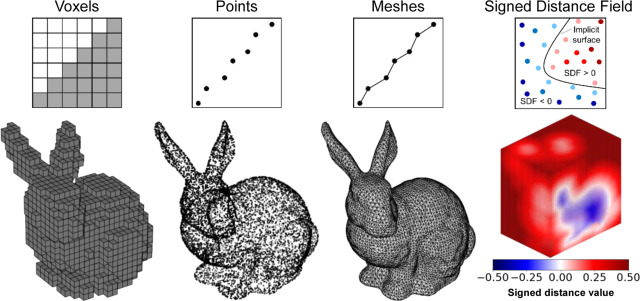
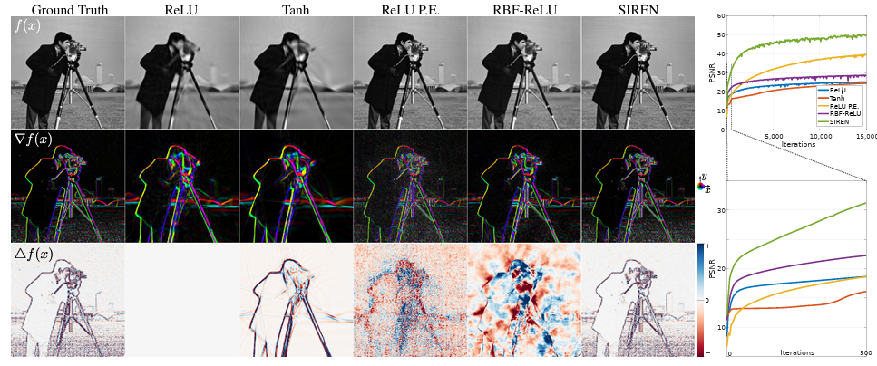

## Motivation: Neural Radiance Field (NeRF)
Neural Radiance Field (NeRF) is one of the interesting topics, which is kinds of extension of SIREN (Sinusoidal Representation Networks). NeRF is a method for representing 3D scenes using neural networks, specifically designed for novel view synthesis. Before this paper, there were Soft3D, Multiplane Image Methods (Multi-Layer, if views are different=>Orthogonal, it can't be rendered), Neural Volumes (Memory Consumption issue <=> Resolution Issues), and many more. Most of them uses explicit 3D representation, such as voxel grids or points cloud. As you may know voxel representation can (1) leads to discretization artifacts or degrades view-consistency and (2) large memory consumption. But NeRF uses Implicit feature representation (Ligher than voxel representation), and continuous volumetric scene function. In detail or result, Nerual Radiance Field (NeRF) encodes a continuous volume within the deep nerual networks, whose input is a single 5D Coordinate (spatial location (x, y, z) and viewing direction (θ, φ)) and output is the volume density and view-dependent emitted radiance(RGB Color) at that spatial location.

The image shown below is the overview of Explicit Representation vs Implicit Representation. As you can see, Explicit Representation uses Voxel Grid, Mesh, and Point Cloud, but Implicit Representation uses Signed Distance Function & Fields (SDF).

  

### Background: Neural Fields, Periodicity, Learning to Map

In order to understand NeRF, we need to understand the "Periodicity" and "Neural Fields" that underpin modern neural rendering techniques. 

Neural Fields represent signals as continuous functions parameterized by nerual networks. Rahter than storing data in discrete grids or voxels, neural fields map input coordinates directly to output values - whether that's color, density, signed distance, or any other signal. This idea shift allows us to represent complex 3D scenes implicitly through learned function approximations. For example, given an image, we train model with function that maps f_theta(x, y) -> RGB at position (100.4, 200.7) in the image, and compute this in nerual network by inputing (x, y) coordinates. This makes us toe query the scene at specific coordinates supporting different resolution.

The image below explains the periodicity concept. 

  

### NeRF Key Points
* This paper proposes a method that synthesizes novel view of complex scenes by optimizing an underlying continuous volumetric scene function using a sparse set of input views.
* This algorithm represents a scene using a fully-connected deep network, whose input is a single 5D Coordinates and whose output is the volume density and view-dependent RGB Color at that spatial location.
* Classical volume rendering techniques are used to accumulate those colors and densities into a 2D Images

### Resources
* [SIREN, Implicit Neural Representations with Periodic Activation Functions](https://arxiv.org/abs/2006.09661)
* [NeRF: Representing Scenes as Neural Radiance Fields for View Synthesis](https://arxiv.org/abs/2003.08934)
* [Neural Fields in Visual Computing and Beyond](https://arxiv.org/abs/2301.05224)