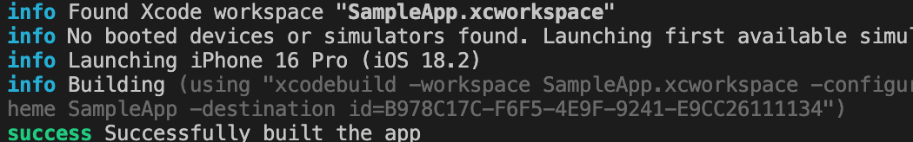
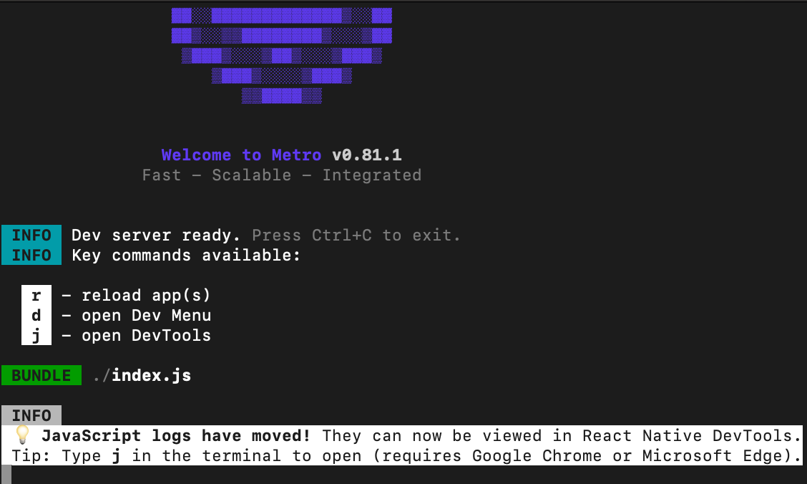
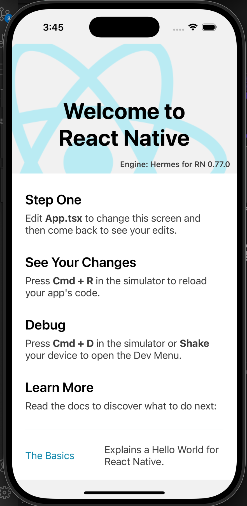

## React Native Motivation & Installation

### React Native 시작 및 동기부여

사실 Interactive Web 을 사용하고 싶었고, 뭔가 항상 가지고 있었던, Front-end 는 별로야. 너무 볼것도 많고, 디자인 할것도 많고, Core Value 가 없어보여.. 이런말만 했었는데, 요즘은 Spatial Computing 이 되게 중요하지 않나? 라고 생각해서 mobile 로 할수 있는게 뭘까? 하니 [What is  Spatial Computing](https://medium.com/@victoragulhon/what-is-spatial-computing-777fae84a499). 읽어보면,

> It's the purset form of "blending technology into the world

라고 작성이 되어있다. 즉 우리가 사용하는 Computer Hardware 를 사라지게 하며, digital 현상으로 볼수 있는, machine 으로 부터 Output 만 보는 형태! 라고 볼수 있다. Application 으로는 VR/AR/MR 등이 있으며, 아래와 같이 정의한다.

* VR: VR places the user in another location entirely. Whether that location is computer-generated or captured by video, it entirely occludes the user's natural surroundings.

* AR: In augmented reality - like Google Glass or the Yelp app's monocle feature on mobile devices - the visibile natural world is overlaid with a layer of digital content.

* MR: In technologies like Magic Leap's virtual objects are integrated into - and responsive to- the natural world. A virtual ball under your desk, for example, would be blocked from view unless you bent down to look at it. In theory, MR could become VR in a dark room.

좋은 실무 예제로는 [Youtube](https://www.youtube.com/watch?v=3RZuGniDcF8&ab_channel=StageMeta) 이 있을것 같다.

### Before getting into develop mode

일단 개발환경을 앞서서, 어떻게 XR 과 관련된 개발을 찾아보자. 일단 ARKit, RealityKit 같은 경우는 ARKit 은 증강현실 프레임워크 이고, RealityKit 는 3D Rendering Framework 이다. RealityKit 이 ARKit on top (ARSession) 에 실행된다고 보면 된다. RealityKit 은 rendering 할수 있는 engine 이 존재하고, physics 또는 animation 을 담당한다. 언어로는 swift / object-c 가 있다. 물론 Framework (Unity)를 껴서 개발은 가능하다. 더 자세한건 여기 [Forum](https://www.reddit.com/r/augmentedreality/comments/fjc11i/whats_the_difference_or_relationship_between/) 에서 보면 될것 같다. 그리고 RealityKit 과 Metal Computing Shader 와는 같이 작동하고, API 를 사용해서 렌더링 성능을 향상 시킨다.

그리고 OpenXR 같은 경우 vulkan 을 만든 chronus group 에서 만들어졌고, 뭐 C/C++ 을 사용한다. 그리고 나머지는 WebXR 이다. 웹브라우저에서 XR 을 지원하기 위해서 만들어졌으며, WebGL 함께해서 갭라을 한다고 하자.

물론 Metal 을 공부하는것도 나쁘진 않지만, 기본적인 구조는 DirectX11/12 Graphics Pipeline 는 같은것 같다?(이건 확인 필요!)

### Setting up IOS(VM) Dev on Windows or MacOS directly
이 부분은 굉장히 까다로웠다. 일단 기본적으로 환경설정을 고려할때, 굳이 macOS 를 Base 로 쓰고 싶지 않았다. [VMWare 설치 및 환경설정](https://cmeaning.tistory.com/77) (단 여기서, .iso file 은 unlocker 에 있는 .iso) 파일을 설치하도록 하자. 그리고 [Resolution Setting](https://sihloh4me.tistory.com/508) 여기를 확인해보자. 가끔씩 VMWare 가 금쪽이 같은 면 이있지만 App 을 Build 하고 코드 작성하는데 크게 문제가 있지는 않은것 같다. 그리고 XCode 를 혹시 모르니까 설치를 해놓자. 설치하는데 시간을 뻇기는건 어쩔수 없는거긴 하지만, 너무 비효율적이고, 길어진다. 인터넷 같은 경우에는 VMWare Player 세팅에서, `NAT: Used to share the host's IP address` 만 해놓으면 괜찮다.

그리고 부가적으로, [Homebrew](https://brew.sh/) 를 설치하자. `/bin/bash -c "$(curl -fsSL https://raw.githubusercontent.com/Homebrew/install/HEAD/install.sh)"`.

그이후에 `https://reactnative.dev/docs/set-up-your-environment?os=macos&platform=ios` 여기에서 Environment 를 설정해주자.

```bash
brew install node
brew install watchman
ruby - v
brew install rbenv
rbenv install -l
rbenv install {latest_version}  # check
rbenv global {latest_version}   # check
sudo gem install bundler
```

설치 되었다면 확인 하자!

```bash
node - v
nvm - v
npm - v

vim ~/.zprofile # or .zsrc / .bashrc

# add this into .zprofile & .zsrc & .bashrc
export NVM_DIR="$HOME/.nvm"
[ -s "/opt/homebrew/opt/nvm/nvm.sh" ] && \. "/opt/homebrew/opt/nvm/nvm.sh"  # This loads nvm
[ -s "/opt/homebrew/opt/nvm/etc/bash_completion.d/nvm" ] && \. "/opt/homebrew/opt/nvm/etc/bash_completion.d/nvm"  # This loads nvm bash_completion

source ~/.zprofile  # .zprofile, .zsrc, .bashrc

nvm install --lts
node - v
nvm - v
npm - v
```

이후에는 XCode 설치 및 설정을 한다. `XCode -> Settings -> Command Line Tool` 최신으로 바꿔준다. 그리고 IOS Simulator 를 설치하면 끝이다.

### Project Setting

프로젝트 생성 관련 및 개발환경 관련된건 두가지가 있다. `Expo` 와 `React Native CLI` 가 있는데, 자세한건 이 [링크](https://toberich.co.kr/entry/Reative-Native-Expo-CLI%EC%99%80-React-Native-CLI-%EA%B0%9C%EB%85%90?category=1056342) 간단하게 말하면, Expo 는 개발 환경 초기설정을 단순화하고 개발 속도가 빠르다는 장점이 있다. Expo go 앱이 있다면 프로젝트 실행이 된다. 하지만 제공되는 API 만 사용해야되고 Native Module 이 없기 때문에, 기술 구현상 어려운 부분이 있다. 그리고 Package 볼때, Expo 에 사용될수 있는지 확인 해야 한다. 

React Native 같은 경우 Native module 을 사용할수 있고, 다양한 라이브러리 사용 가능하다. 기본적으로 제공되는 라이브러리가 없다 보니, 대부분 기능 구현에 있어서는 직접 설치해야한다 하지만 장점으로는 유지보수가 잘되어있다고 한다. (이건 잘모름) 배포 하기 위해서는 Android Studio 나 XCode 가 있어야한다. [이 글](https://www.reddit.com/r/reactnative/comments/17lqvih/what_do_companies_use_expo_or_cli/)을 보게 되면 어떤걸로 개발할지가 뭔가 잘 나와있다. 결국에는 요약한건 이거다. (`React Native itself is an abstraction over the native layer and expo adds another abstraction on top of that one ... learning react native cli first can help you with debugging issues when using expo`)

### Create Project 

처음 하기에는 expo 로 한다고 했는데, 나는 장기적으로 보기 때문에, cli 로 했다. expo 로 개발하려면 [expo 개발환경 설정](https://docs.expo.dev/tutorial/create-your-first-app/) 참조하자.  

기존에 react-native-cli 를 전역(global) 로 설치한적 이 있으면 깔끔하게 지워주자. 그리고 project 를 생성하자.

```bash
npm uninstall -g react-native-cli @react-native-community/cli
npx @react-native-community/cli@latest init {project_name}
```

의존설 설치 관련되서는 `npm install` 이나 `yarn` 을 설정하면 된다. 그 이후 `cocoapod` 를 설치 하면된다.

```bash
npm install
cd ios 
bundle exec pod install # or pod install
```

코드 서명하는법은 skip 하도록 하겠다. 그리고 `yarn start` 하고 `i` 를 누르거나 `npx react-native run-ios` 하면 아래와 같은 그림이 나올거다. 



만약하다가 `error code 65` 가 나온다면 아래와 같이 해주자

```bash
rm -rf ~/Library/Developer/XCode/DerivedData`
sudo killall Simulator
rm -rf ~/Library/Developer/CoreSimulator/Cashes
```

그리고 아래와 같은 그림으로 나올거다. 주의점으로는 절대 빌드 할때 급하게 exit 하지 말자! 알아서 잘될거다.




이로 끝! 긴여정이 끝났다. 개발만 해보자!

### Hello World

자 일단 크게 변경 할점은 `App.tsx` JSX 로 되어있는 부분에 `function APP()` 이부분을 수정을 하면 Hello World 를 볼수 있다.

더 자세한건 [Integration with existing app](https://reactnative.dev/docs/integration-with-existing-apps?language=apple&ios-language=swift#create-a-indexjs-file) 이걸 보면 될것 같다.

## Resource
* [Youtube](https://www.youtube.com/watch?v=wxaCOleAumk&list=PL60Uti4nULBN7EQYmgjksXJXnkufo0m-9&index=3)
* [What's the difference or relationship between ARKit, RealityKit, SceneKit, QuickLook, and Reality Composer?](https://www.reddit.com/r/augmentedreality/comments/fjc11i/whats_the_difference_or_relationship_between/)
* [Blog](https://itinerant.tistory.com/210)
* [Blog](https://developer-haru.tistory.com/62)
* [How to develop app in Orion or Meta Quest3](https://www.reddit.com/r/virtualreality/comments/1ftmhr8/how_to_develop_apps_in_orion_or_meta_quest_3/)
* [How to create a WebXR App using React](https://medium.com/@carolyuanliu/how-to-create-a-webxr-app-using-react-22f16485f710)
* [Meta Spatial SDK](https://www.uploadvr.com/meta-spatial-sdk/)
* [React Three Fiber](https://github.com/pmndrs/react-three-fiber)