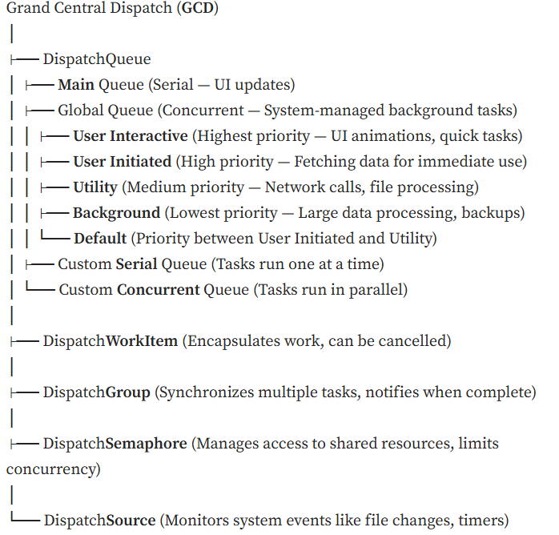
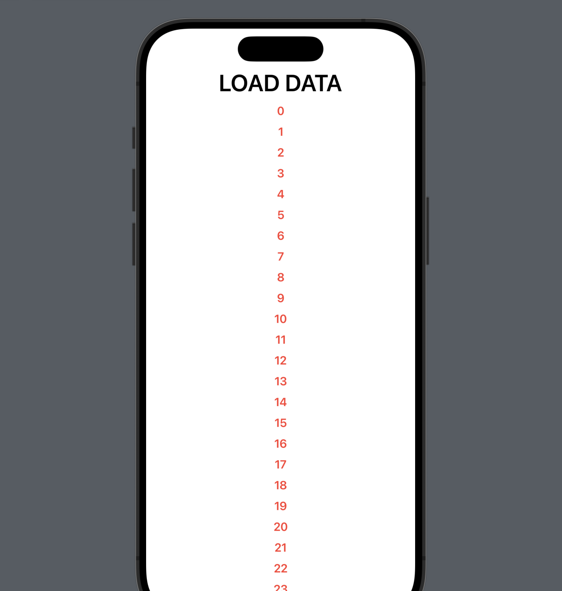
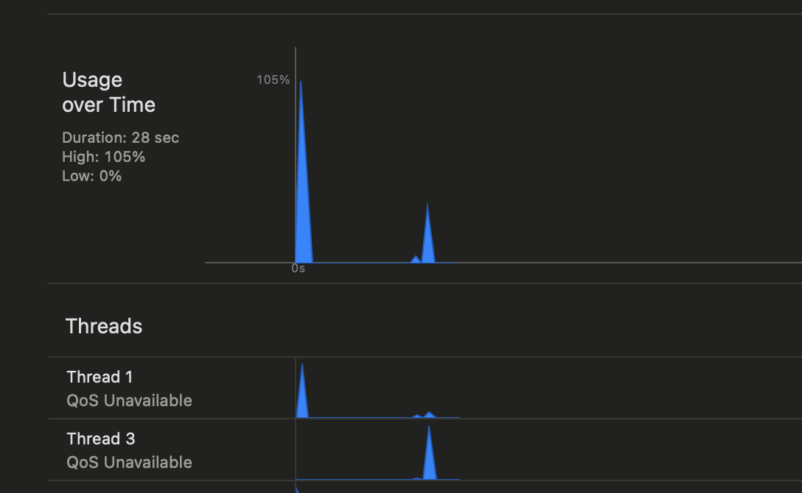

{:toc .large-only}

## MultiThreading & Generic in Swift

어떤 Language 가 됬든 일단 방대한 Data 를 Loading 을 해야하거나, 어떤 통신에 맞물려서 상태 return 받을 때 main thread 에서 모든걸 하게 되면, Performance 가 떨어진다. Swift 에서는 이걸 어떻게 해결하는지, 동작 방법 및 실제 구현해서 App 에서 어떻게 Profiling 을 하는지도 봐보자.

### GCD (Grand Centeral Dispatch)
일단 Multithreading 을 알기 이전에 [Grand Central Dispatch](https://en.wikipedia.org/wiki/Grand_Central_Dispatch) 에 대한 용어 부터 보자. wiki 에서 나와있는것 처럼 multi-core processor 와 other symmetric multiprocessing system 을 최적화하는걸 support 하기위해서 만들어졌고, Thread Pool Pattern 으로 Task 기반으로 병렬화를 진행한다. Thread Pool Pattern 생소할수 있는데, Thread Pool 은 결국에는 Thread(일용직) 들을 위한 직업 소개소라고 생각하면 된다. 여러개의 Thread ~~가~~ 대기 하고 있다가 할 일이 들어오면, 대기했던애가 들어와서 일(실행) 하게 되는거라고 볼수 있다. Thread Pool 은 Queue 기반으로 만들면된다. 그래서 Swift 에서는 DispatchQueue 를 사용해서 이를 해결한다. 쉽게 말해서 Task 에 대한 병렬 처리 또는 (비)동기 처리 를 총괄하는 것이 GCD 라고 볼수 있다. 아래의 그림을 보면 간략하게 GCD 가 뭔지를 대충 알 수 있고, `DispatchQueue`, `DispatchWorkItem`, `DispatchGroup`(thread group?) 등을 볼수 있다. (참고: [Ref](https://medium.com/@ayshindhe/simplifying-grand-central-dispatch-gcd-in-swift-cc3d4f681c43))



GCD 에서 제공 하는 Thread 를 살짝 살표 보자면 Main(Serial) 은 UiKit 이나 SwiftUI 의 모든 요소를 담당한다고 볼수 있고, Global(Concurrent) 같은 경우는 system 전체에서 공유가 되며, 병렬적으로 실행되지만 [QoS](https://developer.apple.com/documentation/dispatch/dispatchqos) 따라서 prioirity 를 지정할수 있다.

Priority 위의 그림에서 Interactive 가 Highest Priority 를 가지고, 아래로 갈수록 우선순위가 낮아진다. (참조: [Energy Efficiency Guide for iOS Apps](https://developer.apple.com/library/archive/documentation/Performance/Conceptual/EnergyGuide-iOS/PrioritizeWorkWithQoS.html)) 참조한글을 보면 Use Case 별로 아주 잘 나와있다.

### DispatchQueue
Apple Developer Doc 에 찾아보다 보니 DisptchQueue 라는걸 이렇게 설명한다. `An ojbect that manages the execution of tasks serially or concurrently on your apps main thread on a background` 마치 [QT](https://www.qt.io/) 하고 비슷한 역활을 하는구나라고 볼수 있다. DispatchQueue 는 결국엔 어떤한 work 에 해당되는 item 들이 있다보면, 그 work 의 실행을 Thread Pool 에 넘겨서, executuion 된다고 볼수 있다. 

Thread 를 이야기할때는 내가 짠 프로그램이 Thread Safe 한지를 Check 를 해야하는데, 이 DispatchQueue 는 Thread-Safe 한다고 한다. (즉 Thread 들이 한곳에 접근 가능하다는 뜻이다.)

위에 GCD Image 를 보면 Serial 과 Concurrent 로 나눠지는데, Serial 순차적으로 Task 진행 (전에 있던 Task 가 끝난 이후), Concurrent 는 작업이 끝날때까지 기다리지 않고, 병렬 형태로 동시에 진행이다. 결국엔 이게 `async` 와 `sync` 키워드로 나눠진다.

일단 DispatchQueue 사용법을 봐보자. 일단 print 된걸 보면 제일 마지막에 Main Thread 가 돌아가고, Aync 로 돌리기 때문에 개념상으로는, for-loop 과 다른 background 와 userInteractive 용 thread 가 동시에 돌리는걸 볼수 있다. 그리고 계속 돌리다보면, Output 은 다를것이다. 하지만 확인할수 있는건 userInteractive 가 background 보다는 더 빨리 돈다는걸 확인할 수 있다.

```swift
import Foundation

func foo() {
    for i in 1...5 {
        print(i)
    }
}

func fooo(){
    for i in 6...9 {
        print(i)
    }
}

// Closure
DispatchQueue.main.async {
    print("Main Thread \(Thread.current)")
    print("UI Update")
    foo()
}

DispatchQueue.global(qos: .background).async {
    print("Background Thread \(Thread.current)")
    foo()
}

DispatchQueue.global(qos: .userInteractive).async {
    print("User Interactive Thread \(Thread.current)")
    foo()
}

for item in 10...20{
    print(item)
}

/* Output
10
User Interactive Thread <NSThread: 0x60000171b100>{number = 7, name = (null)}
11
6
7
8
Background Thread <NSThread: 0x60000172c080>{number = 8, name = (null)}
1
12
13
14
15
16
17
18
19
2
20
9
3
4
5
Main Thread <_NSMainThread: 0x600001704080>{number = 1, name = main}
UI Update
1
2
3
4
5
*/
```

**Another Example**

```swift
import Foundation

func loadData(completionHandler: @escaping (_ msg: String) -> ()){
    DispatchQueue.global().async {
        print("Start Loading Data", Thread.current)
        sleep(3)
        
        DispatchQueue.main.async {
            completionHandler("Finished Loading")
        }
    }
}

loadData { msg in print(msg, Thread.current)}
```

### Application 구현

예를 들어서 어떤 Data 를 다운로드 받아서 display 를 한다고 하자. 물론 어떤 Loader 로 부터 다운로드 받아서 fetch 하기는 하는데, 여기에서는 간단하게, 한군데에서 하고, downloadData method 자체를 private 으로 구분해주자. 각 class 역활은 `BackgroundThreadViewModel` class 는  `fetch`, `download` 를 하고 async 로 Data 를 Download 받고 fetch 로 UI 에 다가 download 된 데이터를 뿌려준다라고 보면될것 같다. 일단 `.background` thread 에서 돌리는거 하나 `main 에서 UI update 해주는걸 생각하면 될것 같다.

```swift
import SwiftUI

class BackgroundThreadViewModel : ObservableObject {
    @Published var dataArray: [String] = []
    
    func fetchData() {
        // Background Thread
        // DispatchQueue.global().asyncs
        DispatchQueue.global(qos: .background).async {
            let newData = self.downloadData()
            
            // Main Thread Update (UI)
            DispatchQueue.main.async {
                self.dataArray = newData
            }
        }
    }
    
    private func downloadData() -> [String] {
        var data: [String] = []
        for x in 0..<50 {
            data.append("\(x)")
        }
        return data
    }
}

struct BackgroundThreadBootcamp: View {
    @StateObject var vm = BackgroundThreadViewModel()
    
    var body: some View {
        ScrollView {
            LazyVStack(spacing: 10){
                Text("LOAD DATA")
                    .font(.largeTitle)
                    .fontWeight(.semibold)
                    .onTapGesture {
                        vm.fetchData()
                    }
                ForEach(vm.dataArray, id: \.self) { item in
                    Text(item)
                        .font(.headline)
                        .foregroundColor(.red)
                }
            }
        }
    }
}

#Preview {
    BackgroundThreadBootcamp()
}
```



자.. 여기에서 할수 체크할수 있는건 build 를 해보고 돌려보는거다. 아래의 그림을 보면 Main Thread 1 에서 첫 Loading 과 그리고 뿌려질때의 spike 가 보이는걸로 보이고, thread 3 에서 이제 downloading 하는걸 볼수 있다. 그 이외에 background thread 도 아마 관찰이 가능할거다. 여기에서 중요한점은 무조건 thread 를 많이 사용하면 좋지 않다라는 점과 developement doc 에서도 sync 로 했을경우에 deadlock 현상이 나타날수 있다는거만 주의하면 과부하가 잃어나지 않는 앱을 만들수 있을것이다.



실제 Image Loader 를 만들어본다고 하자. 총 3 가지의 방법이 있다고 한다. `escaping`, `async`, `combine` 형태로 아래의 코드를 봐보자. 배경설명은 이러하다. URL 로 부터, 서버에서 Image 를 가져와서 화면에 뿌려주는 그런 앱을 작성한다고 하자. 일단 URL 과 UImage 를 받았을때의 Handler 를 작성한걸 볼수 있다. Data 를 못받으면 nil 로 return 을 하고, 아니면 Data 를 받아서 UIImage 로 변경해주는 코드이고, response error handling 도 안에 있다.

일단 기본적으로 escape 를 사용한걸 보면, URLSession.shared.dataTask 자체가 closure 형태로 전달로 받고, **.resume() method** 를 반드시 작성해줘야하며, 하나의 background thread 로 동작한다. 그리고 `completionHandler` 를 통해서 image 를 받을시에 UIImage 와 함께 error 코드를 넘겨준다. (void return). 그 이후 image 를 fetch 한 이후에 main thread 를 update 해야 UI 에서 보여지기 시작한다.

이것만 봤을때는 코드가 잘작동은 되겠지만, 별로 깔끔하지못하다. 그 아래 코드는 combine 이다. 위의 Escaping 코드를 본다고 하면, combine 도 not so bad 이다. 정확한건 combine 이라는 개념만 이해하면 잘작성할수 있을것 같다.

마지막으로는 `async` 를 사용한 데이터 처리이다. `URLSession.shared.data(from: url, delegate: nil)` 여기 함수 signature 을 보면 `data(from: URL) async throw -> (Data, URLResponse` Description `...to load data using a URL, creates and resume a URLSessionDataTask internally...` 라고 나와있다. 즉 이 함수를 호출하게 되면 바로, URLSession.shared.data(from: url, delegate: nil) 호출하고 tuple() return 을 받지만, response 가 바로 안올수도 있기 때문에 `await` 이라는 keyword 가 필요하다. 그래서 `await` 을 사용하게 되면, 결국엔 response 가 올때까지 기다리겠다라는 뜻이다. 그 이후에 `downloadWithAync()` 를 호출할때, concurrency 를 만족하기위해서 여기에서도 `async` keyword 가 필요하다. 그렇다면 마지막으로 main thread 에서 어떻게 UI Update 를 할까? 라고 물어본다면, 답변으로 올수 있는 방법은 `DispatchQueue.main.async { self?.image = image }` 하지만 아니다. main thread 에서 이걸 처리를 하려면, `.appear` 부분에서 `Task` 로 받아서 `await` 으로 처리해주면 된다. 빌드 이후에 Warning 이 뜰수도 있는데 이부분은 `Actor` 라는걸로 처리를 하면된다. 물론 `Actor` 라는건 이 post 에서 벗어난 내용이지만 따로 정리를 해보려고 한다.

```swift
import SwiftUI
import Combine

class DownloadImagesAsyncImageLoader {
    let url = URL(string: "https://picsum.photos/200")!
    
    func handleResponse(data: Data?, res: URLResponse?) -> UIImage? {
        guard
            let data = data,
            let image = UIImage(data: data),
            let res = res as? HTTPURLResponse,
            // res code
            res.statusCode >= 200 && res.statusCode < 300 else {
            return nil
        } 
        return image
    }
    
    // escaping
    func downloadWithEscaping(completionHandler: @escaping (_  image: UIImage?, _ error: Error?) -> ()) {
        // async code
        URLSession.shared.dataTask(with: url) { [weak self] data, res, err in
            let image = self?.handleResponse(data: data, res: res)
            completionHandler(image, err)
                return
        }
        .resume()
    }
    
    // Combine
    func downloadWidthCombine() -> AnyPublisher<UIImage?, Error>{
        URLSession.shared.dataTaskPublisher(for: url)
            .map(handleResponse)
            .mapError({ $0 })
            .eraseToAnyPublisher()
    }
    
    // Async
    func downloadWithAync() async throws -> UIImage? {
        do {
            let (data, res) = try await URLSession.shared.data(from: url, delegate: nil)
            return handleResponse(data: data, res: res)
        } catch {
            throw error
        }
    }
}

class DownloadImagesAsyncViewModel : ObservableObject {
    @Published var image: UIImage? = nil
    let loader = DownloadImagesAsyncImageLoader()
    var cancellables = Set<AnyCancellable>()
    
    func fetchImage() async {
        
        // escape
        loader.downloadWithEscaping {
            [weak self] image, error in
            DispatchQueue.main.async {
                self?.image = image
            }
        }
        
        // combine
        loader.downloadWidthCombine()
            .receive(on: DispatchQueue.main)
            .sink { _ in } receiveValue: { [weak self] image in
                    self?.image = image
            }
            .store(in: &cancellables)
        
        // async 
        let image = try? await loader.downloadWithAync()
        // Error -> run this main thread
        // To resolve this issue: key concept for actor
        await MainActor.run {
            self.image = image
        }
    }
}

struct DownloadImagesAsync: View {
    @StateObject private var vm = DownloadImagesAsyncViewModel()
    
    var body: some View {
        ZStack {
            if let image = vm.image {
                Image(uiImage: image)
                    .resizable()
                    .scaledToFit()
                    .frame(width: 250, height:250)
            }
        }
        .onAppear(){
            Task {
                // get into async task
                await vm.fetchImage()
            }
        }
    }
}

#Preview {
    DownloadImagesAsync()
}
```

### Generic

사실 cpp 에서는 Meta programming 이라고도 한다. swift 에서도 generic 을 일단 지원한다. 어떤 타입에 의존하지 않고, 범용적인 코드를 작성하기 위해서 사용된다.

이런건 코드로 보면 빠르다.

```swift
func swapValues<T>(_ a: inout T, _ b: inout T) {
    let temp = a
    a = b
    b = temp
}

var a = 10
var b = 20
swapValues(&a, &b)
print(a, b)

struct Stack<T>{
    // Generic Type(T) Array
    private var elements : [T] = []

    mutating func push(_ value: T) {
        elements.append(value)
    }

    // std::optional T (null)  | swift (nil)
    mutating func pop() -> T? {
        // exception
        guard !elements.isEmpty else {
            return nil
        }
        return elements.popLast()
    }
    
    var top: T?{
        return elements.last
    }
    
    func printStack(){
        if elements.isEmpty{
            print("Stack is Empty")
        } else {
            print("Stack: \(elements)")
        }
    }
}
var intStack = Stack<Int>()
intStack.push(1)
intStack.push(2)

if let item = intStack.pop() {
    print("Pooped Item : \(item)")
}
```

### Reference
* [Simplifying Grand Central Dispatch (GCD) in Swift](https://medium.com/@ayshindhe/simplifying-grand-central-dispatch-gcd-in-swift-cc3d4f681c43)
* [Images with Async/Wait](https://www.youtube.com/watch?v=9fXI6o39jLQ&list=PLwvDm4Vfkdphr2Dl4sY4rS9PLzPdyi8PM&index=3&ab_channel=SwiftfulThinking)