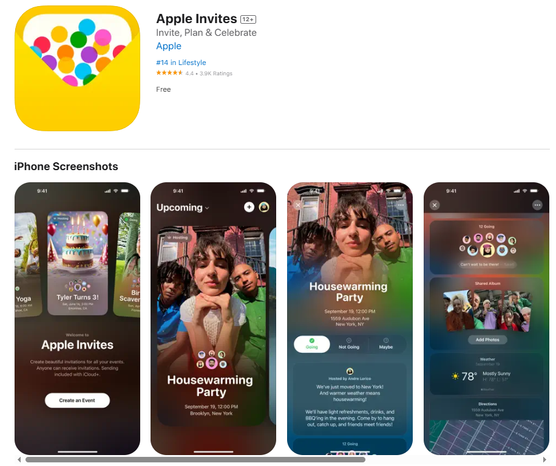

## Apple Invites App

### Current State of the project.

I'm currently doing the project from the BootCamp. The goal is to make a member introduction app. Then the motivation was from the `Apple Invites` app. As I delved into optimizing the performance of our app, particularly focusing on image loading times, I realized the importance of implementing an effective image caching strategy. The motivation stemmed from observing how apps like Apple Invites handle image loading efficiently. Initially, I noticed that fetching images from the internet could lead to slower loading times, especially if the same images were loaded multiple times. This led me to explore how caching could improve the user experience by reducing the need for repeated network requests.

Caching images is a crucial technique in mobile app development, as it significantly enhances app performance by reducing load times and conserving bandwidth. By storing images locally on the device, either in memory or on disk, apps can quickly retrieve them instead of fetching them from the internet every time they are needed. This approach not only speeds up image rendering but also reduces data usage, which is beneficial for both users and developers in terms of cost savings and improved user satisfaction.

In iOS, there are several ways to implement image caching, including using built-in classes like NSCache for memory caching and URLCache for both memory and disk caching. Additionally, third-party libraries such as Kingfisher provide robust caching capabilities with features like asynchronous image loading and customizable cache behavior.

For the product, I am not going to post about the app, but I will show you the example of how to chache image on very simple app.

### Assets.xcassets
**Why Use Assets.xcassets?**
1. Optimized Lookup: Image assets are optimized for name and trait-based lookup. It's faster to find an image asset in the asset catalog than to search for files with specific naming schemes on disk.
2. Buffer Size Management: Asset catalogs efficiently manage buffer sizes.
3. Device-Specific Optimization (App Thinning): Provides functionality to download only image resources relevant to the device on which the application will run.
4. Vector Artwork Optimization: When an image is rendered in an image view larger or smaller than its original size, it doesn't become blurry. The image is re-rasterized from vector artwork. The asset catalog compiler has already produced pre-rasterized versions of images and stored them in the asset catalog. Instead of performing complex calculations to rasterize vector artwork into bitmaps, we can decode the stored image and render it directly to the frame buffer.
5. Centralized Management: Asset catalogs allow developers to organize and manage app-related assets in a single location.
6. Performance Optimization: Asset catalogs automatically handle image compression, optimization, and caching to improve app performance and reduce memory usage.

**Disadvantages**
1. Memory Issues: The imageNamed: caching mechanism can lead to potential memory shortages. This can be problematic when loading many images (e.g., 350MB).
2. Differences in Image Loading Methods:
    - imageNamed:: Loads images included in the project with high memory usage, but the app continues to function normally after didReceiveMemoryWarning is called.
    - imageWithContentsOfFile:: Doesn't cache image data, resulting in lower memory usage and allowing loading only when needed, but requires knowledge of file extensions.

**Solutions**
1. Use Regular File System: Manage images using the regular file system instead of asset catalogs.
2. Modify Content.json: Override Content.json to modify image information management.
3. Extend UIImage: Use method swizzling to redefine the imageNamed: method by extending UIImage. This logic applies only to the modified Content.json.

In iOS 8.3 and above, cache removal works properly, so the imageNamed: method can be used directly. However, caution is still needed when dealing with large images.

### Popular Image Caching & Processing Lib
- [Kingfisher](https://github.com/onevcat/Kingfisher/tree/master)
    - Async image downloading / caching
    - multilayer caching
    - loading image from URLSession / local disk
    - image process filters are included
    - extensions 로 UIImageView, NSImageView, NSButton …  extended features

### How to cache the image in iOS.
// TODO: Develop

### How to manage that...
When my colleague says I need to make file loader or image laoder, I often made singleton so that every cowoker of mine can access that, that was what I intended even though there are several problem with that (eg: shared memory). But in this case, I simply made used **Dependency Injection** (Interface), so that any object can switch the loader.

But it's really unnecessary to load the image from Assets.xcassets, so I moved all iamge into specific folders, so called img.

### Result

### Resource
* [Apple Invites](https://apps.apple.com/us/app/apple-invites/id6472498645)
* [Swizzeling](https://stackoverflow.com/questions/22856283/use-xcassets-without-imagenamed-to-prevent-memory-problems/23438145#23438145)
* [What is NSCache](https://baechukim.tistory.com/90)
* [Async Loading Images](https://developer.apple.com/documentation/uikit/asynchronously-loading-images-into-table-and-collection-views)
* [How can I cache an image in swift](https://stackoverflow.com/questions/69330135/how-can-i-cache-an-image-in-swift-5)
* [Image Caching](https://velog.io/@o_joon_/Swift-Image-caching%EC%9D%B4%EB%AF%B8%EC%A7%80-%EC%BA%90%EC%8B%B1#%EC%9D%B4%EB%AF%B8%EC%A7%80%EA%B0%80-%EC%BA%90%EC%8B%9C%EC%97%90-%EC%A1%B4%EC%9E%AC%ED%95%98%EC%A7%80-%EC%95%8A%EB%8A%94-%EA%B2%BD%EC%9A%B0)
* [UITable Fetching](https://andreygordeev.com/2017/02/20/uitableview-prefetching/)
* [Reusable Image Cahce](https://medium.com/@mshcheglov/reusable-image-cache-in-swift-9b90eb338e8d)
* [Pagination](https://ios-development.tistory.com/716)