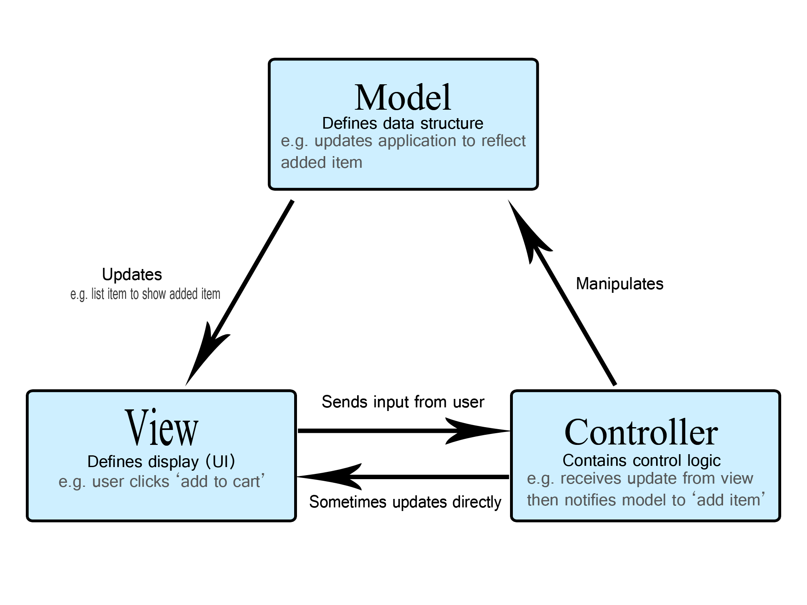
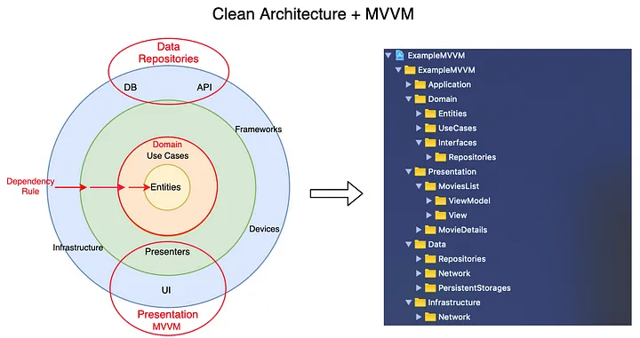

## Motivation: MVVM

나는 어떠한 Architecture Pattern 이라고 하면, 항상 들었던건, 이걸 Concept 를 사용해보고, 직접 수행해보고, 디버깅을 해봐야 그 느낌을 겨우 알것 같다. 그냥 말로만 하는걸 그다지 좋아하지는 않는다. 형태를 본다고 해서 우리가 직접적으로 Debugging 을 찍어봐야 이해가 가는 편이라고 생각한다. 왜냐하면 한번에 코드를 보고, 직관적으로 보는 경우는 나는 경험이 깊은 사람들만 할수 있다는 점이고, 그 Architecture Pattern 으로 인해서, 이제 개발자들이 이 패턴을 사용했을때와 어떤것과 비교 또는 User 들의 피드백이 필요하다고 생각하기 때문이다. 그래서 적절한 사용이라는 Keyword 가 항상 따라 다닌다고 생각을 한다. 그래서 무분별한 어려운 단어에 대한 Keyword 에대해서는 쉽게 말을 해야할 필요가 있어보인다. 단 구현을 어떻게 하는가는 정말 다르다라는 생각이다.

일단 잡소리는 그만하고, 실제로 어떻게 구현을 하는지가 목표일것 같다. 

### MVVM (Model, View, View Model)

기본적으로 MVVM 을 사용하려면, MVC 에 대한 이해도가 어느정도 필요하다. 아래의 그림을 한번 봐보자.

* Model 은 Data Structure 을 정의한다. Data Structure 같은 경우는 예를 들어 Data 를 Parsing 하는것들에 대한 Mdoel 이 될수도 있고, Network 로 부터 받아온 Data 를 메모리에 들고 있어서, 이걸 사용해서 View 에게 Update 의 명령을 준다.
* View: 는 위의 내용과 같이, 어떤 Item 이 변경됬어라는걸, View 에다가 Display 하는것뿐이다, 즉 진짜 껍데기 밖에 없다.
* Controller 는 위의 내용을 전부다 Control 한다는 뜻이다. "나 Data Parsing 할꺼니까, Model 아 받아서, 너가 나중에 View 에게 Update 해줘" 나 View 로부터는 "야! User 한테는 이 값을 받았어, 처리해줘" 라는 느낌이고" Controller 는 View 와 Model 을 어떻게 보면 관리해주는 역활을 해준다.

이렇게 보았을때, Controller 가 모든걸 관리하는거라고 해서 Model View Controller, 가 또다른 단어로는 Massive View Controller 라고 부른다고 한다. 그래서 이걸 보완해줄만한 이야기가 바로 MVVM 이다. 결국에는 Controller 가 많은것을 관리하고, UI Update 다 했던걸 이제 조금씩 기능상으로 쪼개서, 일부는 View 에게, 일부는 View Model 에게 역활을 담당하여, Controller 의 짐을 덜어주고자 만든 Architecture 라고 생각을 하면 될것 같다.

정말 많은 내용을 읽어봤지만 처음에 딱봤던건, 굉장히 처음에 보면 추상적인 그림인 아래의 그림과 같았다. 크게보면 총 3가지의 Layer 들이 존재한다. (Presentation Layer, Domain Layer, Data Layer)

### Resource
* 