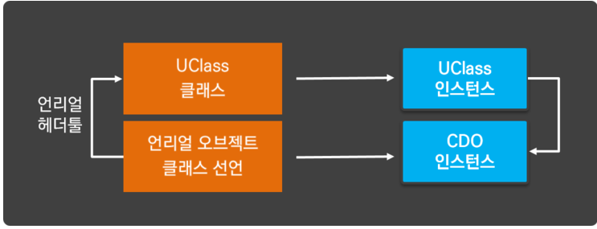

## Class Default Object (CDO)

* Unreal Object 가 만들어지기 위해서는, 실제 컴파일 전에 Unreal Header Tool 에 헤더 파일 분석하는 과정에서 선행이 되며, 이 과정이 완료되면, Intermediate Folder 에 Unreal Object 정보를 담음 Meta File 이 생성 된다.
* 이 Meta 정보는 Unreal Engine이 지정한 UClass 라는, 특별한 클래스를 통해서 보관됩니다.
* UClass 에는 Unreal Object 에 대한 클래스 계층 구조 정보와 멤버 변수, 함수에 대한 정보를 모두 기록하고 있습니다. 
* 하지만 단순히 검색하는 것에서 더 나아가, Run Time 에서 특정 클래스를 검색해 형(Type) 을 알아내 인스턴스의 멤버 변수 값을 변경하거나 특정 인스턴스의 member function 호출하는것이 가능하다.

## Reflection

* Java / C# 과 같은 경우 Reflection 이라는 이름으로 제공
* Compile 단계에서 Unreal Object 마다 UCLass 가 생성된다면, 실행 초기의 Run Time 과정에서는 Unreal Object 마다 Class 의 정보와 함께 Unreal Object 의 Instance 가 생성됩니다.
* 이 특별한 Instance 는 Unreal Object 의 기본 세팅을 지정하는데 사용되는데, 이를 클래스 기본 객체 (Class Default Object: CDO) 라고 한다.
* Unreal Engine 에서 CDO 를 만드는 이유는 Unreal Object 를 생성할 떄마다 매번 초기화를 시키지 않고, 기본 인스턴스를 미리 만들어 놓고 복제하는 방식으로 메커니즘이 구성되어 있기 때문이다. 
* 예를 들어서 복잡한 기능을 수행하는 캐릭터를 담당하고, 기능이 커진다고 했을때 굉장히 큰덩어리로 될수 있다. 이럴때 100 개의 instance 를 만든다고 가정하면, 캐릭터를 하나씩 처음부터 생성 하고, 초기화 시키는 방법보다, 미리 큰 기본 객체 덩어리를 복제하고, 속성 값만 변경하는게 더 효율적이기 때문이다.
* 정리하자면, 아래와 같이 하나의 Unreal Object 가 초기화 될 때에는 두개의 Instance 가 항상 생성 됩니다.
  

* 이 생성자 클래스는 Instance 를 초기화 해 CDO 를 제작하기 위해서 사용되고, 초기화에서만 실행되고, 실제 게임 플레이에서는 생성자 코드를 사용할 일이 없다.
* Unreal Engine 에서 게임 플레이에서 사용할 초기화 함수는 생성자 대신 Init 이나 혹은 BeginPlay() 함수를 제공
* 

## Resource
* [Class Default Object](https://blog.naver.com/destiny9720/220934112532)