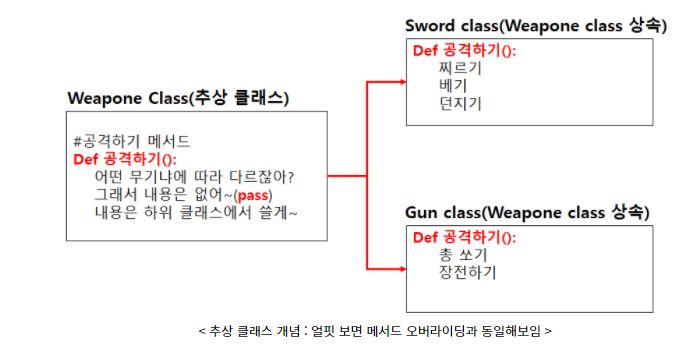

## What is the "Abstraction" ?

회사에서, UNDO / REDO 설계를 맡게 되었는데.. 여러의 source 들을 찾아보려고 하니 `@abstractstaticmethod` 라는 녀석을 보게 되었다. 과연 abstract 는 왜 사용 되는지, static method, class method, 그리고 instance method 를 알아보겠다.

일단 아래의 그림을 보면, 대충 추상클래스가 왜 필요한지 볼 수 있다.

<figure>
  
</figure>

정의는 이러하다 Weapon Class(추상 클래스)가 생성이 되면, 무기마다 다른 특성들을 가지고 있기 때문에 Gun Class 와 Sword Class 가 가지는 action method 들도 다를것이고, 역활? 도 나름 다를 것이다. 사실 무기 클래스는 attack() 이라는 method 를 가질수 있다, 하지만 내부에서 구현하는 방식이, 어떤 종류의 무기에 따라서 내용이 달라진다.

즉 여러 종류의 무기 class (e.g sword, gun, etc..) 들은 무기(Weapon)이라는 Class로 부터 상속을 받게 하므로, 세세한 구현은 상속받은 자식 클래스로부터 세부 구현해야한다. 이렇다고 한다면, 이론적으로 overriding 하고 똑같은 의미이지 않느냐? 라고 물어볼수 있다.

일단, 추상 클래스는 실제로 추상적인 또는 대체적인 그림의 틀을 가지고 있다고 생각하면 된다. 실체 클래스들은 자식들의 클래스이다. 즉 실체 클래스의 멤버(필드, 메소드)를 잘 잡아주는 틀이라고 생각하면 될것 같다.

즉 메소드 선언만 통일화 [링크 참조]를 할수 있게 만들며, 각각의 기능은 달라지는거라고 생각하면 편하다.또 Method 선언만 통일화 하고 각각의 기능이 달라져야 되는 케이스가 필요하기 때문에, 추상 메소드 오버라이딩이 필요하다.

python 에서의 추상 클래스를 만들기 위해서, [abc](https://docs.python.org/3/library/abc.html) 모듈을 가지고 와야한다.

---
-코드-

```python
from abc import *
class MyAbstractClass(metaclass=ABCMeta):

  @abstractmethod
  def MyabstractMethod(self):
    pass
```

예제 코드

```python

from abc import *

class Weapon(metaclass=ABCMeta):
  name = "weapon name"
  att_dmg = 0
  durability = 100

  @abstractmethod
  def attack(self):
    pass


# Gun
class Gun(Weapon):
  def __init__(self, name, att_dmg):
    self.name = name
    self.att_dmg = att_dmg

  def attack(self):
    self.durability -= 2
    print("%s %d %d" %(self.name, self.att_dmg, self.durability))


# Sword
class Sword(Weapon):
  def __init__(self, name, att_dmg):
    self.name = name
    self.att_dmg = att_dmg

  def attack(self):
    self.durability -= 5
    print("%s %d %d" %(self.name, self.att_dmg, self.durability))


# Bow
class Bow(Weapon):
  def __init__(self, name, att_dmg):
    self.name = name
    self.att_dmg = att_dmg

  def attack(self):
    self.durability -= 1
    print("%s %d %d" %(self.name, self.att_dmg, self.durability))

```

위의 코드와 같이 `weapon` 이라는 클래스는 맞지만, 클래스가 아닌? 추상적인 클래스가 있고, 세부적인 무기들은  `weapon` 이라는 클래스를 상속 받는다. 파이썬에서 각각의 weapon 들을 instance 화 시키면, 결과 값은 다 다르다. 결국, 억지인 예일수 있지만, 달고나 만드는것 처럼, 달고나를 만드는 행위는 어떤 모양이든 다 같지만, 하지만 어떤한 모양으로 낼지는 다른거다 라고 말을 할수 있을것 같다.

### Resouce

1. [Python Basic - Abstract & Class Variable](https://ybworld.tistory.com/27)
2. [Abstract Method and Overriding](https://21413011.tistory.com/72)
3. [Why do we need to use the Abstract Method](https://edu.goorm.io/learn/lecture/41/%EB%B0%94%EB%A1%9C%EC%8B%A4%EC%8A%B5-%EC%83%9D%ED%99%9C%EC%BD%94%EB%94%A9-%EC%9E%90%EB%B0%94-java/lesson/734/%EC%B6%94%EC%83%81%ED%81%B4%EB%9E%98%EC%8A%A4%EB%A5%BC-%EC%82%AC%EC%9A%A9%ED%95%98%EB%8A%94-%EC%9D%B4%EC%9C%A0)
4. [Virtual Function](http://tcpschool.com/cpp/cpp_polymorphism_virtual)
